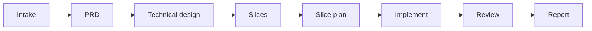

# AI-driven development — how this works

A plain-language guide to **what** AI-driven development means in this workspace, **why** it is structured this way, and **how** humans and agents work together.

For day-to-day commands see [step-by-step.md](step-by-step.md) and [how-it-works.md](how-it-works.md). For coding standards see [conventions/README.md](conventions/README.md).

---

## What is AI-driven development?

**AI-driven development** does not mean “the AI writes the whole product alone.”

It means:

1. **You** own product intent, approvals, and merge decisions.
2. **The agent** drafts plans, explores the codebase, writes code from approved specs, and runs checks.
3. **The hub** stores the contract between you and the agent — PRDs, designs, plans, standards.
4. **Every important step has a gate** — the agent stops until you approve.

```text
Traditional:     Idea → developer codes → PR → review
AI-driven here:  Idea → agent drafts plan → YOU approve → agent codes → PR → review
```

The AI accelerates **drafting and execution**. You keep **control** at each boundary.

---

## Why a separate hub repo?

Without a hub, AI coding tools tend to:

- Skip straight to code with no shared spec
- Forget decisions from last week
- Ignore team standards
- Mix planning notes with application source

This workspace fixes that by splitting **planning** from **code**:

```text
┌──────────────────────────────────────┐
│  Hub (ai-orchestrator-workspace)     │
│  • What we agreed to build           │
│  • How the system is shaped          │
│  • Coding & engineering standards    │
│  • Audit trail (reports)             │
└─────────────────┬────────────────────┘
                  │ approved plans only
                  ▼
┌──────────────────────────────────────┐
│  App clone (projects/ipd/, …)        │
│  • Real React + Fastify code         │
│  • Tests, migrations, CI             │
│  • Normal git PRs                    │
└──────────────────────────────────────┘
```

Same idea as **platform-workspace**: one meta-repo for delivery, many app repos for code.

---

## The delivery pipeline

Work flows through **phases**. Each phase produces a **document**. Documents chain together — later steps read earlier ones.



| Phase | Question answered | Output | Human gate |
|-------|-------------------|--------|------------|
| Intake | What did the user ask for? | `prd/.../ticket.md` | Confirm scope |
| PRD | What problem, for whom, acceptance criteria? | `prd.md` | **Approve** |
| Technical design | Modules, APIs, data — system shape? | `technical-design.md` | **Approve** |
| Decompose | How do we ship in thin vertical cuts? | `slices/slice-N.md` | **Approve order** |
| Plan slice | Exact files and steps for one slice? | `specs/features/.../slice-N.md` | **Approve** |
| Implement | Build it | Code + PR in `backend/` | PR review |
| Report | What was done? | `reports/features/...` | — |

**Small work** (bug, chore) skips PRD/slices — still needs an approved plan in `specs/bugs/` or `specs/chores/`.

---

## Vertical slices (tracer bullet)

Large features are not built in one giant PR. They are cut **vertically**:

```text
Slice 1:  Login screen → API route → DB table → test   (tracer bullet)
Slice 2:  Validation + error handling
Slice 3:  Permissions
Slice 4:  Polish
```

Each slice goes through **plan → approve → implement → merge** before the next. That keeps AI changes reviewable and limits damage if something goes wrong.

---

## Human gates (the most important rule)

Before any implementation, the plan file must contain:

```markdown
## Approval
- [x] Product — acceptance criteria match intent
- [x] Tech — architecture constraints respected
- **Approved by:** Your Name
- **Date:** YYYY-MM-DD
```

If this is missing, **`implement-slice` refuses to run**. This is intentional — it prevents “helpful” agents from coding off an unreviewed draft.

You are not slowing down delivery. You are **choosing the point where automation starts**.

---

## What the agent reads before coding

Agents do not guess your standards. They load:

| Source | Purpose |
|--------|---------|
| Approved plan in `specs/` | What to build this slice |
| `docs/conventions/` | How to write backend, frontend, API |
| `docs/architecture/<product>.md` | System boundaries and modules |
| `docs/decisions/<product>/` | ADRs — decisions already made |
| **convention-loader** skill | Only the rules relevant to files being touched |
| App `.cursor/rules/` | Short reminders inside the clone |

**Spec is source of truth.** Code must match the approved plan.

---

## Document types and levels

Confusion often comes from mixing document levels. Keep them separate:

| Level | Doc type | Example location | Contains |
|-------|----------|------------------|----------|
| Product | PRD | `prd/ipd/admissions/prd.md` | User stories, acceptance criteria |
| System | Architecture (HLD) | `docs/architecture/ipd.md` | Modules, deploy, data overview |
| Feature | Technical design | `prd/.../technical-design.md` | Endpoints, migrations for this epic |
| Slice | Implementation plan (LLD) | `specs/features/ipd/slice-1.md` | Exact files, steps, tests |
| Decision | ADR | `docs/decisions/ipd/0002-….md` | Why Better Auth, why Postgres |
| Living | Service doc | `docs/services/ipd.md` | What exists in code today |

Architecture is **not** built from slice plans — slice plans **implement** architecture.

See [architecture/STRUCTURE.md](architecture/STRUCTURE.md).

---

## Skills = repeatable agent workflows

In platform-workspace these were `.claude/commands/`. Here they are **Cursor skills** in `.cursor/skills/`:

| Skill | What it does |
|-------|----------------|
| `feature-orchestrator` | Full phased flow with stops |
| `plan-slice` | One slice → detailed plan |
| `implement-slice` | Approved plan → code + PR |
| `convention-loader` | Load relevant coding rules |
| `code-review` | Review a PR against spec |
| `project-discovery` | Document what is in a clone |
| … | 28 skills total |

You trigger them in natural language: *“Run feature-orchestrator for ipd — …”*

The skill file is the **playbook** — same steps every time, less drift.

---

## Your role vs the agent’s role

| You | Agent |
|-----|--------|
| Describe goals, constraints, priorities | Draft PRDs, designs, plans |
| Approve or reject each phase | Stop and wait at gates |
| Set non-goals and scope | Explore codebase, propose slices |
| Merge PRs, own production | Implement approved slices, open PRs |
| Decide when to add projects | Follow conventions and architecture |
| Run `drift` when docs feel stale | Update reports after implement |

Think of yourself as **tech lead + product owner**. The agent is a **fast junior team** that never skips the spec.

---

## AI-driven vs “just ask Cursor to code”

| Just chat & code | This workspace |
|------------------|----------------|
| No persistent spec | PRD + plans in git |
| Standards in chat history | `docs/conventions/` |
| One-shot prompts | Phased pipeline + skills |
| Hard to review AI diffs | One slice ≈ one PR |
| Decisions lost | ADRs + reports |
| Anyone’s Cursor session differs | Same hub for whole team |

---

## Multi-project (today and tomorrow)

| Today | Tomorrow |
|-------|----------|
| One product: IPD | Add FlowMD, others |
| `docs/architecture/ipd.md` | + `docs/architecture/flowmd.md` |
| Shared `docs/conventions/` | Same stack → reuse conventions |
| `repos.yaml` lists clones | One hub, many `projects/<name>/` |

Onboarding: [onboarding-new-project.md](onboarding-new-project.md)

---

## Typical week (team of one or few)

```text
Mon   feature-orchestrator → PRD draft → you approve
Tue   technical design + decompose slices → you approve
Wed   plan slice 1 → you approve → implement → PR
Thu   code review, fix review comments, merge
Fri   plan slice 2 OR project-discovery / drift / docs
```

Hub-only weeks (no coding) are valid — fill `prd/`, architecture, contracts, test plans until ready to implement.

---

## What success looks like

- Every merged feature has a **trail**: PRD → plan → PR → report
- Agents produce code that **matches conventions** without you repeating rules in chat
- New team members read **docs**, not old Slack threads
- Adding a project takes **~30 minutes** of hub setup, not a new process
- You trust merges because **scope was approved before code existed**

---

## Where to go next

| I want to… | Read |
|------------|------|
| Use the hub day to day | [how-it-works.md](how-it-works.md) |
| Onboard a new app | [onboarding-new-project.md](onboarding-new-project.md) |
| Coding standards | [conventions/README.md](conventions/README.md) |
| Architecture docs | [architecture/STRUCTURE.md](architecture/STRUCTURE.md) |
| Command reference | [developer-guide.md](developer-guide.md) |

---

## One sentence summary

**AI-driven development here = approved specs in the hub + standards the agent must follow + vertical slices implemented in app clones — with you approving every phase before code ships.**
