# flowMD — Two Architecture Options

Compare **Option A (Unified)** vs **Option B (Separate IPD database)**.

| | Option A — Unified | Option B — Separate IPD DB |
|--|-------------------|---------------------------|
| **Repos** | One (his-global-south extended) | Two (flowMD OPD + IPD app) |
| **Databases** | One Postgres per country | Two Postgres (flowMD + IPD) |
| **Patient** | One `patients` table, FK | IPD stores `patient_ref` only |
| **Super Admin** | One portal, one DB | One portal → provisions both via API |
| **Complexity** | Lower | Higher (sync/API) |
| **Best for** | Embedded OPD+IPD, Phase 1 Kenya | Sovereign IPD-only, separate scaling |

---

# OPTION A — UNIFIED (OPD + IPD, same database)

## A1. Overview

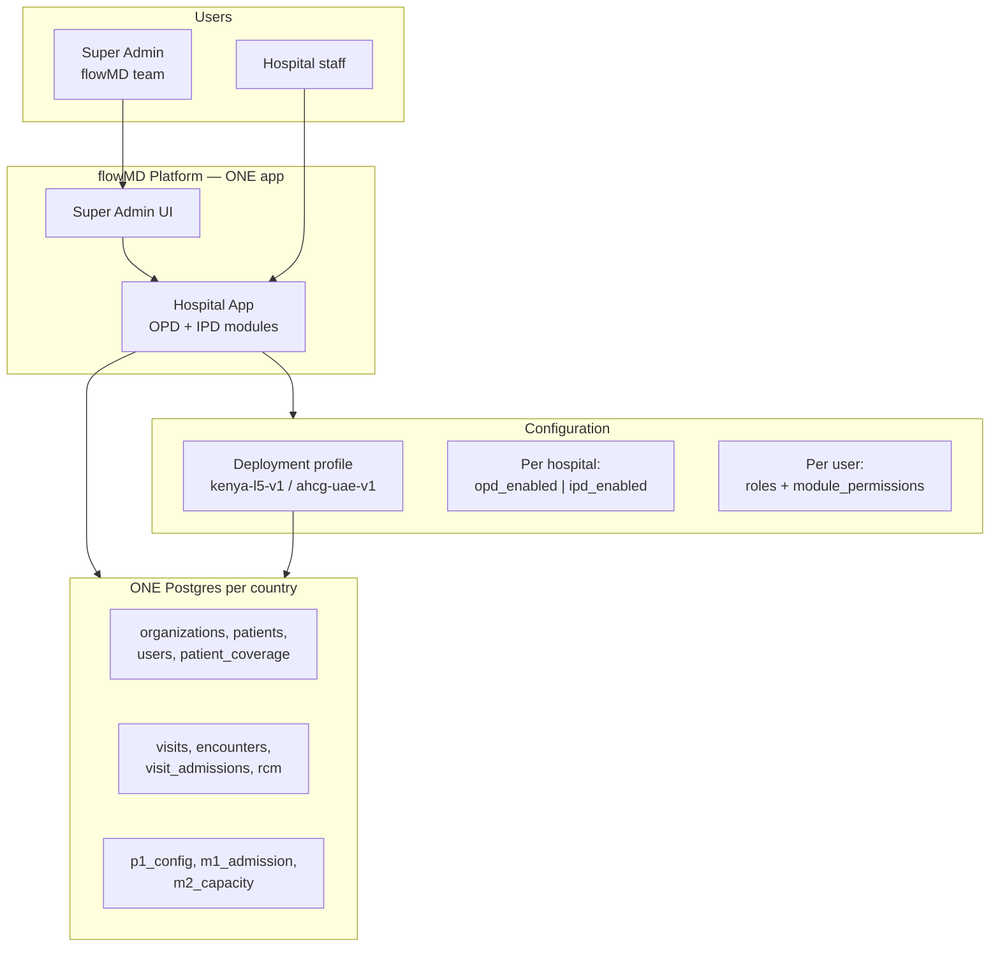

**Rule:** One country install → one Postgres. OPD and IPD are **modules in the same app**, not separate services.

---

## A2. Super Admin → Deployment profile → Database

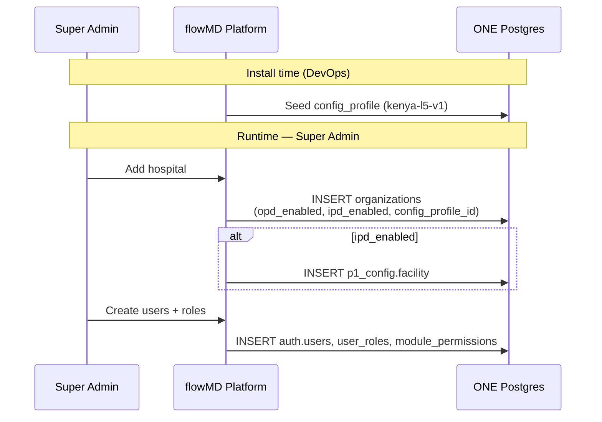

| Layer | Where stored | Who sets it |
|-------|--------------|-------------|
| Deployment profile | `p1_config.config_profile` | DevOps / install |
| Org module flags | `organizations.opd_enabled`, `ipd_enabled` | Super Admin |
| User access | `user_roles`, `module_permissions` | Super Admin / Hospital Admin |

---

## A3. What user sees (assignment-based)

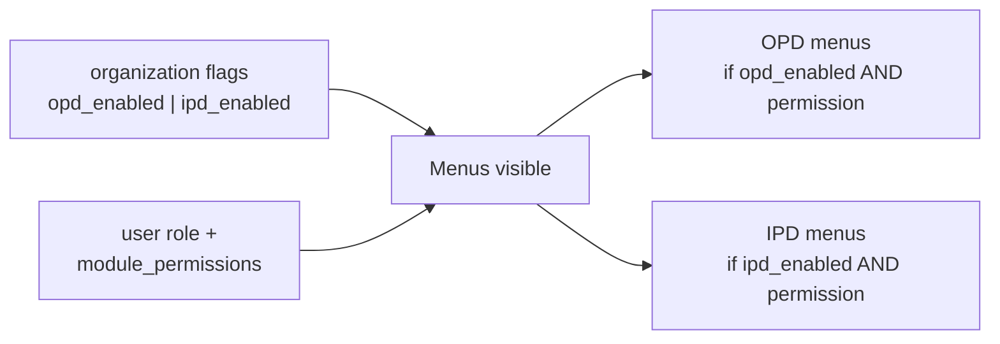

**Example:**

| User | Role | Org flags | Sees |
|------|------|-----------|------|
| Reception | receptionist | opd✅ ipd✅ | OPD Register only |
| Doctor | doctor | opd✅ ipd✅ | OPD Consult + Admission advised |
| Ward nurse | nurse + beds module | opd✅ ipd✅ | IPD Admissions + Bed board |
| Hospital Admin | admin | opd✅ ipd✅ | Org setup + IPD Admin beds |

Same login. Router hides modules user/org is not allowed to see.

---

## A4. OPD + IPD in same DB — communication

**No API between services.** Internal module calls + SQL foreign keys.

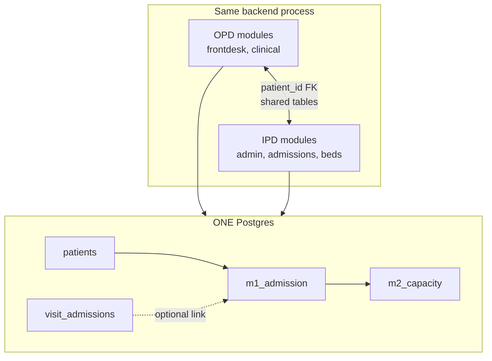

### Embedded journey (Option A)

```text
OPD Register     →  WRITE patients
OPD Consult      →  WRITE visit_admissions (advised)
IPD Admit        →  READ patients, WRITE m1_admission (patient_id FK)
IPD Assign bed   →  WRITE m2_capacity
```

### Standalone IPD within Option A (OPD off, same DB)

```text
IPD Register     →  WRITE patients (same table)
IPD Admit        →  READ/WRITE m1_admission
(OPD tables empty — no separate DB)
```

---

## A5. Option A — tables

| REUSE (existing) | NEW (IPD) | EXTEND |
|------------------|-----------|--------|
| organizations, patients, patient_coverage | p1_config.* | organizations + flags |
| users, user_roles, module_permissions | m1_admission.* | |
| visits, encounters, visit_admissions | m2_capacity.* | |
| rcm, payer catalog | config_profile | |

---

# OPTION B — SEPARATE IPD (own database)

## B1. Overview

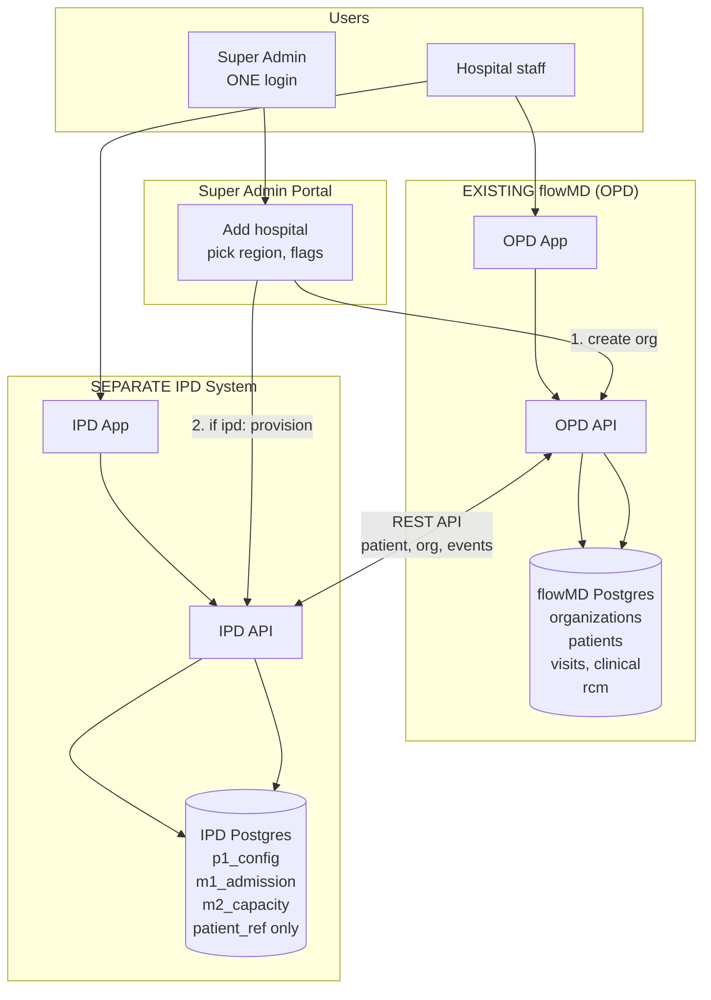

**Rule:** Two databases. Link by **UUID copy** (`flowmd_organization_id`, `patient_ref`) — **no cross-DB foreign keys**.

---

## B2. Super Admin → profiles → two databases

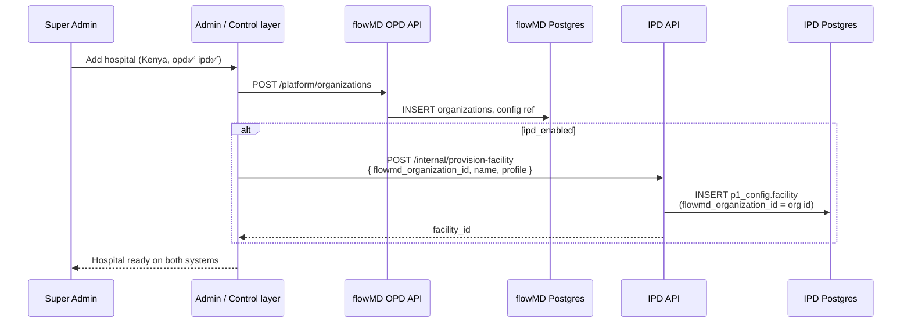

| Data | flowMD DB | IPD DB |
|------|-----------|--------|
| Organization master | ✅ `organizations` | link only `flowmd_organization_id` |
| Deployment profile | optional copy | ✅ `config_profile` |
| Patients (name, SHA) | ✅ `patients` | ❌ only `patient_ref` |
| OPD visits | ✅ | ❌ |
| IPD admissions/beds | ❌ | ✅ |

---

## B3. Deployment profiles in Option B

Each system has profile config; **aligned at provision time**:

```text
flowMD install (Kenya):
  ACTIVE_PROFILE = kenya-l5-v1
  → OPD behaviour (SHA forms, RCM)

IPD install (Kenya, same region):
  ACTIVE_PROFILE = kenya-l5-v1
  → IPD behaviour (MoH reports, bed rules)

Both deployed in Kenya. Two DBs. Same profile name.
Super Admin picks profile once → passed to both APIs on provision.
```

---

## B4. How IPD communicates with flowMD DB (Option B)

IPD **never connects directly** to flowMD Postgres. **REST API only.**

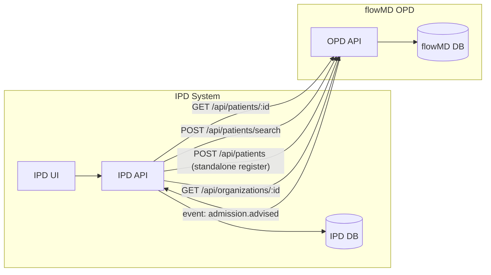

### API contract (Option B)

| Need | Direction | API | IPD stores |
|------|-----------|-----|------------|
| Search patient | IPD → flowMD | `GET /api/patients?q=` | nothing (display only) |
| Get patient detail | IPD → flowMD | `GET /api/patients/:id` | `patient_ref` on admit |
| Register (standalone) | IPD → flowMD | `POST /api/patients` | returns id → `patient_ref` |
| Org info | IPD → flowMD | `GET /api/platform/organizations/:id` | `flowmd_organization_id` |
| Admission advised | flowMD → IPD | webhook/event `admission.advised` | creates admission queue |
| Provision facility | Admin → IPD | `POST /internal/provision-facility` | `facility` row |

---

## B5. Option B — Embedded (OPD + IPD separate DBs)

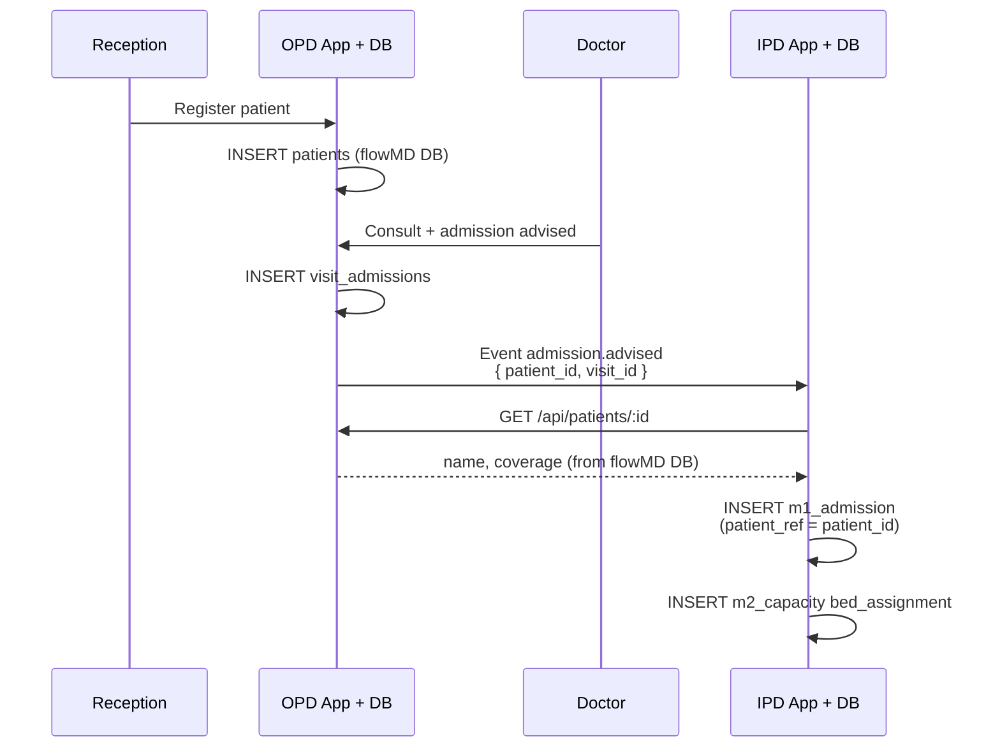

```text
Patient master     →  flowMD DB only
Admission + beds   →  IPD DB only
Link               →  patient_ref (UUID copy)
```

---

## B6. Option B — Standalone IPD (no OPD UI)

Two sub-cases:

### B6a. Standalone — IPD register via flowMD Patient API

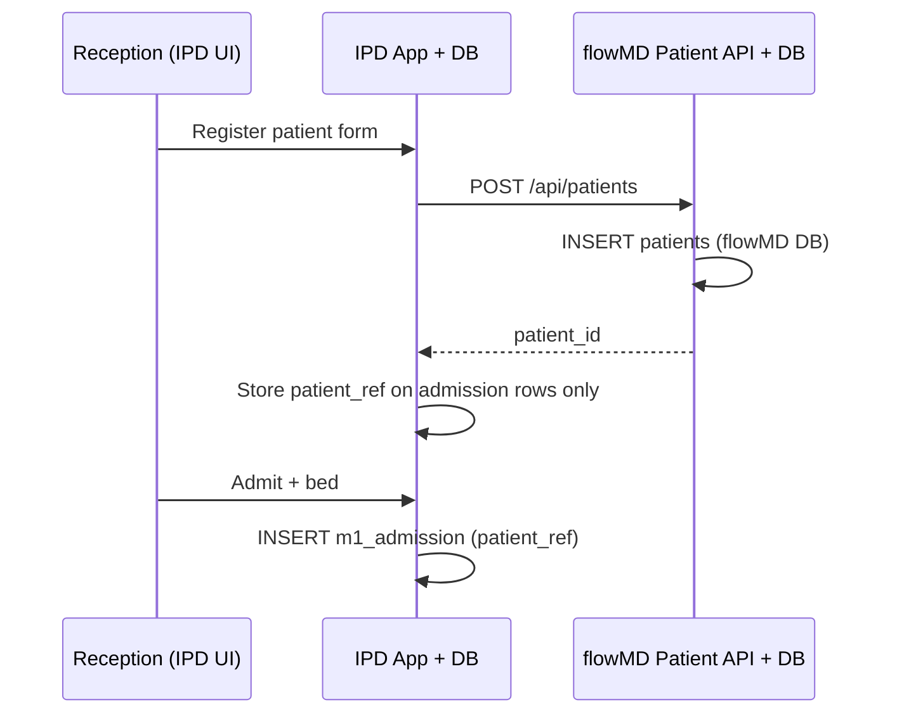

**OPD app not shown to user. Patient still saved in flowMD DB via API.**

### B6b. Standalone — Hospital HIS (UAE)

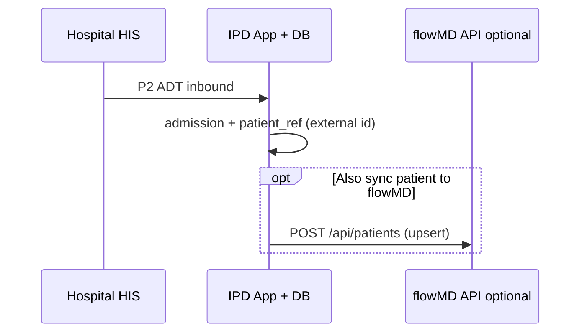

---

## B7. Option B — what lives where

### flowMD Postgres (REUSE existing)

| Table | Purpose |
|-------|---------|
| organizations | Hospital master + opd_enabled, ipd_enabled |
| patients | **Patient registration master** |
| patient_coverage | Insurance |
| users, user_roles | Login (embedded: shared auth) |
| visits, encounters | OPD |
| visit_admissions | OPD handoff |
| rcm | OPD billing |

### IPD Postgres (NEW — separate)

| Table | Purpose |
|-------|---------|
| p1_config.config_profile | IPD deployment profile |
| p1_config.facility | `flowmd_organization_id` link |
| m1_admission.* | Admissions (uses `patient_ref`) |
| m2_capacity.* | Beds, assignments |
| m8_billing.* | IPD charges (later) |

**IPD does NOT have `patients` master table** — only `patient_ref` on operational rows.

---

## B8. User login — Option B

| Case | Login | Apps |
|------|-------|------|
| Embedded | flowMD auth (Better Auth) | OPD app URL + IPD app URL, same token/JWT |
| Standalone IPD | flowMD auth or IPD auth | IPD app only; API to flowMD for patients |

```text
Same JWT → both apps validate against flowMD identity
IPD API adds patient_ref from flowMD on each operation
```

---

# SIDE-BY-SIDE SUMMARY

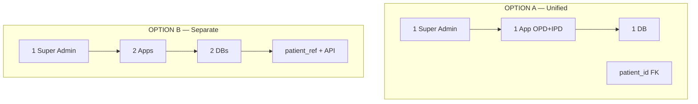

| Question | Option A | Option B |
|----------|----------|----------|
| How many DBs? | 1 | 2 |
| Patient register | Same `patients` table | flowMD DB; IPD has `patient_ref` |
| OPD ↔ IPD talk | SQL / internal modules | REST API + events |
| Super Admin | Writes one DB | Calls OPD API + IPD provision API |
| Deployment profile | One DB `config_profile` | Both systems; synced at provision |
| User sees modules | Flags + roles in one app | Two apps or linked shell |
| Phase 1 Kenya | **Recommended simpler** | More work |
| Standalone IPD | Same DB, OPD off | IPD DB + flowMD Patient API |
| Embedded | Natural fit | Sync + events needed |

---

# RECOMMENDATION

| Phase | Suggestion |
|-------|----------|
| **Phase 1 Kenya pilot (OPD+IPD embedded)** | **Option A** — one DB, extend his-global-south |
| **UAE sovereign IPD-only later** | Option B possible if hospital demands isolated IPD DB |
| **Long term** | Start A; extract to B only if contract requires hard DB separation |

---

# CURRENT CODE STATE

| Item | Option A path | Option B path |
|------|---------------|---------------|
| flowMD OPD | ✅ his-global-south | ✅ same |
| IPD | Build inside his-global-south | projects/ipd separate repo |
| Super Admin | ✅ exists | Needs provision API to IPD |
| config_profile | ❌ build | ❌ build both sides |
| Cross-system API | Not needed | ❌ build patient + provision APIs |
