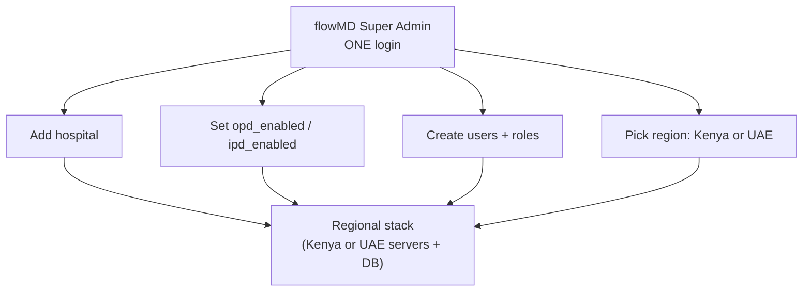
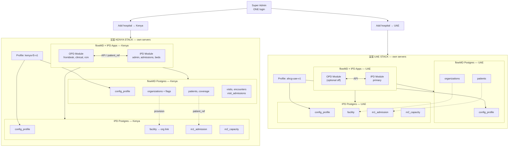
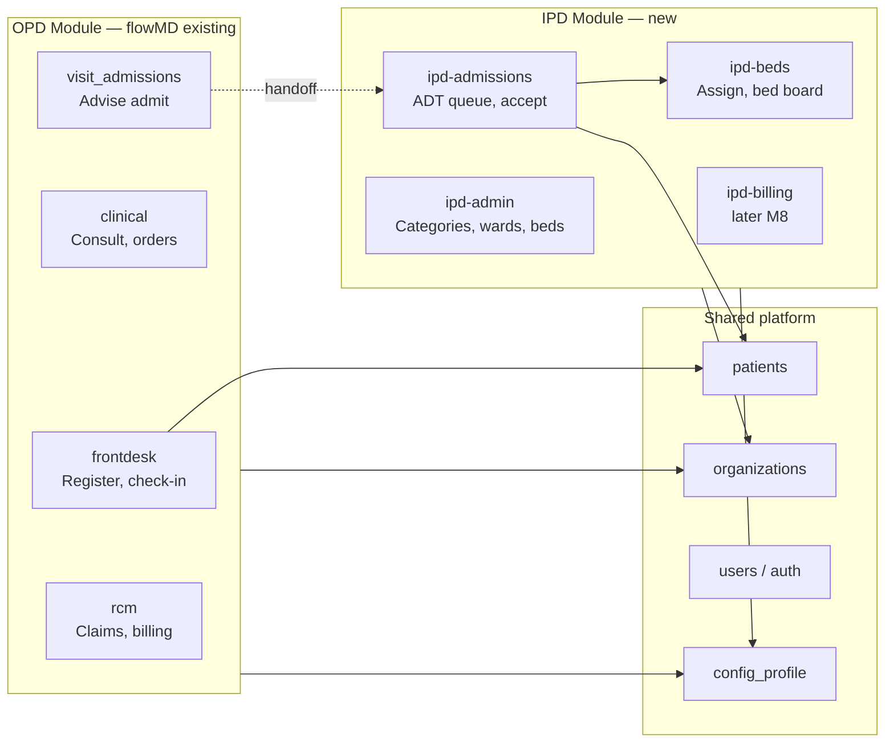
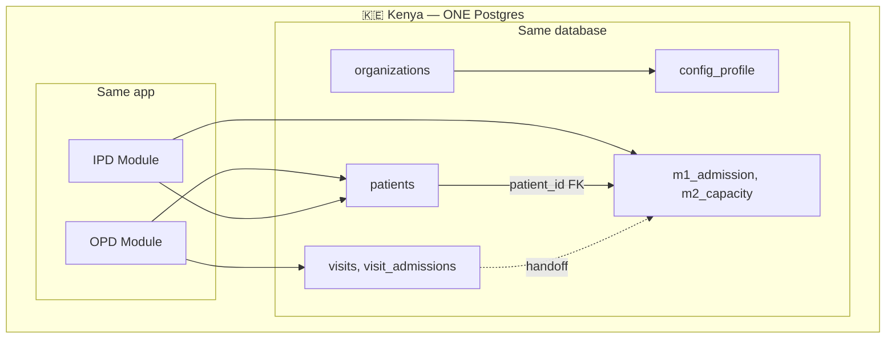
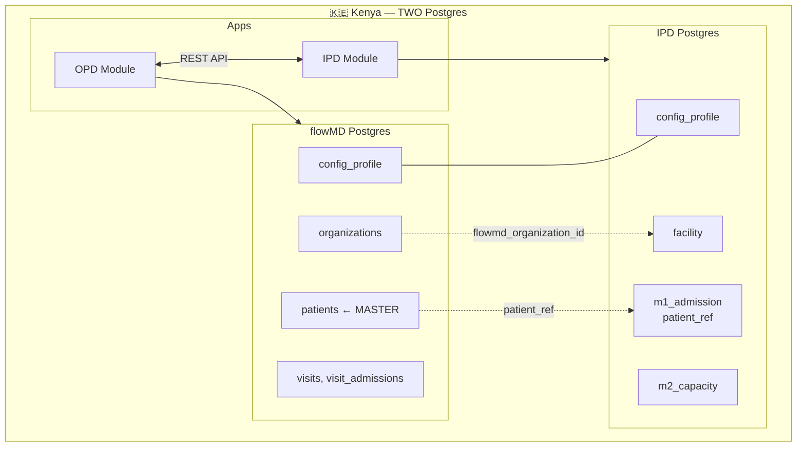
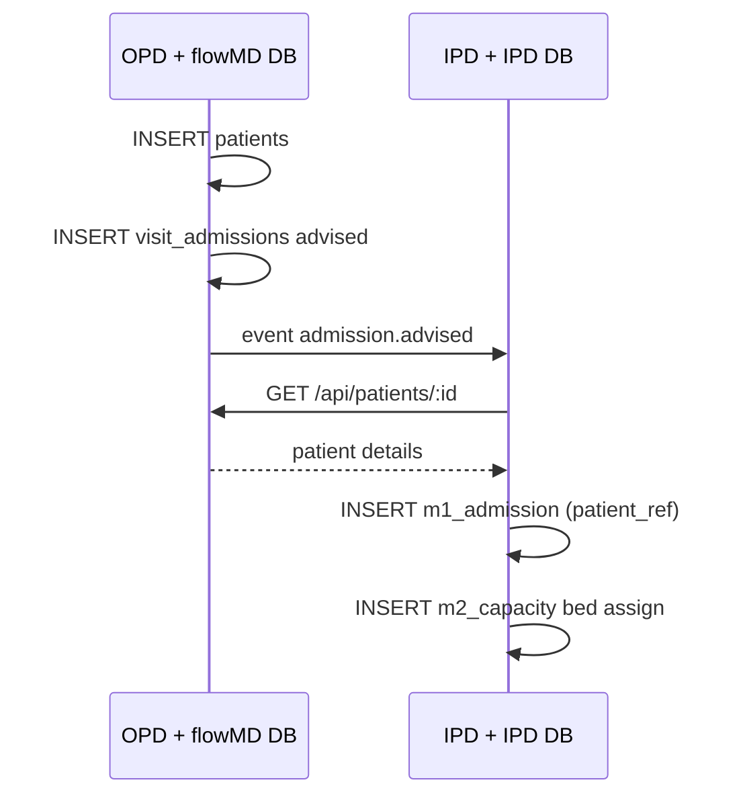
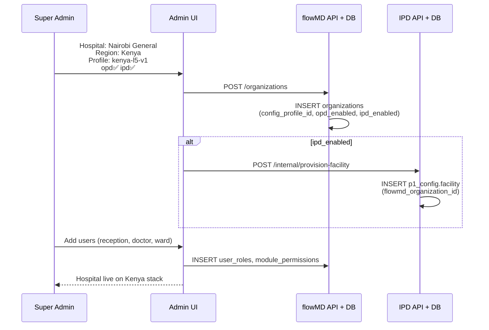

# flowMD × IPD — Full Architecture
## Super Admin · Deployment Profile · Kenya/UAE · OPD + IPD Modules

**Read top to bottom.**  
Covers: Super Admin → profile & config → regional stacks (Kenya / UAE) → OPD + IPD modules → how they communicate.

---

# PART 1 — SUPER ADMIN (start)



| Super Admin action | Stored in |
|--------------------|-----------|
| Add hospital | `organizations` |
| Enable OPD / IPD | `organizations.opd_enabled`, `ipd_enabled` |
| Region (Kenya/UAE) | Which server stack + which profile |
| Users & roles | `auth.users`, `user_roles`, `module_permissions` |

---

# PART 2 — THREE CONFIG LAYERS (profile + flags + user)

```text
┌─────────────────────────────────────────────────────────────┐
│ LAYER 1 — DEPLOYMENT PROFILE (market / country rules)        │
│ Table: p1_config.config_profile                              │
│ Set at: install time per region                              │
│ Examples: kenya-l5-v1 (SHA, MoH) | ahcg-uae-v1 (HIS, ERP)   │
├─────────────────────────────────────────────────────────────┤
│ LAYER 2 — ORG MODULE FLAGS (per hospital)                    │
│ Table: organizations                                         │
│ Set by: Super Admin                                          │
│ opd_enabled | ipd_enabled                                    │
├─────────────────────────────────────────────────────────────┤
│ LAYER 3 — USER ACCESS (per staff)                            │
│ Tables: user_roles + module_permissions                      │
│ Set by: Super Admin / Hospital Admin                         │
│ Who sees OPD menus vs IPD menus                              │
└─────────────────────────────────────────────────────────────┘
```

**Profile and org flags are different tables — not merged into one.**

---

# PART 3 — KENYA & UAE (separate servers, separate databases)

```text
❌ NOT: one global database for Kenya + UAE
✅ YES: each country = own servers + own database(s)
        same TABLE NAMES in each — data never mixed across countries
```

---

## 3.1 Master diagram — flowMD × IPD in both regions



---

## 3.2 ASCII poster — complete stack

```text
                         SUPER ADMIN (one login)
                                    │
                 ┌──────────────────┴──────────────────┐
                 ▼                                      ▼
    ┌────────────────────────────┐      ┌────────────────────────────┐
    │  🇰🇪 KENYA                    │      │  🇦🇪 UAE                      │
    │  Servers: Kenya DC           │      │  Servers: UAE DC           │
    │  Profile: kenya-l5-v1        │      │  Profile: ahcg-uae-v1        │
    ├────────────────────────────┤      ├────────────────────────────┤
    │  flowMD × IPD APPLICATION    │      │  flowMD × IPD APPLICATION    │
    │  ┌──────────┐ ┌──────────┐ │      │  ┌──────────┐ ┌──────────┐ │
    │  │ OPD      │ │ IPD      │ │      │  │ OPD off  │ │ IPD      │ │
    │  │ Register │ │ Admin    │ │      │  │ or on    │ │ Admin    │ │
    │  │ Consult  │ │ Admit    │ │      │  │          │ │ Admit    │ │
    │  │ RCM      │ │ Bed board│ │      │  │          │ │ Bed board│ │
    │  └────┬─────┘ └────┬─────┘ │      │  └────┬─────┘ └────┬─────┘ │
    │       └──────┬──────┘       │      │       └──────┬──────┘       │
    ├──────────────┼──────────────┤      ├──────────────┼──────────────┤
    │  flowMD Postgres (Kenya)     │      │  flowMD Postgres (UAE)     │
    │   config_profile             │      │   config_profile           │
    │   organizations + flags      │      │   organizations + flags    │
    │   patients, coverage         │      │   patients, coverage       │
    │   visits, clinical, rcm      │      │   visits, clinical         │
    ├──────────────┬───────────────┤      ├──────────────┬─────────────┤
    │       REST API / patient_ref │      │       REST API             │
    ├──────────────┴───────────────┤      ├──────────────┴─────────────┤
    │  IPD Postgres (Kenya)        │      │  IPD Postgres (UAE)        │
    │   config_profile             │      │   config_profile           │
    │   facility (org link)        │      │   facility (org link)      │
    │   m1_admission, m2_capacity  │      │   m1_admission, m2_capacity│
    └────────────────────────────┘      └────────────────────────────┘
```

---

# PART 4 — OPD × IPD MODULES (what each does)

## 4.1 Module map inside flowMD × IPD app



## 4.2 Who sees what (org flags + user role)

| User | opd_enabled | ipd_enabled | Role | Sees |
|------|:-----------:|:-----------:|------|------|
| Reception | ✅ | ✅ | receptionist | OPD Register |
| Doctor | ✅ | ✅ | doctor | OPD Consult, advise admit |
| Ward nurse | ✅ | ✅ | nurse + beds | IPD Admit, bed board |
| Hospital Admin | ✅ | ✅ | admin | Org setup + IPD Admin |
| Reception | ❌ | ✅ | receptionist | **IPD Register** (standalone) |
| Ward staff | ❌ | ✅ | nurse | IPD Admit, beds only |

---

# PART 5 — HOW OPD & IPD COMMUNICATE

## 5.1 Option A — Unified (ONE Postgres per country)

*OPD and IPD in same DB — FK links, no cross-DB API.*



### Embedded journey (Option A, Kenya)

```text
OPD Register  →  WRITE patients
OPD Consult   →  WRITE visit_admissions
IPD Admit     →  READ patients, WRITE m1_admission (patient_id FK)
IPD Bed       →  WRITE m2_capacity
```

### Standalone journey (Option A, Kenya — opd off)

```text
IPD Register  →  WRITE patients (same table)
IPD Admit     →  READ/WRITE m1_admission
(OPD tables unused)
```

---

## 5.2 Option B — Separate IPD DB (TWO Postgres per country)

*flowMD DB + IPD DB — REST API + patient_ref UUID.*



### Embedded journey (Option B, Kenya)



### Standalone journey (Option B, Kenya or UAE)

```text
IPD Register UI
  → IPD API calls POST flowMD /api/patients
  → patient saved in flowMD Postgres
  → IPD stores patient_ref on admission only

IPD Admit + Bed
  → all in IPD Postgres
  → patient name fetched from flowMD API when needed
```

---

# PART 6 — DEPLOYMENT PROFILE TABLE (same name, each DB)

```text
TABLE: p1_config.config_profile   ← SAME structure everywhere

┌─────────────────────────────────────────────────────────────┐
│ Kenya flowMD DB    │ row: kenya-l5-v1  │ SHA, MoH, offline  │
│ Kenya IPD DB       │ row: kenya-l5-v1  │ aligned copy        │
│ UAE flowMD DB      │ row: ahcg-uae-v1  │ HIS, sovereign      │
│ UAE IPD DB         │ row: ahcg-uae-v1  │ aligned copy        │
└─────────────────────────────────────────────────────────────┘

organizations table (flowMD DB only):
  opd_enabled | ipd_enabled | config_profile_id FK
```

| Data | Table | Which DB |
|------|-------|----------|
| Market rules (profile) | `config_profile` | flowMD + IPD (each region) |
| Hospital on/off OPD/IPD | `organizations` | flowMD |
| User menus | `user_roles`, `module_permissions` | flowMD |
| Patient master | `patients` | flowMD |
| IPD beds/admissions | `m1_admission`, `m2_capacity` | IPD (Option B) or same DB (Option A) |

---

# PART 7 — SUPER ADMIN CREATE HOSPITAL (full flow)



---

# PART 8 — TABLES: REUSE vs NEW

## flowMD Postgres (REUSE — existing his-global-south)

`organizations`, `patients`, `patient_coverage`, `auth.users`, `profiles`, `user_roles`, `module_permissions`, `visits`, `encounters`, `visit_admissions`, `facilities`, `departments`, `units`, `rcm/*`, payer catalog

**EXTEND:** `organizations` + `opd_enabled`, `ipd_enabled`, `config_profile_id`

## NEW (IPD — in same DB Option A, or IPD DB Option B)

| Table | Purpose |
|-------|---------|
| `p1_config.config_profile` | Deployment profile |
| `p1_config.facility` | IPD hospital config |
| `p1_config.bed_category` | Admin |
| `p1_config.billing_category` | Admin |
| `m1_admission.admission_request` | ADT |
| `m1_admission.admission_disposition` | Accept/decline |
| `m2_capacity.bed` | Bed master |
| `m2_capacity.bed_assignment` | Patient on bed |

---

# PART 9 — COMPARE OPTIONS (per country)

| | Option A — Unified | Option B — Separate IPD DB |
|--|---------------------|----------------------------|
| Kenya DBs | **1** Postgres | **2** Postgres (flowMD + IPD) |
| UAE DBs | **1** Postgres | **2** Postgres |
| OPD ↔ IPD | SQL FK same DB | REST API + patient_ref |
| config_profile | 1 table per country DB | 2 tables per country (aligned) |
| Embedded OPD+IPD | Natural | API sync |
| Standalone IPD | Same DB, OPD off | IPD DB + flowMD Patient API |
| Phase 1 Kenya | **Simpler** | More integration |

---

# PART 10 — ONE-PAGE SUMMARY

```text
Super Admin (one login)
    → picks region: Kenya | UAE
    → picks profile:  kenya-l5-v1 | ahcg-uae-v1  (in config_profile table)
    → sets org flags: opd_enabled | ipd_enabled
    → creates users + module permissions

Kenya stack (own servers)                UAE stack (own servers)
├── flowMD × IPD app                     ├── flowMD × IPD app
│   ├── OPD: register, consult, rcm    │   ├── OPD (optional)
│   └── IPD: admin, admit, beds        │   └── IPD: admin, admit, beds
├── flowMD Postgres                      ├── flowMD Postgres
│   config_profile, org, patients      │   (same table names)
└── IPD Postgres (Option B)              └── IPD Postgres (Option B)
    config_profile, m1, m2                   (same table names)

Embedded: OPD register → IPD admit (same or linked DB)
Standalone: IPD register → flowMD patients API → IPD admit
```

---

## Related docs

- [flowmd-architecture-option-a-vs-b.md](./flowmd-architecture-option-a-vs-b.md) — detailed Option A vs B
- [flowmd-platform-full-architecture.md](./flowmd-platform-full-architecture.md) — narrative walkthrough
