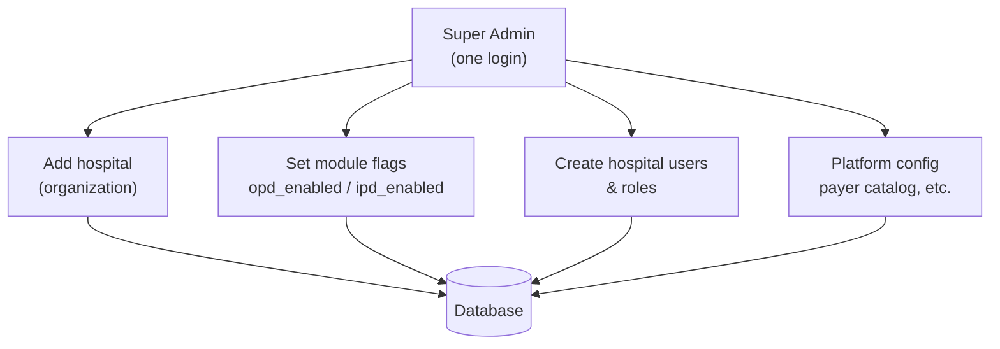
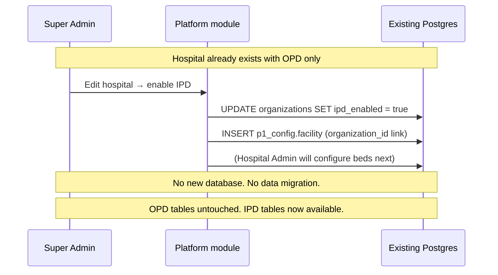
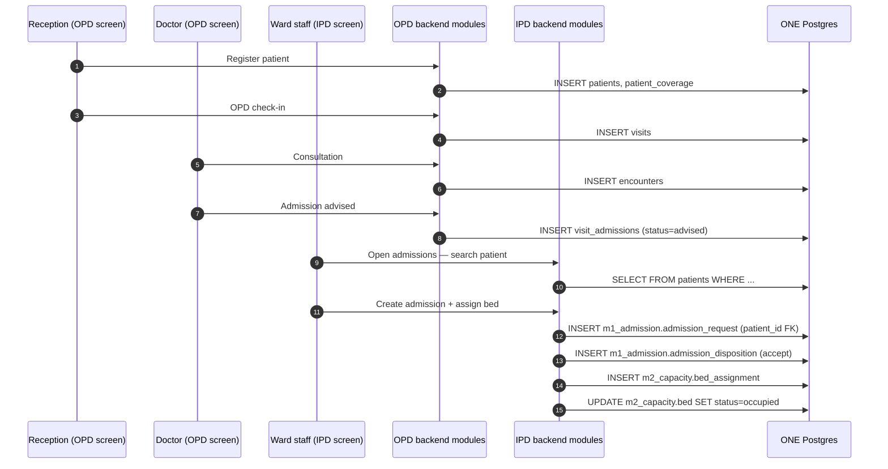
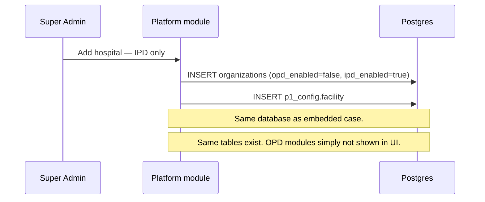
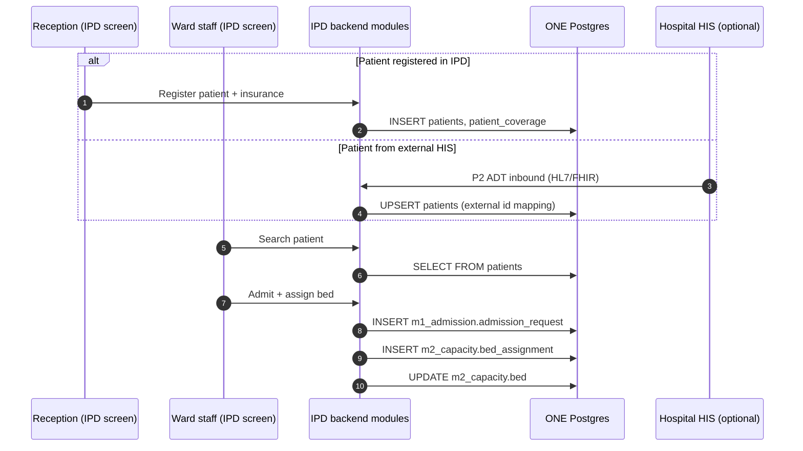

# flowMD Platform — Full Architecture (Super Admin → Country → OPD/IPD)

**Read order:** Start at Section 1 and read sequentially.  
**Principle:** ONE platform, ONE codebase, ONE database per country deployment.

---

# PART 1 — SUPER ADMIN (start here)

## 1.1 Who is Super Admin?

```text
flowMD Super Admin = flowMD company team (NOT hospital staff)

Role in code: super_admin (already exists in his-global-south)
Login:         ONE login — Better Auth (same as today)
Screen:        Platform admin — add hospitals, enable modules, manage users
```

Hospital Admin is different — they configure beds/wards inside one hospital, not add hospitals to the platform.

---

## 1.2 What Super Admin does



| Super Admin action | What gets saved | Table |
|--------------------|-----------------|-------|
| Add hospital | Hospital record | `organizations` |
| Enable OPD | Flag on hospital | `organizations.opd_enabled` |
| Enable IPD | Flag + IPD facility | `organizations.ipd_enabled` + `p1_config.facility` |
| Add users | Staff accounts | `auth.users`, `profiles`, `user_roles` |

**Phase 1:** Super Admin writes **directly to the same database** the hospital uses. No separate admin DB.

---

## 1.3 Super Admin — create hospital screen (concept)

```text
┌─────────────────────────────────────────────────────────┐
│  flowMD Super Admin — Add Hospital                       │
├─────────────────────────────────────────────────────────┤
│  Hospital name:  [ Nairobi General        ]            │
│                                                          │
│  Modules:                                                │
│    ☑ OPD enabled     ← existing flowMD (register, consult)│
│    ☑ IPD enabled     ← new inpatient (beds, admit)       │
│                                                          │
│  [ Save Hospital ]                                       │
└─────────────────────────────────────────────────────────┘
         │
         ▼
   Writes to ONE database (see Part 2)
```

When **both checked** → Embedded case (Part 3)  
When **only IPD checked** → Standalone case (Part 4)

---

# PART 2 — COUNTRY, DEPLOYMENT PROFILE & DATABASE

## 2.1 Three words — do not confuse

| Word | What it means | Example |
|------|---------------|---------|
| **Country / Deployment** | Where the server runs | Kenya server in Nairobi |
| **Deployment profile** | Market settings pack (rules) | Kenya = SHA, MoH reports |
| **Database** | Where all data is stored | One Postgres on that server |

```text
Country     =  WHERE server is
Profile     =  WHAT rules apply (settings)
Database    =  WHERE data lives

All three are linked at install time — not per hospital.
```

---

## 2.2 One country = one deployment = one database

```text
┌─────────────────────────────────────────────────────────────┐
│  KENYA DEPLOYMENT (Phase 1 — what we build first)            │
│                                                              │
│  Server:     Kenya (in-country hosting)                      │
│  Profile:    kenya-l5-v1  (settings for Kenya market)        │
│  Database:   ONE PostgreSQL — the "central DB" for Kenya   │
│                                                              │
│  Inside that ONE database:                                   │
│    • config_profile row   (Kenya settings)                   │
│    • Hospital A, B, C     (organizations)                  │
│    • All patients         (shared tables)                    │
│    • OPD data             (visits, clinical)                 │
│    • IPD data             (admissions, beds)                 │
└─────────────────────────────────────────────────────────────┘

┌─────────────────────────────────────────────────────────────┐
│  UAE DEPLOYMENT (later — same code, different install)       │
│                                                              │
│  Server:     UAE (sovereign hosting)                         │
│  Profile:    ahcg-uae-v1                                     │
│  Database:   ONE PostgreSQL — separate from Kenya            │
│                                                              │
│  Kenya data and UAE data are NOT in the same physical DB.   │
└─────────────────────────────────────────────────────────────┘
```

**Super Admin:** Still ONE login. Phase 1 = only Kenya exists. Phase 2 = admin UI can pick region when adding hospital (future).

---

## 2.3 Deployment profile — what is inside

Stored in database table `p1_config.config_profile` — **not a separate system**.

```text
config_profile row: kenya-l5-v1
{
  "payers": ["SHA", "cash"],
  "reports": ["moh_ipd_register"],
  "offline": { "enabled": true },
  "locale": "en-KE",
  "integrations": ["sha-mpi"]
}

config_profile row: ahcg-uae-v1
{
  "payers": ["private_insurance"],
  "authority_mode": "external_his",
  "integrations": ["generic-hl7-adt", "erp-export"]
}
```

App reads profile at startup → shows correct forms, reports, adapters. **No `if (kenya)` in code.**

---

## 2.4 Database structure (one Postgres per country)

```text
ONE POSTGRES (Kenya central DB)
│
├── EXISTING — already in his-global-south (REUSE)
│   ├── organizations          ← Super Admin creates hospitals here
│   ├── auth.users, profiles, user_roles
│   ├── patients               ← patient master (both OPD & IPD use this)
│   ├── patient_coverage       ← insurance / SHA
│   ├── visits, encounters     ← OPD
│   ├── visit_admissions       ← OPD doctor "advise admit"
│   ├── facilities, departments, units
│   └── rcm / claims           ← OPD billing
│
├── EXTEND existing
│   └── organizations          ← add opd_enabled, ipd_enabled columns
│
└── NEW — IPD schemas
    ├── p1_config.*            ← profile, facility, bed/billing categories
    ├── m1_admission.*         ← admission requests, disposition
    └── m2_capacity.*          ← beds, assignments
```

---

# PART 3 — EMBEDDED: OPD + IPD TOGETHER (introduce IPD to existing flowMD)

## 3.1 What "embedded" means

Hospital **already uses flowMD OPD**. We **add IPD** without replacing OPD.

```text
Super Admin sets:
  opd_enabled = true
  ipd_enabled = true

Hospital sees:
  OPD menus (register, consult)  +  IPD menus (admit, bed board)
  Same login for all staff
  Same database
```

---

## 3.2 How Super Admin introduces IPD to existing system



**Steps after Super Admin enables IPD:**

```text
1. Super Admin     → ipd_enabled = true, create p1_config.facility
2. Hospital Admin  → IPD Admin: bed categories, wards, beds
3. Ward staff      → IPD Admissions: admit patients, assign beds
4. Reception       → still uses OPD for registration (unchanged)
```

---

## 3.3 How OPD and IPD communicate (embedded)

**They do NOT talk over network or separate databases.**  
Same app, same Postgres — they share tables via foreign keys and internal API calls.

```text
┌─────────────────────────────────────────────────────────────────────┐
│                    flowMD APP (one process)                          │
│                                                                      │
│  ┌─────────────────────┐         ┌─────────────────────┐          │
│  │   OPD MODULES       │         │   IPD MODULES       │          │
│  │   (existing)        │         │   (new)             │          │
│  │                     │         │                     │          │
│  │  frontdesk          │         │  ipd-admin          │          │
│  │  clinical           │  read   │  ipd-admissions     │          │
│  │  rcm                │ ──────► │  ipd-beds           │          │
│  │                     │ patients│                     │          │
│  └──────────┬──────────┘         └──────────┬──────────┘          │
│             │                                │                      │
│             └────────────┬───────────────────┘                      │
│                          ▼                                          │
│              ┌───────────────────────┐                              │
│              │   ONE POSTGRES        │                              │
│              │                       │                              │
│              │  patients ◄───────────┼── IPD reads/writes patient_id│
│              │  visit_admissions ────┼──► IPD optional handoff link │
│              │  m1_admission         │                              │
│              │  m2_capacity          │                              │
│              └───────────────────────┘                              │
└─────────────────────────────────────────────────────────────────────┘
```

### Communication methods (embedded)

| From | To | How | What passes |
|------|-----|-----|-------------|
| OPD Register | IPD Admit | **Shared table** `patients` | `patient_id` (UUID) |
| OPD Consult | IPD Queue | **Shared table** `visit_admissions` | "doctor advised admit" flag |
| IPD Admit | OPD Patient | **SQL read** / internal GET patient API | name, coverage from `patients` |
| IPD Bed assign | — | **Write** `m2_capacity` only | bed status |

**No message queue required for Phase 1.** Optional event `admission.advised` later for real-time queue refresh.

---

## 3.4 Embedded — full patient journey with tables



### Table touch map — embedded journey

| Step | Module | API | Table | Read/Write |
|------|--------|-----|-------|------------|
| Register | OPD | `POST /api/frontdesk/patients` | `patients`, `patient_coverage` | WRITE |
| Check-in | OPD | `POST .../check-in` | `visits` | WRITE |
| Consult | OPD | clinical APIs | `encounters` | WRITE |
| Advise admit | OPD | `POST .../admissions` | `visit_admissions` | WRITE |
| Search patient | IPD | `GET /api/patients` | `patients` | READ |
| Create admission | IPD | `POST /api/ipd/admissions` | `m1_admission.*` | WRITE |
| Assign bed | IPD | `POST /api/ipd/beds/:id/assign` | `m2_capacity.*` | WRITE |

---

## 3.5 What OPD keeps vs what IPD adds (embedded)

```text
OPD KEEPS (unchanged):
  ✅ Patient registration
  ✅ OPD visits & consultation
  ✅ OPD billing / RCM
  ✅ Existing screens and workflows

IPD ADDS (new):
  ➕ Hospital admin: bed categories, billing categories, wards, beds
  ➕ Admission desk: accept admission, assign bed
  ➕ Bed board: live occupancy
  ➕ (later) discharge, IPD billing charges

SHARED (both use same rows):
  ↔ patients, patient_coverage, organizations, users
```

---

# PART 4 — STANDALONE IPD (no OPD app for hospital)

## 4.1 What "standalone" means

Hospital uses **IPD only**. OPD module is disabled.

```text
Super Admin sets:
  opd_enabled = false
  ipd_enabled = true

Hospital sees:
  IPD screens only (register, admin, admit, bed board)
  No OPD menus
  Same database structure — OPD tables exist but unused
```

Typical case: **UAE hospital with existing HIS** — IPD is operational layer for beds/admissions.

---

## 4.2 How Super Admin sets up standalone IPD



---

## 4.3 How standalone IPD communicates with "existing system"

**Important:** Standalone does NOT mean a separate database.  
It means **OPD UI is off**, but the platform still uses the **same Postgres** and **same patient tables**.

```text
┌─────────────────────────────────────────────────────────────────────┐
│                    IPD APP (hospital view)                             │
│                                                                      │
│  ┌─────────────────────────────────────────────────────────────┐    │
│  │  IPD Register  →  writes to patients, patient_coverage     │    │
│  │  IPD Admin     →  writes to p1_config, m2_capacity          │    │
│  │  IPD Admit     →  reads patients, writes m1_admission       │    │
│  └─────────────────────────────────────────────────────────────┘    │
│                          │                                           │
│                          ▼                                           │
│              ┌───────────────────────┐                                │
│              │   SAME POSTGRES     │                                │
│              │   (existing tables) │                                │
│              │                     │                                │
│              │  patients      ◄────┼── IPD register WRITES here     │
│              │  patient_coverage   │                                │
│              │  organizations      │                                │
│              │  m1_admission       │                                │
│              │  m2_capacity        │                                │
│              │                     │                                │
│              │  visits         (empty / unused)                     │
│              │  encounters     (empty / unused)                     │
│              └───────────────────────┘                                │
└─────────────────────────────────────────────────────────────────────┘
```

### Standalone vs external hospital HIS

If hospital **already has another system** (HIS/ERP), IPD connects via **P2 Integration adapters** — not by sharing the HIS database.

```text
Hospital HIS (external)          flowMD IPD (our Postgres)
        │                                  │
        │  HL7 / FHIR / REST               │
        └──────── P2 adapter ─────────────►│ patients (upsert)
                                           │ m1_admission (create from ADT)
                                           │
        ◄──────── P2 export ───────────────┤ m8_billing charges (later)
              ERP billing
```

**Standalone IPD does NOT connect directly to HIS database.** It receives messages via API/adapters.

---

## 4.4 Standalone — full patient journey with tables



### Table touch map — standalone journey

| Step | Screen | API | Table | Read/Write |
|------|--------|-----|-------|------------|
| Register | IPD | `POST /api/ipd/patients` | `patients`, `patient_coverage` | WRITE |
| Admin setup | IPD | `POST /api/ipd/admin/...` | `p1_config.*`, `m2_capacity.bed` | WRITE |
| Search | IPD | `GET /api/ipd/patients` | `patients` | READ |
| Admit | IPD | `POST /api/ipd/admissions` | `m1_admission.*` | WRITE |
| Assign bed | IPD | `POST /api/ipd/beds/:id/assign` | `m2_capacity.*` | WRITE |
| HIS sync (optional) | P2 | `POST /api/integration/adt/inbound` | `patients`, `m1_admission.*` | WRITE |

---

# PART 5 — SIDE BY SIDE COMPARISON

## 5.1 Super Admin view

| | Embedded | Standalone |
|--|----------|------------|
| `opd_enabled` | ✅ true | ❌ false |
| `ipd_enabled` | ✅ true | ✅ true |
| Super Admin action | Enable IPD on existing hospital | Create IPD-only hospital |
| New DB? | ❌ No | ❌ No |

## 5.2 Patient registration

| | Embedded | Standalone |
|--|----------|------------|
| Who registers | OPD frontdesk | IPD register screen |
| API | `/api/frontdesk/patients` | `/api/ipd/patients` (same service inside) |
| Table | `patients` | **Same** `patients` |

## 5.3 Admission

| | Embedded | Standalone |
|--|----------|------------|
| Doctor advises | OPD → `visit_admissions` | N/A |
| Admit | IPD → `m1_admission` | IPD → `m1_admission` |
| Patient link | `patient_id` FK | **Same** `patient_id` FK |
| Bed assign | IPD → `m2_capacity` | **Same** |

## 5.4 Database

| | Embedded | Standalone |
|--|----------|------------|
| Database count | 1 Postgres | 1 Postgres |
| OPD tables used | Yes | No (empty) |
| IPD tables used | Yes | Yes |
| Patient table | Shared | Shared |

---

# PART 6 — FULL SYSTEM DIAGRAM

```text
                         flowMD SUPER ADMIN
                         (one login, one portal)
                                  │
                                  ▼
                    ┌─────────────────────────┐
                    │  Add / edit hospital     │
                    │  opd_enabled             │
                    │  ipd_enabled             │
                    └────────────┬────────────┘
                                 │
         ┌───────────────────────┼───────────────────────┐
         │                       │                       │
         ▼                       ▼                       ▼
   ┌───────────┐         ┌───────────┐         ┌───────────┐
   │  KENYA    │         │  UAE      │         │  GLOBAL   │
   │  deploy   │         │  deploy   │         │  deploy   │
   │  (Phase1) │         │  (later)  │         │  (later)  │
   └─────┬─────┘         └─────┬─────┘         └─────┬─────┘
         │                     │                     │
         ▼                     ▼                     ▼
   Kenya Postgres         UAE Postgres          Global Postgres
   profile:kenya          profile:uae           profile:global
         │                     │                     │
         └─────────────────────┴─────────────────────┘
                    (separate physical DBs per country)

   Inside EACH Postgres:
   ┌─────────────────────────────────────────────────────────┐
   │  organizations (+ opd_enabled, ipd_enabled)               │
   │  patients, patient_coverage, users        ← SHARED       │
   │  visits, encounters, visit_admissions       ← OPD (if on)  │
   │  p1_config.*, m1_admission.*, m2_capacity.* ← IPD (if on)  │
   └─────────────────────────────────────────────────────────┘
              ▲                              ▲
              │                              │
     EMBEDDED: OPD + IPD screens     STANDALONE: IPD screens only
     same DB, both modules           same DB, OPD hidden
```

---

# PART 7 — TABLES SUMMARY

## REUSE from existing his-global-south (no recreate)

`organizations`, `patients`, `patient_coverage`, `auth.users`, `profiles`, `user_roles`, `module_permissions`, `visits`, `encounters`, `visit_admissions`, `facilities`, `departments`, `units`, RCM tables, payer catalog

## EXTEND

`organizations` → add `opd_enabled`, `ipd_enabled`, `config_profile_id`

## CREATE NEW (IPD)

`p1_config.config_profile`, `p1_config.facility`, `p1_config.bed_category`, `p1_config.billing_category`, `m1_admission.admission_request`, `m1_admission.admission_disposition`, `m2_capacity.bed`, `m2_capacity.bed_assignment`

---

# PART 8 — WHAT EXISTS TODAY vs TO BUILD

| Item | Today | To build |
|------|-------|----------|
| Super Admin + organizations | ✅ | Extend with IPD flags |
| OPD modules | ✅ | Keep as-is |
| patients table | ✅ | Reuse |
| config_profile | ❌ | Create |
| IPD modules (admin, admit, beds) | ❌ | Create |
| opd_enabled / ipd_enabled | ❌ | Add columns |
| Standalone IPD register screen | ❌ | Create (wraps patient service) |
| P2 HIS adapters | ❌ | Phase 2 |

---

# PART 9 — GLOSSARY

| Term | Meaning |
|------|---------|
| Super Admin | flowMD platform admin — adds hospitals |
| Embedded | OPD + IPD both enabled for a hospital |
| Standalone | IPD only — OPD disabled for that hospital |
| Deployment profile | Country/market settings (`config_profile` row) |
| Central DB | One Postgres per country deployment |
| Communication | Same-app REST + shared tables (FK) — not separate DB sync |
