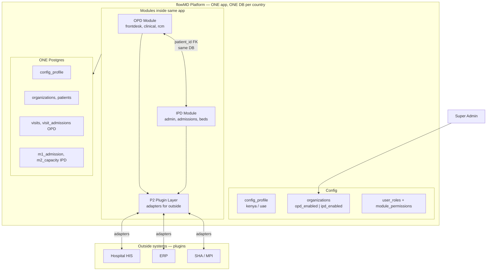
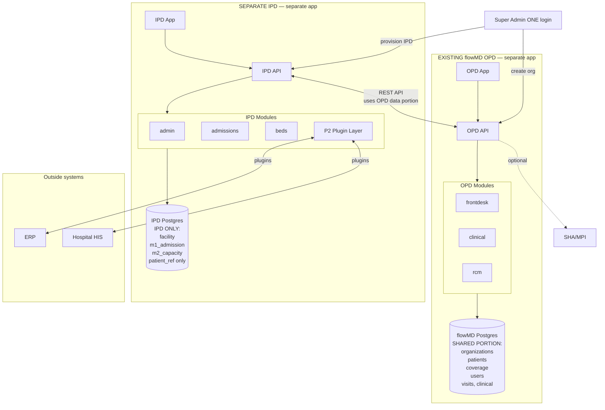
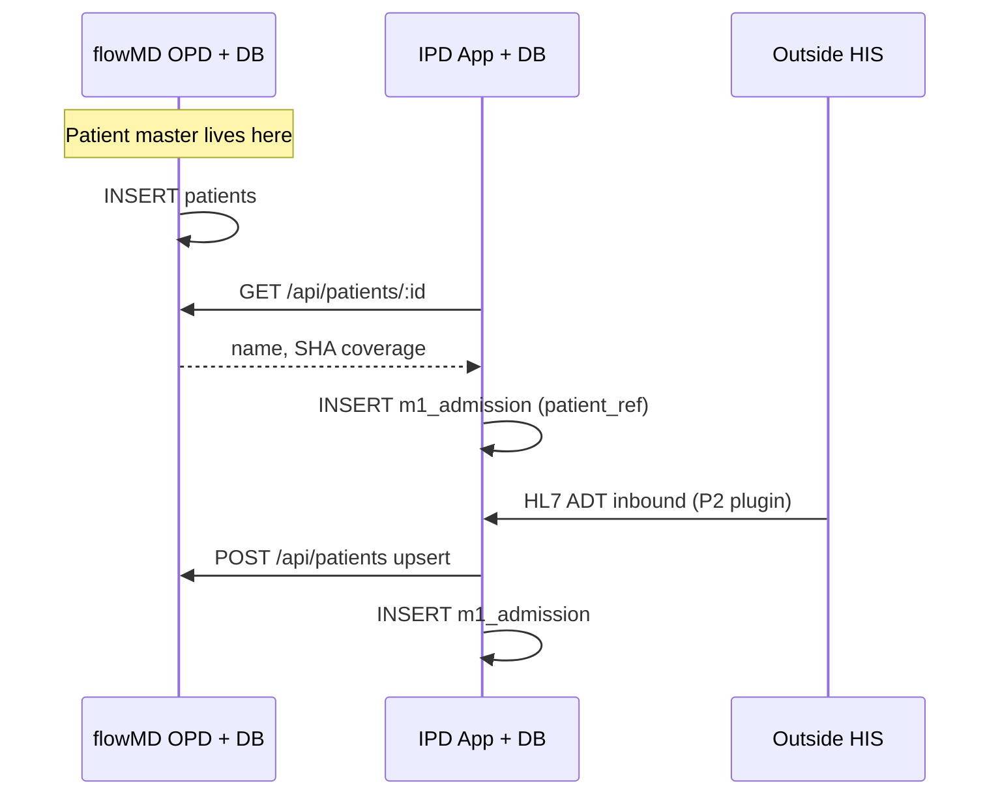
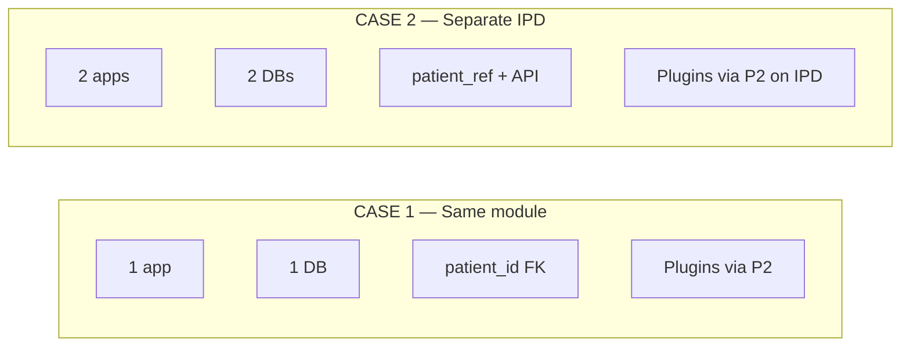
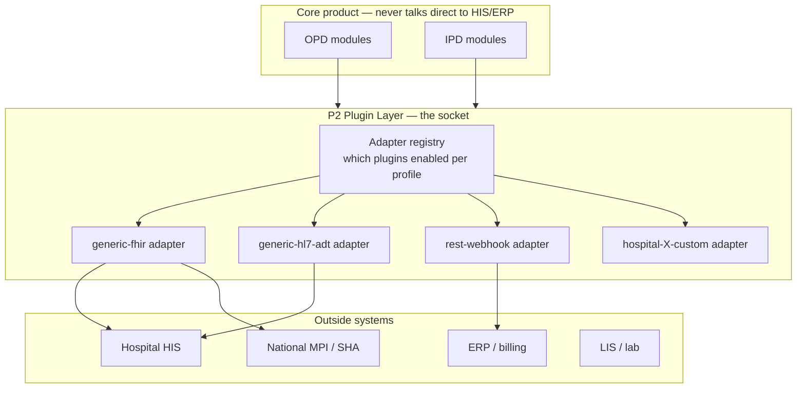

# flowMD × IPD — Two Cases + External Plugins

> **LOCKED (2026-08-19):** Phase 1 uses **Case 1 only** — IPD embedded in `his-global-south`. Case 2 deferred.  
> Architecture: [his-global-south.md](his-global-south.md)

Answers:
1. **Case 1** — OPD + IPD **same module/app/DB**
2. **Case 2** — OPD flowMD **separate**, IPD **separate**, uses **part of OPD data** (patients, org) via API
3. **Can unified system still plug into outside systems?** → **Yes** — P2 plugin/adapters

---

# CASE 1 — OPD + IPD TOGETHER (same module, same database)

## What this means

```text
ONE codebase (his-global-south extended)
ONE app (hospital sees OPD + IPD menus based on flags)
ONE Postgres per country (Kenya, UAE each own copy)
OPD and IPD = modules inside same backend — NOT separate servers
```

## Architecture diagram



## Communication (Case 1)

| From | To | How |
|------|-----|-----|
| OPD Register | IPD Admit | Same `patients` table — **FK** |
| OPD Advise admit | IPD Queue | Same `visit_admissions` table or internal event |
| IPD | Patient name | **SQL read** — no API |
| App | Outside HIS/ERP | **P2 plugin adapters** |

## Embedded (Case 1)

```text
opd✅ ipd✅
  Reception → OPD register → patients
  Doctor    → OPD consult  → visit_admissions
  Ward      → IPD admit    → m1_admission (patient_id FK)
```

## Standalone IPD within Case 1 (OPD off, same DB)

```text
opd❌ ipd✅
  Reception → IPD register → patients (same table, OPD UI hidden)
  Ward      → IPD admit    → m1_admission
  visits/encounters tables = empty
```

## Tables (Case 1)

| REUSE existing | NEW IPD | EXTEND |
|----------------|---------|--------|
| organizations, patients, users, visits, clinical, rcm | p1_config, m1_admission, m2_capacity | organizations + flags |

---

# CASE 2 — OPD flowMD separate, IPD separate (uses OPD data portion)

## What this means

```text
TWO codebases:  his-global-south (OPD)  +  projects/ipd (IPD)
TWO Postgres per country: flowMD DB + IPD DB
IPD does NOT copy full patient master — uses flowMD DB portion via API
Link: patient_ref, flowmd_organization_id (UUID, not cross-DB FK)
```

## Architecture diagram



## What IPD uses from OPD database (via API — not direct DB access)

| OPD data (flowMD DB) | IPD uses it for | IPD stores |
|----------------------|-----------------|------------|
| `organizations` | Hospital identity, flags | `flowmd_organization_id` on facility |
| `patients` | Register, search, admit | **`patient_ref` only** (UUID) |
| `patient_coverage` | Insurance display | fetch via API, not copy |
| `users` / auth (embedded) | Same login JWT | no copy |
| `visit_admissions` | Embedded handoff | optional link id |

| IPD owns (IPD DB only) | |
|------------------------|--|
| `p1_config.facility`, bed/billing categories | |
| `m1_admission.*` | |
| `m2_capacity.*` | |
| `config_profile` | aligned copy |

## Communication (Case 2)



### Embedded (Case 2)

```text
OPD register     → flowMD DB patients
OPD advise admit → flowMD DB visit_admissions → event → IPD
IPD admit        → IPD DB m1 (patient_ref) + API fetch patient
```

### Standalone (Case 2)

```text
IPD register UI  → POST flowMD /api/patients  → flowMD DB
IPD admit        → IPD DB only + patient_ref
OR
Hospital HIS     → P2 plugin → IPD → optional sync to flowMD patients API
```

---

# CASE 1 vs CASE 2 — side by side



| | Case 1 — Together | Case 2 — Separate IPD |
|--|-------------------|------------------------|
| Code | One repo | OPD repo + IPD repo |
| DB per country | **1** Postgres | **2** Postgres |
| Patient master | `patients` table, FK | flowMD DB; IPD `patient_ref` |
| OPD ↔ IPD | Internal modules / SQL | **REST API** |
| OPD data portion for IPD | Whole same DB | **patients, org, coverage, users** via API |
| Kenya/UAE | Separate stack each | Separate stack each |
| Phase 1 Kenya | **Simpler** | More work |

---

# PLUGINS FOR OUTSIDE SYSTEMS — both cases?

## Short answer: **YES — both cases support plugins**

Combining OPD + IPD (Case 1) does **NOT** block external integrations.  
LLD **P2 Integration** = plugin layer. Works in unified monolith **and** separate IPD.

## Plugin architecture (same idea both cases)



## How plugins work

```text
1. config_profile lists enabled adapters:
     kenya-l5-v1:  [sha-mpi, generic-fhir]
     ahcg-uae-v1:  [generic-hl7-adt, erp-export]

2. Domain module needs external data:
     M1 admission ← P2.inboundAdt()     ← never calls HIS URL directly

3. New hospital system:
     Write new adapter plugin → register in P2
     Core OPD/IPD code unchanged
```

## Plugin examples

| Outside system | Plugin direction | Case 1 (unified) | Case 2 (separate IPD) |
|----------------|------------------|:----------------:|:-----------------------:|
| Hospital HIS ADT | Inbound → admission | P2 in same app | P2 in IPD app |
| ERP billing | Outbound ← charges | P2 in same app | P2 in IPD app |
| SHA patient lookup | Inbound → patients | P2 → patients table | P2 → flowMD API |
| Standalone IPD + HIS only | HIS → IPD | opd off, P2 on | Natural fit |

## Can unified (Case 1) behave like standalone for UAE?

**Yes:**

```text
organizations: opd_enabled=false, ipd_enabled=true
P2 plugins: generic-hl7-adt, erp-export
Patient: from HIS plugin OR IPD register → patients table
```

You get standalone **behaviour** without separate repo — flags + plugins.

## When you still want Case 2 (separate IPD repo)

| Reason | |
|--------|--|
| Contract requires **physically separate IPD database** | Case 2 |
| IPD team deploys **on different release cycle** | Case 2 |
| Sovereign hosting — IPD VM isolated from OPD | Case 2 |
| Kenya embedded OPD+IPD pilot | **Case 1 simpler** |

---

# RECOMMENDATION

```text
Phase 1 Kenya (OPD + IPD embedded):
  → CASE 1 unified
  → Build P2 plugin layer from day 1 (generic HL7/FHIR)
  → Standalone + external HIS = config + plugins, not new product

UAE / sovereign later:
  → CASE 1 with opd off + HIS plugins
  OR
  → CASE 2 if contract mandates separate IPD DB/server
  → Plugins work the same way on IPD side
```

---

# ONE DIAGRAM — everything together

```text
                         SUPER ADMIN
                              │
              ┌───────────────┴───────────────┐
              ▼                               ▼
     CASE 1: KENYA unified          CASE 2: KENYA separate
     ┌──────────────────┐           ┌──────────┐  ┌──────────┐
     │ OPD+IPD one app  │           │ OPD app  │  │ IPD app  │
     │ one Postgres     │           │ flowMD DB│  │ IPD DB   │
     │ P2 plugins ──────┼───┐       │ patients │◄─┤ API      │
     └──────────────────┘   │       └──────────┘  └────┬─────┘
                            │                          │
                            ▼                          ▼
                     ┌─────────────────────────────────────┐
                     │  OUTSIDE: HIS, ERP, SHA, LIS        │
                     │  connected via P2 PLUGIN ADAPTERS   │
                     │  (works in BOTH cases)              │
                     └─────────────────────────────────────┘
```
