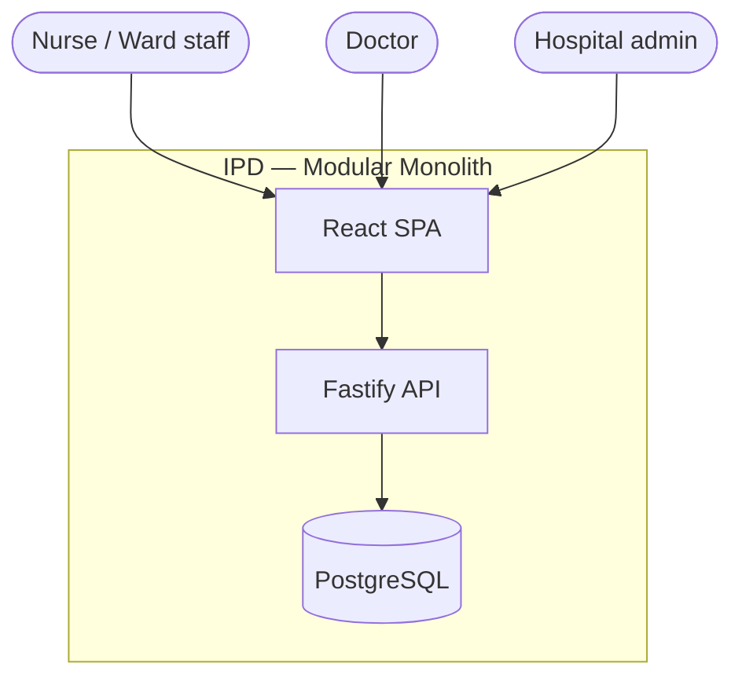

# IPD Architecture

In-patient department (IPD) — staff-facing web app for hospital admission, bed management, and discharge workflows.

| Item | Value |
|------|--------|
| Clone | `projects/ipd/` |
| Remote | https://github.com/rahulrinfinia/IPD.git |
| Pattern | Modular monolith — React SPA + Fastify API |
| Database | PostgreSQL 16 |
| Auth | Better Auth (session cookies) — [ADR 0002](../decisions/ipd/0002-better-auth-session-auth.md) |

---

## C4 Level 1 — System context

**External systems (future):** EMR, lab, billing — integrate via dedicated modules or ADR when scoped.

---

## C4 Level 2 — Containers

| Container | Path | Deploy |
|-----------|------|--------|
| Frontend | `src/` | Static SPA / CDN — [ADR 0003](../decisions/ipd/0003-path-based-deploy-split.md) |
| API | `backend/` | Node container |
| Database | Postgres | Managed or docker-compose dev |

One git repo, **two deploy artifacts** (path-based CI).

---

## Domain modules (vertical slices)

Frontend and backend **must use the same domain names**:

| Domain | Backend | Frontend | Purpose |
|--------|---------|----------|---------|
| platform | `modules/platform/` | `features/health/` (expand) | Health, audit, auth helpers |
| patients | `modules/patients/` | `features/patients/` | Patient demographics (PHI) |
| admissions | `modules/admissions/` | `features/admissions/` | Admit, transfer, discharge |
| beds | `modules/beds/` | `features/beds/` | Bed board, occupancy |

See [folder-structure](../conventions/folder-structure.md) for file roles per module.

**v1 scope:** tracer bullet on admissions (UI → API → DB). Other domains stubbed until sliced.

---

## Data (high level)

| Entity | Owner module | Notes |
|--------|--------------|-------|
| patients | patients | PHI — audit on read/write [ADR 0004](../decisions/ipd/0004-audit-logging-for-phi-access.md) |
| admissions | admissions | Links patient ↔ ward/bed |
| beds / wards | beds | Occupancy state |
| audit_events | platform | Append-only |
| users / sessions | platform (auth) | Better Auth |

Detailed schema lives in migrations + feature technical designs — not in this doc.

---

## API

- Base: `/api`
- Wire format: snake_case JSON — [api-design](../conventions/api-design.md)
- Errors: standard envelope
- Auth: session cookie on all non-public routes

Contracts per resource: `docs/contracts/ipd/` (add as modules ship).

---

## Security & compliance

- [HIPAA conventions](../conventions/hipaa.md) for PHI
- Minimum necessary fields in API responses
- Audit log for PHI access — [ADR 0004](../decisions/ipd/0004-audit-logging-for-phi-access.md)
- No PHI in logs or client storage

---

## Architecture decisions

| ADR | Decision |
|-----|----------|
| [0001](../decisions/ipd/0001-postgres-primary-data-store.md) | PostgreSQL, hand-written SQL |
| [0002](../decisions/ipd/0002-better-auth-session-auth.md) | Better Auth + httpOnly cookies |
| [0003](../decisions/ipd/0003-path-based-deploy-split.md) | Path-based FE/BE deploy |
| [0004](../decisions/ipd/0004-audit-logging-for-phi-access.md) | Audit log for PHI |

---

## Related docs

| Doc | Path |
|-----|------|
| Service discovery | [services/ipd.md](../services/ipd.md) |
| User journeys | [journeys/ipd/](../journeys/) _(add as features land)_ |
| PRD / features | [prd/](../../prd/) |
| Coding standards | [conventions/](../conventions/) |

---

## Non-goals (v1)

- Multi-hospital tenancy (defer — new ADR if needed)
- Native mobile apps
- Real-time bed sync with external EMR
- Microservice split

---

## When to update this doc

- New domain module added
- New external integration
- ADR accepted that changes boundaries
- After `drift ipd` reports architecture mismatch

Do **not** duplicate slice-level detail here — keep that in `specs/features/ipd/`.
