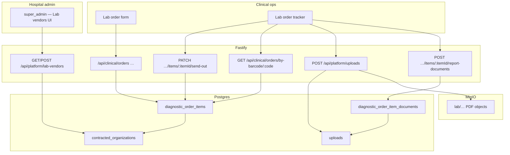

# Technical Design: Lab send-out — outsourced vendors, barcode, report intake

| Field | Value |
|-------|--------|
| **Project** | `his-global-south` |
| **Feature** | `lab-send-out-vendors` |
| **PRD** | [prd.md](./prd.md) |
| **Target repo** | `projects/his-global-south/` @ `develop` |
| **Status** | Draft — **Gate G2 pending** (product + engineering review) |
| **Date** | 2026-08-31 |
| **Coding rules** | [HIS-CODING-RULES-COMPLETE.md](../../../docs/conventions/HIS-CODING-RULES-COMPLETE.md), hub `.cursor/rules/*.mdc`, clone `.cursor/rules/*.mdc` |

---

## 1. Design summary

Extend **existing** clinical diagnostic orders and platform **contracted organizations** — no standalone LIS module.

| Area | Today | After |
|------|-------|-------|
| Vendor master | `contracted_organizations` + `/api/platform/contracted-organizations` API; weak validation; **no `super_admin` gate**; incomplete UI | Lab-vendor CRUD with PRD validation; **`super_admin` only** for writes; list readable by org clinical roles |
| Send-out flag | `diagnostic_order_items.refer_out` persisted; catalog never sets `refer_out` enrollment | Order/create resolves send-out; **`vendor_id` required** when `refer_out` |
| Fulfilment tracking | Order-level `diagnostic_orders.status` only (`pending`…`cancelled`) | **Item-level** `send_out_status` pipeline for outsourced lines |
| Barcode | None | Unique `specimen_barcode` per send-out line + print + lookup API |
| Report PDF | Platform uploads exist (RCM); no link to order items | Upload → link table → view from lab tracker |

**Implement on:** `projects/his-global-south/` (backend + frontend). Reference clone with full orders backend: `projects/his-global-south-pr51/`.

---

## 2. System context



---

## 3. Architecture decisions

### AD-1 — Extend clinical orders + platform provider master; no new top-level module

**Choice:** Vendor master lives under `backend/src/modules/platform/providerMaster/` (or a focused `labVendors/` subfolder). Send-out fulfilment, barcode, and report documents live under `backend/src/modules/clinical/orders/`.

**Why:** PRD lock; `refer_out` and orders UI already exist. A separate `lis/` module would duplicate auth, org scope, and encounter linkage.

**Not chosen:** Greenfield Laboratory product or portable root split (`src/lis/` + thin `modules/lis/index.ts` re-export).

---

### AD-2 — Reuse `contracted_organizations` with `org_type = laboratory`

**Choice:** No new `lab_vendors` table in v1. Filter and validate contracted org rows where `org_type = 'laboratory'`.

**Why:** Table, FK patterns, document upload (`provider_documents`), and list API already exist in pr51.

**Implement note:** Add platform constants for contracted org types and statuses (today some are raw strings in service). CHECK values in pgschema remain source of truth; mirror as `CONTRACTED_ORG_TYPE`, `CONTRACTED_ORG_STATUS` in `platform.constants.ts` + `*_VALUES` arrays.

---

### AD-3 — Item-level `send_out_status`; do not overload `diagnostic_orders.status`

**Choice:** New column `diagnostic_order_items.send_out_status` (nullable; only set when `refer_out = true`). Parent order `status` continues to reflect overall order lifecycle (`pending`, `collected`, `processing`, `completed`, `cancelled` per DB CHECK).

**Why:** Send-out pipeline is per test line; radiology and in-house lab lines on the same order must not share a single send-out state. Avoids breaking existing result-entry flow.

**Constants:** Add to `clinical.constants.ts`:

```typescript
export const SEND_OUT_STATUS = {
  PENDING_COLLECTION: 'pending_collection',
  SENT_TO_VENDOR: 'sent_to_vendor',
  AWAITING_REPORT: 'awaiting_report',
  REPORT_RECEIVED: 'report_received',
  COMPLETED: 'completed',
} as const;

export const SEND_OUT_STATUS_VALUES = [ /* … */ ] as const;
```

CHECK constraint via migration + `textInArrayCheck` in pgschema (never bind CHECK literals with `${value}` inside `` sql` ``).

**Also:** Extend `ORDER_STATUS` / `ORDER_STATUSES` in `clinical.constants.ts` to include DB values `collected` and `processing` (today constants are narrower than DB — fix in Slice 2 to prevent drift).

---

### AD-4 — `super_admin` gate for vendor CRUD in service layer

**Choice:** New dedicated routes `/api/platform/lab-vendors` delegate to service functions that call `assertSuperAdmin(userId)` (same pattern as `postPersonnel` / screening platform-admin checks). Reads (list/get) use `withOrgAuth` only.

**Why:** PRD; existing contracted-org routes only use `withOrgAuth` — insufficient for PRD US-A1.

**Not chosen:** RLS-only enforcement (hard to test; inconsistent with rest of platform module).

**`platform_admin`:** Explicit **403** if caller has only `platform_admin` and no hospital `super_admin` in the session org — they must not manage tenant vendor lists.

---

### AD-5 — Vendor assignment at order submit

**Choice:** When creating/updating lab order items with `refer_out = true`, require `vendor_id` (UUID FK → `contracted_organizations.id`) in the same request. Validate vendor belongs to caller org, `org_type = laboratory`, `active = true`, `status = active`.

**Why:** PRD default for open question #2.

**Service validation error:** `422` with code `VENDOR_REQUIRED_FOR_SEND_OUT` or `INVALID_LAB_VENDOR`.

---

### AD-6 — Barcode format and generation

**Choice:** On first print/generate action, set `specimen_barcode` if null:

```text
{LAB_CODE}-{YYYYMMDD}-{6-char base32 from item id}
```

Example: `CITYLAB-20260831-A1B2C3`. `LAB_CODE` = vendor `code` (uppercase). Unique index on `specimen_barcode` where not null.

**Why:** Human-readable on requisition; scannable Code128/QR in print template. No external barcode service in v1.

**Lookup:** `GET /api/clinical/orders/by-barcode/:code` → order item + parent order summary (org-scoped).

---

### AD-7 — PDF reports: platform upload + junction table (append history)

**Choice:**

1. Client `POST /api/platform/uploads` with `category = lab_result` (add to upload category constants).
2. Client `POST /api/clinical/orders/items/:itemId/report-documents` with `{ upload_id, notes? }`.
3. Insert into new `diagnostic_order_item_documents` (multiple rows per item allowed — PRD open Q3 default: **append with history**).

**Why:** Reuses MinIO + `uploads` row pattern from RCM/provider master. Keeps clinical linkage out of generic `uploads` table.

**Storage key prefix:** `lab/` (not `rcm/`) in upload service — parameterise by category in existing `createUpload()` or pass category through unchanged if key already includes category segment.

---

### AD-8 — Backend computes list/tracker fields (no frontend heavy lifting)

**Choice:** List and detail order endpoints return per item (when `refer_out`):

- `vendor_id`, `vendor_name`, `vendor_code` (join `contracted_organizations`)
- `send_out_status`, `specimen_barcode`
- `sent_to_vendor_at`, `report_received_at`
- `latest_report_document_id` / `has_report_pdf` (subquery or lateral join)

**Why:** Workspace rule `no-frontend-heavy-lifting.mdc` and PR #47 bar — list and detail shapes must match.

---

### AD-9 — Fastify schemas on every route (PR review bar)

**Choice:** All new/changed routes define `schema.params`, `schema.querystring`, `schema.body`, and **`schema.response`** for success **and** every error status the handler returns (`400`, `403`, `404`, `409`, `422`, `500` as applicable).

**AJV `errorMessage`:** Title Case labels (`Lab Name`, `Vendor Id`, `Address Line 1`) — not snake_case keys.

**UUID fields:** `format: 'uuid'` on params and body — not `minLength: 1`.

**Reference:** `screening/definitions/definitions.schema.ts` (`definitionIdParamsSchema`), platform-admin-hospitals response schemas.

---

### AD-10 — Frontend module layout (constants, hooks, thin pages)

**Choice:**

| Layer | Path |
|-------|------|
| API paths | `src/platform/constants/labVendors.ts` + `src/clinical/constants/orders.ts` (send-out statuses) |
| Types | `src/platform/types/labVendors.types.ts`, extend `src/clinical/types/orders.types.ts` |
| Services | `src/services/labVendors.service.ts`; extend `src/services/orders.service.ts` |
| Hooks | `src/hooks/queries/useLabVendors.ts`, extend order hooks |
| Pages | `src/pages/orgSetup/LabVendorsPage.tsx` or section under org setup |
| Tracker/form | Extend `src/components/orders/LabOrderForm.tsx`, `LabOrderTracker.tsx` |
| Print | Extend existing `print.ts` / label pattern from `LabOrderForm` |

**Rules:** camelCase in TS; snake on wire via `api` client. Query keys from `queryKeys` factory only. Lazy routes in `appRoutes.tsx`. `RequireRole` / `usePermissions().isSuperAdmin` for vendor admin UI.

**Not chosen:** Constants inside page folders; ad-hoc `useQuery` in pages; client-side vendor name resolution from a separate vendor list fetch on every tracker row.

---

### AD-11 — Standard error envelope + domain error codes

**Choice:** All non-2xx responses use the repo error envelope (`error.code`, `error.message`, `error.details`). Domain codes live in `labVendors.constants.ts` / `orders.constants.ts` (or `clinical.constants.ts`):

```typescript
export const LAB_VENDOR_ERROR = {
  VENDOR_REQUIRED_FOR_SEND_OUT: 'vendor_required_for_send_out',
  INVALID_LAB_VENDOR: 'invalid_lab_vendor',
  DUPLICATE_LAB_CODE: 'duplicate_lab_code',
  CONTACT_REQUIRED: 'contact_required',
} as const;
```

Map to HTTP: `422` → `validation_error`, `403` → `forbidden`, `409` → `conflict`. **No PHI** in `message` (patient name, report text).

**Reference:** `docs/conventions/api-design.md` Part H.

---

### AD-12 — Paginated list responses include `total`

**Choice:** `GET /api/platform/lab-vendors` and extended `GET /api/clinical/orders` return:

```json
{ "items": [], "total": 0, "limit": 50, "offset": 0 }
```

Count via SQL (`count(*)` or window) in service — **not** client-side `.length` after fetching all rows.

**Why:** PR #47 integration schema validation; `no-frontend-heavy-lifting` rule.

---

### AD-13 — PHI audit on report access (ADR 0004)

**Choice:** Emit audit events (existing audit pattern) when:

- User opens/downloads a lab result PDF (signed URL issued or report-documents list returned with URLs)
- User views barcode lookup result containing patient identifiers

Log **that access occurred** (user id, org id, resource type/id, action) — **not** file contents or patient name in the log body.

**Reference:** `docs/decisions/his-global-south/0004-audit-logging-for-phi-access.md`, `docs/conventions/hipaa.md`.

---

### AD-14 — Encounter / patient org validation on order mutations

**Choice:** Before create/update/send-out on diagnostic orders, validate `encounter_id` and `patient_id` belong to caller's `organization_id` (same pattern as screening `assertPatientInOrg` / existing order service guards). Return `404` or `422` with safe message — not 500 on cross-org FK.

**Why:** PR #51 review lesson; prevents cross-tenant data leaks.

---

### AD-15 — Suspended hospital + auth middleware chain

**Choice:** All routes use `{ preHandler: [...withOrgAuth] }` which includes **`rejectSuspendedHospital`** for non–platform-admin users. Role-gated routes add `withOrgAndRoles(LAB_ROLES)` or service-layer `assertSuperAdmin`.

**Why:** PR #47 — mock orgs must `active: true` in integration tests or 403.

---

## 4. Data model

> **Schema-first (mandatory):** Edit `*.pgschema.ts` → `npm run db:generate` → review → add `NNN_*.sql`. Section 4.2 SQL is **illustrative**; the pgschema file is the source of truth. Every migration includes `COMMENT ON TABLE/COLUMN` (`schema-comments.mdc`).

### 4.1 Existing tables (unchanged structure, extended use)

**`contracted_organizations`** — vendor master rows with `org_type = 'laboratory'`. No new columns required for v1 (optional compliance fields already exist).

**`diagnostic_order_items`** — add columns (migration `NNN_lab_send_out_columns.sql`):

| Column | Type | Notes |
|--------|------|-------|
| `vendor_id` | uuid NULL FK → `contracted_organizations.id` | Required in service when `refer_out` |
| `send_out_status` | text NULL | CHECK ∈ `SEND_OUT_STATUS_VALUES`; NULL when not refer_out |
| `specimen_barcode` | text NULL | UNIQUE partial index WHERE NOT NULL |
| `sent_to_vendor_at` | timestamptz NULL | |
| `sent_to_vendor_by` | uuid NULL FK → `profiles.id` | |
| `report_received_at` | timestamptz NULL | Set on first PDF link or manual mark |

### 4.2 New table — `diagnostic_order_item_documents`

```sql
CREATE TABLE public.diagnostic_order_item_documents (
  id uuid PRIMARY KEY DEFAULT gen_random_uuid(),
  organization_id uuid NOT NULL REFERENCES public.organizations(id) ON DELETE CASCADE,
  diagnostic_order_item_id uuid NOT NULL REFERENCES public.diagnostic_order_items(id) ON DELETE CASCADE,
  upload_id uuid NOT NULL REFERENCES public.uploads(id) ON DELETE RESTRICT,
  received_via text NOT NULL DEFAULT 'upload'
    CHECK (received_via = ANY (ARRAY['upload'::text, 'manual'::text, 'email'::text])),
  notes text,
  uploaded_by uuid REFERENCES public.profiles(id) ON DELETE SET NULL,
  created_at timestamptz NOT NULL DEFAULT now()
);

CREATE INDEX idx_doid_item ON public.diagnostic_order_item_documents (diagnostic_order_item_id, created_at DESC);
```

RLS: org isolation via join to `diagnostic_order_items` → `diagnostic_orders.organization_id` (same pattern as order items policy).

**Migration hygiene:** `COMMENT ON TABLE/COLUMN` per project convention; update pgschema mirrors; `npm run db:generate` review.

### 4.3 Optional later (Slice 2+) — org setting

**`organizations.has_in_house_lab`** boolean default `true` — deferred per PRD; when `false`, catalog resolve may default new lab lines to `refer_out`. Not in Slice 1 migration.

---

## 5. API

Base paths defined once in constants (PR #50 — no repeated path strings in `*.routes.ts`):

- `LAB_VENDORS_API_BASE = '/api/platform/lab-vendors'` in `labVendors/labVendors.constants.ts`
- `ORDERS_API_BASE = '/api/clinical/orders'` in `clinical.constants.ts` (introduce when touching `orders.routes.ts`; build every orders path from it)

### 5.1 Lab vendors (Slice 1)

| Method | Path | Auth | Purpose |
|--------|------|------|---------|
| GET | `/api/platform/lab-vendors` | `withOrgAuth` | List active/inactive lab vendors for org. Query: `search`, `active`, `limit`, `offset`. |
| POST | `/api/platform/lab-vendors` | `withOrgAuth` + **`assertSuperAdmin`** | Create vendor (`org_type` forced server-side). |
| GET | `/api/platform/lab-vendors/:id` | `withOrgAuth` | Detail + optional documents list. |
| PUT | `/api/platform/lab-vendors/:id` | `withOrgAuth` + **`assertSuperAdmin`** | Update vendor fields. |
| PATCH | `/api/platform/lab-vendors/:id/status` | `withOrgAuth` + **`assertSuperAdmin`** | Activate/deactivate (`active` + `status`). |

**POST body (required fields enforced in service + schema):**

```json
{
  "name": "City Diagnostics Pvt Ltd",
  "code": "CITYLAB",
  "contact_phone": "+91…",
  "contact_email": null,
  "contact_name": "…",
  "address": { "line1": "…", "city": "…", "state": "…", "postal_code": "…" },
  "registration_number": null,
  "notes": null
}
```

**Responses:** `{ id, name, code, org_type, contact_*, address, status, active, created_at, … }` — snake_case.

**Errors:**

| Status | When |
|--------|------|
| 403 | Not `super_admin` on write |
| 409 | Duplicate `code` per org |
| 422 | Missing name/code; missing phone AND email; missing address line1/city |

**Implementation:** Thin wrapper over `createContractedOrganization` / update helpers with `org_type = CONTRACTED_ORG_TYPE.LABORATORY`, `status = active`, stricter validation. Can live in `labVendors.service.ts` (focused file name per PR #50 — no `providerMaster.labVendors.ts` prefix).

### 5.2 Orders — send-out extensions (Slice 2)

**Extend existing:**

| Method | Path | Change |
|--------|------|--------|
| POST | `/api/clinical/orders` | Accept per item: `refer_out`, `vendor_id`, `catalog_id`. Validate vendor when refer_out. Set `send_out_status = pending_collection`. |
| GET | `/api/clinical/orders` | Include send-out fields + vendor join (backend aggregation). |
| GET | `/api/clinical/orders/:id` | Same extended item shape. |

**New:**

| Method | Path | Auth | Purpose |
|--------|------|------|---------|
| PATCH | `/api/clinical/orders/items/:itemId/send-out` | `withOrgAuth` + `LAB_ROLES` | Body: `{ action: 'mark_sent' \| 'mark_awaiting_report' }`. Updates `send_out_status`, timestamps, `sent_to_vendor_by`. |

**List filter (optional):** `sendOut=true` on GET list to show only outsourced lines — implement as SQL filter on `refer_out`, not client filter of full list.

### 5.3 Barcode (Slice 3)

| Method | Path | Auth | Purpose |
|--------|------|------|---------|
| POST | `/api/clinical/orders/items/:itemId/specimen-barcode` | `withOrgAuth` + `LAB_ROLES` | Generate barcode if absent; return `{ specimen_barcode, print_payload }`. |
| GET | `/api/clinical/orders/by-barcode/:code` | `withOrgAuth` | Resolve item + order + patient summary for desk scan. |

`:code` param schema: `minLength: 6` (not UUID format).

### 5.4 Report documents (Slice 4)

| Method | Path | Auth | Purpose |
|--------|------|------|---------|
| POST | `/api/clinical/orders/items/:itemId/report-documents` | `withOrgAuth` + `LAB_ROLES` | Body: `{ upload_id: uuid, notes? }`. Validates PDF mime on upload row. |
| GET | `/api/clinical/orders/items/:itemId/report-documents` | `withOrgAuth` | List history newest-first with signed URLs. |

Reuse `GET /api/platform/uploads/:id/signed-url` for viewer if needed.

---

## 6. Backend module layout

```text
backend/src/modules/platform/providerMaster/
├── labVendors/
│   ├── labVendors.constants.ts     # LAB_VENDORS_API_BASE, CONTRACTED_ORG_TYPE filter, LAB_VENDOR_ERROR
│   ├── labVendors.routes.ts        # paths from LAB_VENDORS_API_BASE only; no inline handlers
│   ├── labVendors.controller.ts    # thin — OrgAuthRequest, sendResult pattern
│   ├── labVendors.service.ts       # assertSuperAdmin on writes; validation; getTableColumns selects
│   ├── labVendors.schema.ts        # body, querystring, params, response + error schemas
│   ├── labVendors.types.ts         # unions from constants — not string
│   └── labVendors.mapping.ts       # toSendOutStatus(), row → DTO; not re-exported from service
├── providerMaster.routes.ts        # aggregator calls labVendorsRoutes(fastify)

backend/src/modules/clinical/orders/
├── orders.routes.ts                # paths from ORDERS_API_BASE; extend + new subpaths
├── orders.controller.ts
├── orders.service.ts               # transactions for multi-table writes; org validation
├── orders.schema.ts                # additionalProperties: false; enums from *_VALUES
├── orders.types.ts
├── orders.mapping.ts               # extend — joined vendor aliases, send_out fields
├── sendOut.service.ts              # split if orders.service.ts > ~400 lines
└── reportDocuments.service.ts

backend/src/modules/clinical/pgschema/
├── diagnostic-order-items.pgschema.ts
└── diagnostic-order-item-documents.pgschema.ts

backend/src/modules/clinical/
└── clinical.constants.ts           # SEND_OUT_STATUS, RECEIVED_VIA, ORDER_STATUS fix, ORDERS_API_BASE
```

Register routes from existing clinical/platform plugins — **not** `build-app.ts` one-offs.

**Also update:** `backend/src/modules/platform/providerMaster/README.md` and `backend/src/modules/clinical/orders/README.md` (or clinical module README) in the same PR as behavioural changes.

---

## 7. Frontend design

### 7.1 Lab vendors admin (Slice 1)

- **Route:** nested under existing org-setup shell: `/org-setup/lab-vendors` (parent `/org-setup` already exists — match surrounding OPD admin routes).
- **Auth UI:** sidebar/tab visible only when `usePermissions().isSuperAdmin`; use `RequireRole requiredRole="super_admin"` on write actions.
- **Page:** `src/pages/orgSetup/LabVendorsPage.tsx` — thin; list + create/edit drawer.
- **Data:** `useLabVendors` hook → `labVendors.service.ts` → `api` client (never raw `fetch`).
- **Form:** React Hook Form + Zod; schemas derived from frontend constants mirroring backend `*_VALUES`.
- **Query keys:** extend `queryKeys.labVendors` factory in `src/lib/queryKeys.ts` — no hand-written string arrays.
- **Error UI:** `RouteErrorBoundary` around vendor form drawer; `useQueryErrorToast` for fetch failures.
- **Lazy load:** register page via `React.lazy` in `appRoutes.tsx`.

### 7.2 Lab order form (Slice 2)

- When selected catalog row is send-out (or `referOut` from catalog API), show **vendor** `Select` populated from `GET /lab-vendors?active=true`.
- Block submit if send-out lines lack vendor.
- Pass `vendorId` + `referOut` on each item in create payload.

### 7.3 Lab tracker (Slices 2–4)

- Badge **Outsourced** + vendor name from API (not client lookup).
- Status pipeline from `send_out_status`.
- Actions: **Print requisition** (Slice 3), **Mark sent to vendor**, **Upload PDF** (Slice 4).
- PDF viewer via signed URL from report-documents list.

### 7.4 Deprecate mock-only paths

Migrate `ordersMock.ts` send-out-related calls to `orders.service.ts` so tracker uses real API in production paths (keep fixtures for tests only).

---

## 8. Auth & roles

| Operation | Roles |
|-----------|-------|
| Lab vendor CRUD | `super_admin` only |
| Lab vendor list (read) | Any org user with `withOrgAuth` (clinical + admin) |
| Create lab order / assign vendor | `CLINICAL_ROLES` + `lab_tech` (existing order create auth) |
| Send-out status / barcode / PDF | `LAB_ROLES` (= clinical + `lab_tech`) |
| Platform admin vendor CRUD | **Denied** |

Org scope: every query filters `organization_id = session org`. Vendor FK must match org. Integration test org mocks need `active: true` (PR #47 lesson).

---

## 9. Coding rules compliance matrix

Implementers **must** satisfy **every row** before marking a slice done. Sources: hub `AGENTS.md`, `CLAUDE.md`, `.cursor/rules/his-implement-before-code.mdc`, `.cursor/rules/his-pr-review-lessons.mdc`, `.cursor/rules/his-match-ci-before-done.mdc`, `.cursor/rules/no-frontend-heavy-lifting.mdc`, `docs/conventions/HIS-CODING-RULES-COMPLETE.md`, clone `.cursor/rules/*.mdc`.

### 9.1 Backend

| Rule | Requirement | This feature |
|------|-------------|--------------|
| Layered modules | routes → controller → service → db | §6 layout; no SQL in routes |
| Response schemas | Success + every error status handler returns | §AD-9; extend existing orders routes too |
| Body/query/params schemas | All inputs; `additionalProperties: false` | All new schemas |
| AJV messages | Title Case (`Lab Name`, `Vendor Id`) | `labVendors.schema.ts`, `orders.schema.ts` |
| UUID params | `format: 'uuid'` on `:id`, `:itemId` — not `minLength: 1` | All UUID path params |
| Wire JSON | snake_case responses | All API bodies |
| Constants | `*_VALUES` arrays + const objects in `*.constants.ts` | `SEND_OUT_STATUS`, `RECEIVED_VIA`, `CONTRACTED_ORG_TYPE`, `UPLOAD_CATEGORY` |
| No raw string compares | Use `FOO.BAR`, `isSendOutStatus(x)` helpers | Services + UI |
| Types | `(typeof FOO)[keyof typeof FOO]` in `*.types.ts` | Never `string` for status fields |
| No DTO `Record<string, unknown>` | Typed request/response interfaces | `labVendors.types.ts`, `orders.types.ts` |
| Mapping | `*.mapping.ts` only; narrow DB strings; don't re-export from service | `labVendors.mapping.ts`, `orders.mapping.ts` |
| Drizzle selects | `getTableColumns(table)`; joins typed with `InferSelectModel` | List/detail queries |
| CHECK constraints | `textInArrayCheck` / `sql.raw` — never `${value}` in CHECK `` sql` `` | pgschema migrations |
| Schema-first migrations | pgschema → generate → SQL + `COMMENT ON` | §4 note |
| Route paths | Single `*_API_BASE`; build paths in routes from constant | `LAB_VENDORS_API_BASE`, `ORDERS_API_BASE` |
| No inline handlers | Even `/health`-style trivial routes delegate to controller | labVendors.routes.ts |
| Service split naming | `<concern>.service.ts` without module prefix when split out | `sendOut.service.ts`, `reportDocuments.service.ts` |
| Transactions | Multi-table writes (order + items + document link) in one tx | orders.service.ts |
| Domain errors | Structured codes; no silent catch on user actions | §AD-11 |
| Auth | `withOrgAuth` + `rejectSuspendedHospital`; role gates via `withOrgAndRoles` | §AD-15 |
| Org validation | encounter/patient in org on order writes | §AD-14 |
| Env vars | Only via `config/env.ts` | No new inline `process.env` |
| Logging | `request.log`; user id ok; **no PHI** in logs | Barcode lookup, PDF upload |
| Audit | PHI access events per ADR 0004 | §AD-13 |
| Integration mocks | Org `active: true`; default rows complete for all destructured fields; pagination `total` | PR #47/#50 |
| Queued mock overrides | If one table gets multiple query shapes, use `createQueuedDrizzleOverride` | orders + contracted_orgs in sweep tests |
| Schema tests | Update `__tests__/*schema.test.ts` when AJV messages change; grep old message assertions first | PR #50 lesson |
| CI | `npm run build` in `backend/` | Before done |

### 9.2 Frontend

| Rule | Requirement | This feature |
|------|-------------|--------------|
| API boundary | camelCase in TS; transform only in `client.ts` | No `row.vendor_name` reads |
| No per-component mappers | Semantic mapping in service/mapping only | labVendors.service.ts |
| Constants mirror | `src/platform/constants/labVendors.ts`, `src/clinical/constants/orders.ts` | Mirror backend `*_VALUES` |
| Types location | `src/platform/types/`, `src/clinical/types/` — not in components | Typed hooks + forms |
| Thin pages | Data in hooks; pages compose | LabVendorsPage, extend Orders |
| TanStack Query | Hooks in `src/hooks/queries/`; keys from `queryKeys` factory | `useLabVendors`, extend order hooks |
| No raw fetch | `api.get/post` only | All calls |
| RHF + Zod | Forms with typed unions from constants | Vendor form, send-out fields |
| Backend aggregates | Render `vendorName`, `sendOutStatus` from API — don't join client-side | LabOrderTracker |
| List filters | Send `sendOut=true`, `active=true` to API — don't strip sentinels | Tracker filter |
| Lazy routes | `React.lazy` in appRoutes | Lab vendors page |
| Error boundaries | `RouteErrorBoundary` on heavy subtrees | Vendor drawer, tracker panel |
| File naming | camelCase TS files (`labVendors.service.ts`) | No new kebab-case files |
| Union tightening | After constant changes, grep `.toLowerCase()`, `?? ''`, untyped `useState` | Before `tsc -b` |
| CI | `npm run lint` + `npx tsc -b` | Before done |
| Barrel tests | 60s timeout if touching `@/modules/*` registry tests | Full suite |
| PHI storage | Never lab results / patient id in localStorage | PDF via signed URL only |

### 9.3 Scope & process

| Rule | Requirement |
|------|-------------|
| Implement location | `projects/his-global-south/` only |
| No git writes | Unless user explicitly asks |
| Approved slice spec | Required before implement (`specs/features/…` or `prd/…/slices/slice-N.md`) |
| OPD scope | Extend clinical orders + platform — **do not** refactor unrelated OPD modules |
| platform_admin | Must not get vendor CRUD from UI or new APIs |
| Docs in same PR | Update module README.md when behaviour changes |

### 9.4 PR #50 structural lessons (explicit)

| Anti-pattern | Do instead |
|--------------|------------|
| Portable root `src/lis/` + thin `modules/lis/index.ts` | Extend `clinical/orders` + `platform/providerMaster/labVendors/` |
| Constants split causing circular imports | One leaf file for raw `as const` values |
| Hardcoded `/api/platform/lab-vendors` on every route line | `LAB_VENDORS_API_BASE` + template paths |
| Inline route handler | Named `*Handler` in controller |
| `providerMaster.labVendors.ts` service name | `labVendors.service.ts` inside `labVendors/` folder |
| Duplicate role/status strings across files | Grep repo before adding "new" constant |

---

## 10. Dependency graph & build order

```text
Slice 1 (lab vendors API + UI)
    ↓
Slice 2 (vendor on create + tracker send-out UI + send_out_status migration)
    ↓
Slice 3 (barcode generate/print + lookup) — depends on vendor_id on items
    ↓
Slice 4 (PDF upload + item documents + viewer) — depends on send-out items
    ↓
Slice 5 (vendor portal) — out of scope v1
```

**Parallel-safe:** Schema migration for all columns in Slice 2 can add nullable columns early; barcode/PDF columns unused until Slices 3–4.

---

## 11. Testing strategy

| Layer | Scope |
|-------|--------|
| Unit | `labVendors.service.test.ts` — validation, super_admin gate, duplicate code |
| Unit | `orders.service` — vendor required when refer_out; invalid vendor 422 |
| Schema | `labVendors.schema.test.ts` — AJV messages mention Title Case labels |
| Integration | POST/GET lab-vendors; create send-out order; mark sent; upload link (mock MinIO) |
| Integration | `openapi-get-sweep` — new GET routes return schema-valid payloads; org mock `active: true`; `beforeAll` timeout 60s if needed |
| Integration | Default mock rows for `contracted_organizations`, `diagnostic_order_items` include **all** fields any handler destructures |
| Schema | `labVendors.schema.test.ts`, extend `orders.schema.test.ts` — Title Case messages; UUID format tests |
| Frontend | Form validation; super_admin gate hides create button; tracker shows vendor from API mock |
| Post-constant grep | `.toLowerCase()`, `?? ''` on status/vendor unions after frontend changes |

**Definition of done (each slice):** §9 matrix green + hub CI commands (`his-match-ci-before-done.mdc`).

---

## 12. Resolved open questions (from PRD)

| # | Decision |
|---|----------|
| 1 | `provider_admin` **view only** on vendor master in v1 |
| 2 | Vendor **required at order submit** for `refer_out` lines |
| 3 | PDF uploads **append with history** |
| 4 | In-house lab org toggle **deferred** to post–Slice 2 |

---

## 13. Out of scope (unchanged from PRD)

Full LIS, HL7/FHIR, email inbox parsing, platform-admin vendor catalogue, vendor portal, RCM vendor billing.

---

## 14. Approval

| Role | Name | Date | Status |
|------|------|------|--------|
| Product | | | Pending |
| Engineering | | | Pending |

Reply **APPROVE DESIGN** to proceed to **decompose-slices** (`slices/slice-1.md` … + `status.yaml`).
