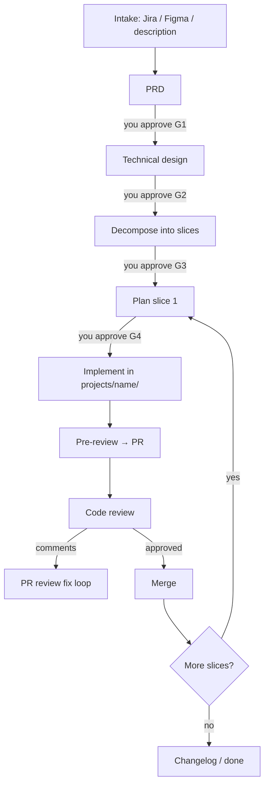

# How it works

This document explains the **AI Orchestrator Workspace** — what it is, how the pieces fit together, and how you use it day to day.

For setup steps see [adding-a-project.md](adding-a-project.md). For command reference see [developer-guide.md](developer-guide.md).

---

## The big idea

You have **two layers**:

```text
┌─────────────────────────────────────────────────────────────┐
│  ai-orchestrator-workspace  (THIS REPO — planning hub)      │
│  prd/  specs/  reports/  docs/  .cursor/skills/             │
│  No application source code committed here                  │
└──────────────────────────┬──────────────────────────────────┘
                           │ clone once per app
                           ▼
┌─────────────────────────────────────────────────────────────┐
│  projects/flowmd/  (cloned app repo — real code)            │
│  src/  backend/  e2e/  — own git, own PRs, own CI           │
└─────────────────────────────────────────────────────────────┘
```

| Layer | What lives here | Who edits it |
|-------|-----------------|--------------|
| **Hub** | PRDs, plans, test plans, reports, architecture docs | You + Cursor agent |
| **Clone** (`projects/<name>/`) | React frontend, Fastify backend, migrations, tests | Cursor agent (via approved plans) |

The hub is the **brain**. The clone is the **body**. Agents read plans from the hub and write code in the clone.

This is the same philosophy as **platform-workspace**, but adapted for:

- **Modular monoliths** (one repo with `src/` + `backend/`) instead of many microservice repos
- **Cursor skills** (`.cursor/skills/`) instead of Claude Code commands
- **Human approval gates** before any implementation

---

## What you open in Cursor

Open **`C:\projects\ai-orchestrator-workspace`** — not just the app folder.

When you chat with the agent here, it can:

1. Read/write plans in `prd/` and `specs/`
2. Switch into `projects/flowmd/` to implement approved work
3. Use the 27 skills under `.cursor/skills/`

`AGENTS.md` at the repo root tells every agent how this workspace behaves.

---

## One-time setup

```powershell
cd C:\projects\ai-orchestrator-workspace

# 1. Register your app in repos.yaml
# 2. Clone it:
.\scripts\setup.ps1

# 3. Document what was cloned:
#    "project-discovery flowmd"
```

You clone **once per app**, not once per feature. All features for `flowmd` reuse the same `projects/flowmd/` folder.

---

## How a feature flows (full path)



### Phase by phase

| # | Phase | Skill | Output in hub | Gate |
|---|-------|-------|---------------|------|
| 0 | Intake | `feature-orchestrator` | `prd/<project>/ticket.md` | Confirm intake |
| 1 | PRD | `prd` or orchestrator | `prd/<project>/prd.md` | **G1 — you approve** |
| 2 | Technical design | `technical-design` | `prd/<project>/technical-design.md` | **G2 — you approve** |
| 3 | Decompose | `decompose-slices` | `prd/<project>/slices/slice-N.md` | **G3 — you approve** |
| 4 | Plan slice | `plan-slice` | `specs/features/<project>/slice-N-*.md` | **G4 — you approve** |
| 5 | Implement | `implement-slice` | Code + PR in `projects/<project>/` | PR review |
| 6 | Report | (automatic) | `reports/features/...` | — |

**The agent stops after every gate.** It will not skip ahead unless you explicitly say to proceed or you add the approval block.

### The approval block

Every plan that leads to code must include this (from `docs/templates/approval.md`):

```markdown
## Approval
- [x] Product — acceptance criteria match Jira/Figma
- [x] Tech — AD constraints respected
- **Approved by:** Your Name
- **Date:** 2026-08-16
```

If this section is missing or unchecked, **`implement-slice` refuses to run**. This is intentional — it prevents the agent from coding off an unreviewed plan.

---

## Vertical slices (tracer bullet)

Large features are split into **vertical slices** — thin end-to-end cuts through the stack:

```text
Slice 1 (tracer bullet):  UI screen → API route → DB table → test
Slice 2:                    Add validation + error states
Slice 3:                    Add permissions
Slice 4:                    Polish + edge cases
```

Each slice ≈ **one PR** in `projects/<name>/`. Slice 1 proves the path works before building depth.

Slice status tracked in: `prd/<project>/slices/status.yaml`

---

## Other work types (shorter paths)

Not everything needs the full PRD pipeline.

| You want to… | Say in Cursor | Plan location |
|--------------|---------------|---------------|
| Fix a bug | `Bug: login 500 on flowmd` | `specs/bugs/` |
| Upgrade deps / cleanup | `Chore: upgrade vitest in flowmd` | `specs/chores/` |
| Small clear feature | `feature plan for …` | `specs/features/` |
| Jira tickets from PRD | `create-stories for flowmd` | `specs/stories/` |

Same rule: **approve the plan first**, then implement.

---

## Testing

Tests are planned separately, then implemented:

```text
test-plan flowmd auth module     →  specs/tests/unit/flowmd/auth.md
test-implement specs/tests/...   →  code in projects/flowmd/ + reports/tests/
```

| Skill | What it plans |
|-------|---------------|
| `test-plan` | Unit + component tests (Vitest) |
| `test-plan-integration` | API + real Postgres |
| `test-plan-contracts` | Response shapes, error codes, auth |

---

## Review loop (after PR is open)

```text
1. pre-review          ← author self-check (lint, types, tests)
2. Open PR
3. code-review         ← reviewer skill → reports/code-reviews/
4. pr-review           ← author plans fixes → specs/pr-reviews/
5. pr-review-implement ← author applies fixes, pushes
6. Merge
```

---

## Living documentation

Docs stay in the hub and describe what's in the clones:

| Folder | Skill | Purpose |
|--------|-------|---------|
| `docs/services/<project>.md` | `project-discovery` | Routes, modules, DB, how to run |
| `docs/contracts/` | `contracts` | API request/response shapes |
| `docs/journeys/` | `journey` | End-to-end user flows |
| `docs/decisions/` | `architecture-decision-record` | ADRs |
| `docs/changelog/` | `changelog` | Release summaries |

Run **`drift flowmd`** periodically — it compares docs/specs against actual code and reports what's stale.

---

## Folder map (hub)

```text
ai-orchestrator-workspace/
├── AGENTS.md                 ← agent entry point
├── repos.yaml                ← which apps to clone
├── projects/                 ← cloned apps (gitignored)
│   └── flowmd/               ← real code lives here
├── prd/
│   └── flowmd/
│       ├── ticket.md         ← intake
│       ├── prd.md            ← product requirements
│       ├── technical-design.md
│       └── slices/           ← vertical slice definitions
├── specs/
│   ├── features/flowmd/      ← implementation plans (per slice)
│   ├── bugs/
│   ├── chores/
│   ├── stories/
│   ├── tests/
│   └── pr-reviews/
├── reports/                  ← audit trail after work completes
├── docs/
│   ├── how-it-works.md       ← this file
│   ├── services/             ← per-app discovery
│   ├── contracts/
│   ├── journeys/
│   ├── decisions/
│   └── conventions/          ← coding standards
└── .cursor/skills/           ← 27 agent skills
```

---

## Modular monolith layout (each clone)

```text
projects/flowmd/
├── src/                      ← React + Vite (frontend)
│   ├── features/
│   └── integrations/api/     ← API client (camelCase ↔ snake_case)
├── backend/
│   └── src/
│       ├── modules/          ← domain modules (Fastify)
│       ├── routes/
│       └── db/migrations/
├── e2e/
└── docker-compose.dev.yml
```

**One repo, two deploy targets.** CI uses path filters:

- Changes under `src/**` → deploy frontend only
- Changes under `backend/**` → deploy API only

---

## All 27 skills at a glance

| Category | Skills |
|----------|--------|
| **Feature flow** | `feature-orchestrator`, `prd`, `technical-design`, `decompose-slices`, `plan-slice`, `implement-slice`, `feature` |
| **Work types** | `bug`, `chore` |
| **Stories** | `create-stories`, `user-stories` |
| **Testing** | `test-plan`, `test-implement`, `test-plan-integration`, `test-plan-contracts` |
| **Review** | `pre-review`, `code-review`, `pr-review`, `pr-review-implement` |
| **Docs** | `project-discovery`, `drift`, `contracts`, `journey`, `changelog`, `architecture` |
| **Decisions** | `architecture-decision`, `architecture-decision-record` |

---

## Example commands (copy-paste into Cursor)

```text
# New epic feature
Run feature-orchestrator for flowmd — Jira PROJ-123 + Figma link

# After PRD approved, continue
Proceed with technical design for flowmd

# After slices approved, plan first slice
Plan slice prd/flowmd/slices/slice-1.md

# After plan approved
Implement specs/features/flowmd/slice-1-login.md

# Bug fix
Bug: appointment list empty after filter on flowmd

# Maintenance
Chore: upgrade vitest in flowmd

# Documentation
project-discovery flowmd
drift flowmd

# Review
pre-review flowmd
code-review flowmd PR #12
pr-review flowmd PR #12
```

---

## vs platform-workspace

| | platform-workspace | ai-orchestrator-workspace |
|--|-------------------|---------------------------|
| Agent interface | Claude Code `.claude/commands/` | Cursor `.cursor/skills/` |
| App structure | Many microservice repos in `backend/` + `frontend/` | One monolith per `projects/<name>/` |
| Implementation gate | Implicit | Explicit approval block required |
| Stack scaffolds | Django, FastAPI, Angular, etc. | Fastify + React monolith conventions |
| Core workflow | PRD → slices → implement → review | Same |

---

## What happens next (your first run)

1. Add `flowmd` (or your app) to `repos.yaml`
2. Run `.\scripts\setup.ps1`
3. Say: **`project-discovery flowmd`**
4. Say: **`Run feature-orchestrator for flowmd — <describe your first feature>`**
5. Review each artifact. Add approval when ready.
6. Let the agent implement slice 1 in `projects/flowmd/`

The hub grows with every feature: more PRDs, specs, reports, and docs — but the clone stays the single source of application code.
