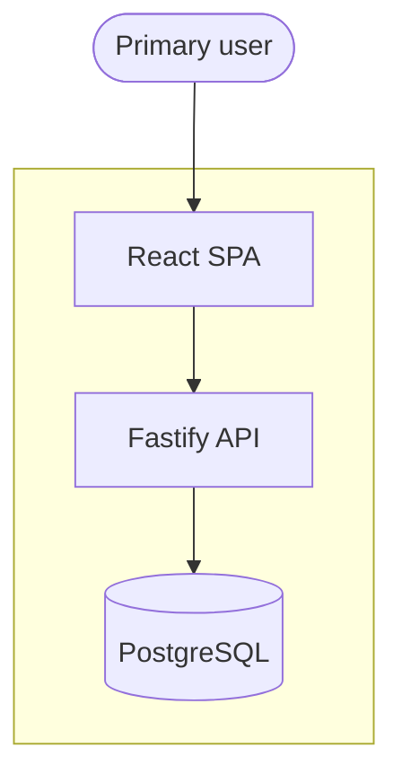

# <Product Name> Architecture

<!-- Copy to docs/architecture/<name>.md and fill in. Delete comments when done. -->

| Item | Value |
|------|--------|
| Clone | `projects/<name>/` |
| Remote | _(git URL)_ |
| Pattern | Modular monolith — React SPA + Fastify API |
| Database | PostgreSQL 16 |
| Auth | _(e.g. Better Auth — link ADR)_ |

## Purpose

_One paragraph: what this product does and who uses it._

## System context

## Domain modules

| Domain | Backend | Frontend | Purpose |
|--------|---------|----------|---------|
| platform | `modules/platform/` | `features/.../` | Health, audit, auth |
| _domain_ | `modules/_domain_/` | `features/_domain_/` | _…_ |

## Data (high level)

| Entity | Owner module | Notes |
|--------|--------------|-------|
| | | |

## API

- Base: `/api`
- See [api-design](../conventions/api-design.md)

## Architecture decisions

| ADR | Decision |
|-----|----------|
| [0001](../decisions/<name>/0001-....md) | |

## Non-goals (v1)

- 

## Related

- [services/<name>.md](../services/<name>.md)
- [conventions/](../conventions/)
