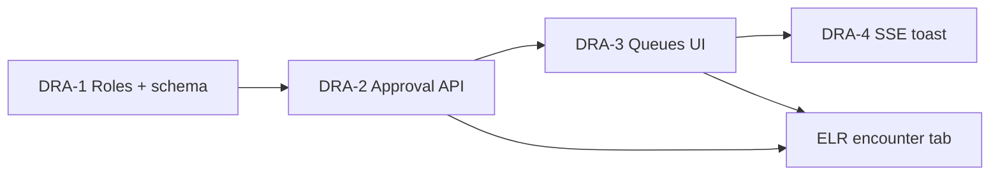

# Slices — diagnostic-results-approval-workflow

| Field | Value |
|-------|--------|
| **Project** | `his-global-south` |
| **Feature** | `diagnostic-results-approval-workflow` |
| **PRD** | [../prd.md](../prd.md) |
| **Technical design** | [../technical-design.md](../technical-design.md) |
| **G3 status** | **Pending** — fill Approval on each slice spec before implement |

---

## Overview

| Slice | Title | Builds on | User capability after merge |
|-------|-------|-----------|----------------------------|
| **DRA-1** | Roles + schema foundation | — | Admin can invite pathologist; DB has `approval_status` columns; existing live rows grandfathered to `released` |
| **DRA-2** | Approval API + service changes | DRA-1 | Ops save stays draft; submit/approve/reject APIs work; bedside POC bypasses queue; doctor GET PDF 403 until released |
| **DRA-3** | Ops tracker + approval queues UI | DRA-2 | Lab tech submits; pathologist approves from queue; reject loop visible on ops tracker |
| **DRA-4** | STAT/critical SSE toast | DRA-3 | Pathologist/radiologist gets in-app toast on urgent submit |

**Tracer bullet:** DRA-1 → DRA-2 → DRA-3 (one lab line: ops enter → submit → pathologist approve → `released`). DRA-4 is polish; can ship in same PR as DRA-3 or follow.

---

## Dependency graph



```text
DRA-1 → DRA-2 → DRA-3 → DRA-4
              ↘
                ELR-1+ (encounter tab — separate feature; needs DRA-2 fields minimum)
```

**Parallelization:** DRA-4 can start once DRA-2 emits SSE from `submitItemForApproval` (backend in DRA-2, frontend toast in DRA-4). Encounter tab **ELR-1** can start after **DRA-2** if test data has `released` rows; full E2E needs **DRA-3**.

---

## User story progress matrix

| User story | DRA-1 | DRA-2 | DRA-3 | DRA-4 |
|------------|-------|-------|-------|-------|
| US-1 Ops submit for approval | — | API | UI button + states | — |
| US-2 Pathologist approval queue | — | API + list filter | Queue UI | Badge + toast |
| US-3 Radiologist approval queue | — | API + list filter | Queue UI | Badge + toast |
| US-4 Reject and resubmit loop | — | reject API | Ops + queue UX | — |
| US-5 STAT/critical notification | — | SSE emit (optional in DRA-2) | Queue badge count | Toast + deep link |
| US-6 Assign pathologist/radiologist | ✓ | — | Nav landing | — |

---

## PRD coverage check

| PRD requirement | Slice |
|-----------------|-------|
| Two-tier ops + approver workflow | DRA-2, DRA-3 |
| Per line item approval | DRA-2 |
| PDF + typed require approval | DRA-2 (enterOrderResults, reportDocuments, radiology) |
| Admin break-glass approve | DRA-2 (`LAB_APPROVE_ROLES` / `RADIOLOGY_APPROVE_ROLES` include admin) |
| Shared queues, no team entity | DRA-3 |
| Reject required with reason | DRA-2, DRA-3 |
| Bedside POC bypass only | DRA-2 |
| Combined roles (ops + approve) | DRA-3 (nav + tabs) |
| Doctor sees released only | DRA-2 (403 on report-documents) — consumed by ELR feature |
| Encounter tab UI | **Out of scope** — [encounter-lab-radiology-reports](../../encounter-lab-radiology-reports/slices/README.md) |

---

## Critical path

1. **DRA-1** — migrations must deploy before app writes new statuses (TD §8).
2. **DRA-2** — blocks all UI and encounter tab classifier fields.
3. **DRA-3** — first end-to-end human demo (ops → approver → released).
4. **DRA-4** — optional for v1 launch; recommended for STAT/critical UX.

---

## Preserve existing (all slices)

- OPD consult + order placement regression green
- Send-out PDF upload path still works (submit → approve → view)
- Grandfathered rows remain viewable (`approval_status = released` where `resulted_at` set)
- Mock org rows in integration tests: `active: true` (PR review lessons)

---

## Out of scope (all slices)

Per PRD §7 — unchanged here:

- Per-user assignment / department teams
- SMS/WhatsApp notifications
- Auto-release by test type
- IPD-specific approval rules
- Encounter Reports tab (separate feature)
- PACS / analyzer integration

---

## Status tracking

Update [status.yaml](./status.yaml) when slices are approved and implemented.

## After you approve

Fill the Approval block on **DRA-1** first, then run `plan-slice` for slice-1. Do not implement until slice spec has completed Approval section.
