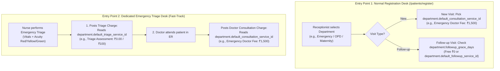
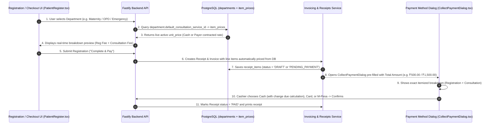

# Enterprise HMIS Dynamic Department & Service Mapping Plan

## Overview
This plan establishes a clean, production-grade **Department-to-Service Mapping Architecture** across `his-global-south`. 

Every department (General OPD, Emergency, Maternity/OBGYN, Paediatrics, Surgery, or any future department) can directly configure its **Doctor Consultation Service**, **Triage/Intake Service**, and **Free Follow-up Grace Days** from the Service Catalog. This completely eliminates hardcoded code strings (`CONSULT-NEW`, `CONSULT-OPD`, `CONSULT-EMERGENCY`, `TRIAGE-ED`, `REG-FEE`) across all billing handlers.

---

## 1. Database Schema & Migration

### Schema Extension on `departments` Table:
```sql
ALTER TABLE departments 
ADD COLUMN default_consultation_service_id uuid REFERENCES service_catalog(id) ON DELETE SET NULL,
ADD COLUMN default_followup_service_id uuid REFERENCES service_catalog(id) ON DELETE SET NULL,
ADD COLUMN default_triage_service_id uuid REFERENCES service_catalog(id) ON DELETE SET NULL,
ADD COLUMN followup_grace_days integer DEFAULT 7,
ADD COLUMN is_followup_free boolean DEFAULT true;
```

### Initial Data Migration:
Seed the existing 11 departments with their initial canonical service links (e.g. OPD → `CONSULT-NEW`, Emergency → `CONSULT-EMERGENCY` & `TRIAGE-ED`, etc.) so current data seamlessly migrates.

---

## 2. Dynamic Service Roles per Department

When configuring **ANY** department in Facility Master:

| Configuration Field | Dropdown Display | Purpose |
| :--- | :--- | :--- |
| **Consultation Service** | `[ CONSULT-OPD — General OPD Consultation Fee ]` | Doctor's primary consultation fee |
| **Follow-up Service** | `[ CONSULT-FOLLOWUP — OPD Follow-up Consultation Fee ]` | Follow-up / review visit fee |
| **Triage / Intake Service** | `[ TRIAGE-ED — Emergency Triage Assessment Fee ]` | Nursing triage / intake assessment fee |
| **Free Follow-up Window** | `[ 7 ] Days` | Revisit grace window (e.g., 7 days, 14 days, or 0 days) |
| **Is Follow-up Free?** | `[ Toggle: Yes / No ]` | If enabled, follow-ups within grace days are billed at **₹0.00 (Fee Waived)** |

---

## 3. How Check-in & Triage Resolve Dynamically (Zero Hardcoding)



---

## 4. Frontend Department Configuration UI

In **Facility Master (`/facilityMaster`) → Edit Department**:
* **Doctor Consultation Service:** Searchable Dropdown displaying **`[CODE] — Service Name (Standard Rate: ₹...)`**
  * *Example:* `[CONSULT-OPD] General OPD Consultation Fee (₹500.00)`
  * *Example:* `[CONSULT-EMERGENCY] Emergency Doctor Consultation Fee (₹1,500.00)`
* **Triage / Intake Service:** Searchable Dropdown displaying **`[CODE] — Service Name`**
  * *Example:* `[TRIAGE-ED] Emergency Triage & Acuity Assessment (₹100.00)`
* **Follow-up Service:** Searchable Dropdown displaying **`[CODE] — Service Name`**
  * *Example:* `[CONSULT-FOLLOWUP] Follow-up Review Consultation (₹300.00)`
* **Free Follow-up Window:** `[ 7 ] Days` (Configurable: e.g. 0, 3, 7, 14, 30 days)
* **Free Follow-up Policy:** `[ Toggle: 100% Free during grace window ]` (If ON, auto-bills ₹0.00 during the window)

---

## 5. Automatic Price Fetching & Payment Method Screen (`CollectPaymentDialog`)

The payment screen must seamlessly consume the auto-calculated line items from the database without any manual price entry by the cashier:



### Key UI Integrations for Payment:
1. **[CollectPaymentDialog.tsx](file:///Users/rahulranjan/Desktop/Projects/AI-orchestrator/projects/his-global-south/src/pages/patientBill/components/CollectPaymentDialog.tsx):**
   * Pre-fills `pay.amount` directly with the auto-calculated database balance.
   * Renders the itemized list of billable services (`billableItems`) populated directly from `item_prices`.
   * Supports **Cash** (with tender & change-due calculations), **M-Pesa** (transaction codes), and **Card** (auth codes).
2. **[PatientRegister.tsx](file:///Users/rahulranjan/Desktop/Projects/AI-orchestrator/projects/his-global-south/src/pages/patients/PatientRegister.tsx):**
   * Automatically passes the department fee breakdown into checkout.
3. **[handlers.ts](file:///Users/rahulranjan/Desktop/Projects/AI-orchestrator/projects/his-global-south/backend/src/modules/rcm/shared/handlers.ts):**
   * Links `receipt_items` directly to the department's configured `service_catalog_id`.

---

## 6. Service Catalog Lifecycle & Immutable Versioning Architecture

To preserve clinical and financial audit integrity, the catalog employs **PostgreSQL Partial Unique Indexes** to support **true immutable historical versioning**:

```sql
-- Partial Unique Index on active custom services:
CREATE UNIQUE INDEX uq_svccat_org_custom_code 
ON service_catalog (org_id, code) 
WHERE (is_custom = true AND active = true);
```

### Versioning Lifecycle Rules:
1. **Historical Immutability (Archive on Deletion):**
   * When an existing service (e.g. `CONSULT-NEW` Version 1, `uuid-v1`) is deleted/deactivated, its row is set to `active = false`.
   * The row is **never purged or overwritten**.
   * All historical encounters, invoices, receipts, and insurance claims from past dates remain permanently linked to `uuid-v1`.
2. **Clean Insert for New Versions (Recreation):**
   * When a hospital creates a new service using the same code `CONSULT-NEW`:
   * Because the old row is `active = false`, it does **not** occupy the `uq_svccat_org_custom_code` partial index.
   * The backend executes a **fresh `INSERT`** generating a brand new UUID (`uuid-v2`), new creation timestamp, and new price rows in `item_prices`.
   * The new `uuid-v2` becomes the active version in the catalog.
3. **Department Mapping Linkage:**
   * Dropdowns in Facility Master only query `WHERE active = true`.
   * Active departments point to the active version `uuid-v2`.
   * If a currently mapped service is archived, the department gracefully retains its foreign key until the admin re-maps it to the new version.

---

## 7. Verification Plan

1. **Automated Tests:**
   * Backend integration tests verifying dynamic price resolution across departments (OPD, Emergency, Maternity) without any hardcoded strings.
   * Testing follow-up visits within grace window (₹0.00) vs outside grace window.
   * Testing automatic receipt generation with correct line item prices from `item_prices`.
   * Testing service recreation with the same code: verifying old inactive row is preserved with original UUID and new active row is created with fresh UUID.
   * Running `npm -C backend test` and `npm test`.
2. **Manual Verification:**
   * Edit a department in Facility Master, assign consultation and triage services with `[CODE] — Name (Rate)`.
   * Register a patient in that department → verify the payment/checkout screen is pre-filled with the exact database amount.
   * Complete payment via `CollectPaymentDialog` with Cash / Card / M-Pesa → verify receipt shows `PAID` with correct line items.
   * Deactivate a service in Catalog Browser, re-create a new service with the same code → verify both historical audit trail and new version are preserved.

