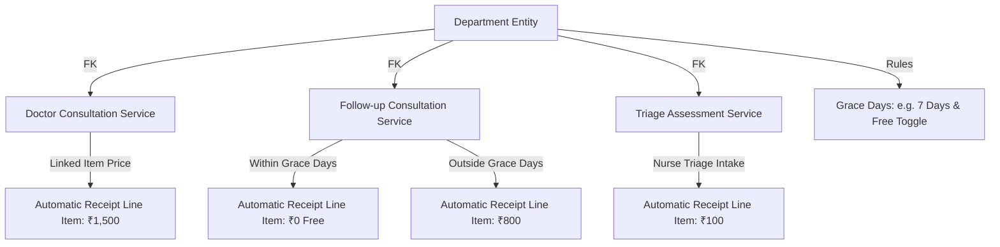

# Dynamic Department & Service Mapping — Implementation Guide

## Table of Contents
1. [Architecture Overview](#1-architecture-overview)
2. [Step-by-Step Implementation Flow](#2-step-by-step-implementation-flow)
3. [Phase 1: Database Schema & Seed Migration](#phase-1-database-schema--seed-migration)
4. [Phase 2: Backend Data Access & Schema Layer](#phase-2-backend-data-access--schema-layer)
5. [Phase 3: Dynamic Pricing & Event Handlers (Zero Hardcoding)](#phase-3-dynamic-pricing--event-handlers-zero-hardcoding)
6. [Phase 4: Frontend Services & Type Definitions](#phase-4-frontend-services--type-definitions)
7. [Phase 5: Facility Master Department Config UI](#phase-5-facility-master-department-config-ui)
8. [Phase 6: Patient Registration & Payment Dialog Integration](#phase-6-patient-registration--payment-dialog-integration)
9. [Phase 7: Automated Tests & Verification Plan](#phase-7-automated-tests--verification-plan)

---

## 1. Architecture Overview

### Problem Statement
Currently, billing fees for check-ins, registrations, and emergency visits rely on hardcoded service codes (`CONSULT-NEW`, `CONSULT-OPD`, `CONSULT-EMERGENCY`, `TRIAGE-ED`, `REG-FEE`). This prevents hospitals from creating new departments (e.g. Maternity/OBGYN, Paediatrics, Dental) or assigning custom tariffs/service codes to departments.

### Target Architecture
Every department directly links to canonical Service Catalog items via foreign keys:
* `default_consultation_service_id` → UUID FK to `service_catalog`
* `default_followup_service_id` → UUID FK to `service_catalog`
* `default_triage_service_id` → UUID FK to `service_catalog`
* `followup_grace_days` → Integer (default `7`)
* `is_followup_free` → Boolean (default `true`)



---

## 2. Step-by-Step Implementation Flow

```text
[Phase 1: DB Migration]
  ├── backend/src/db/migrations/035_department_service_mapping.sql
  └── Run migration via pnpm/npm db:migrate

[Phase 2: Backend Domain & DTOs]
  ├── backend/src/modules/facility/departments/departments.pgschema.ts
  ├── backend/src/modules/facility/departments/departments.service.ts
  └── backend/src/modules/facility/departments/departments.routes.ts

[Phase 3: Billing & Handlers Engine]
  ├── backend/src/modules/rcm/shared/handlers.ts (Remove hardcoded string matching)
  └── backend/src/modules/rcm/invoices/invoices.service.ts

[Phase 4: Frontend API & Types]
  ├── src/services/departments.service.ts
  └── src/types/department.ts

[Phase 5: Facility Master UI]
  ├── src/pages/facilityMaster/components/DepartmentFormDialog.tsx
  └── src/pages/facilityMaster/components/FacilityTree.tsx

[Phase 6: Patient Registration & Payment Flow]
  ├── src/pages/patients/PatientRegister.tsx
  └── src/pages/patientBill/components/CollectPaymentDialog.tsx

[Phase 7: Testing & Verification]
  ├── backend/src/modules/facility/departments/__tests__/departments.test.ts
  └── backend/src/modules/rcm/shared/__tests__/handlers.test.ts
```

---

## Phase 1: Database Schema & Seed Migration

### Target File: `projects/his-global-south/backend/src/db/migrations/035_department_service_mapping.sql`

```sql
-- Migration 035: Department to Service Catalog Dynamic Mapping

-- 1. Add mapping columns to departments table
ALTER TABLE departments 
ADD COLUMN IF NOT EXISTS default_consultation_service_id uuid REFERENCES service_catalog(id) ON DELETE SET NULL,
ADD COLUMN IF NOT EXISTS default_followup_service_id uuid REFERENCES service_catalog(id) ON DELETE SET NULL,
ADD COLUMN IF NOT EXISTS default_triage_service_id uuid REFERENCES service_catalog(id) ON DELETE SET NULL,
ADD COLUMN IF NOT EXISTS followup_grace_days integer NOT NULL DEFAULT 7,
ADD COLUMN IF NOT EXISTS is_followup_free boolean NOT NULL DEFAULT true;

-- 2. Indexes for foreign key lookup performance
CREATE INDEX IF NOT EXISTS idx_dept_consult_svc ON departments(default_consultation_service_id);
CREATE INDEX IF NOT EXISTS idx_dept_followup_svc ON departments(default_followup_service_id);
CREATE INDEX IF NOT EXISTS idx_dept_triage_svc ON departments(default_triage_service_id);

-- 3. Backfill existing standard departments with canonical services
UPDATE departments d
SET default_consultation_service_id = sc.id
FROM service_catalog sc
WHERE sc.code = 'CONSULT-NEW' 
  AND d.name ILIKE '%outpatient%' 
  AND d.default_consultation_service_id IS NULL;

UPDATE departments d
SET default_consultation_service_id = sc_consult.id,
    default_triage_service_id = sc_triage.id
FROM service_catalog sc_consult, service_catalog sc_triage
WHERE sc_consult.code = 'CONSULT-EMERGENCY'
  AND sc_triage.code = 'TRIAGE-ED'
  AND (d.name ILIKE '%emergency%' OR d.name ILIKE '%casualty%')
  AND d.default_consultation_service_id IS NULL;
```

---

## Phase 2: Backend Data Access & Schema Layer

### 1. `backend/src/modules/facility/departments/departments.pgschema.ts`
Add the new Drizzle columns:
```typescript
export const departments = pgTable('departments', {
  id: uuid('id').primaryKey().defaultRandom(),
  organizationId: uuid('organization_id').notNull().references(() => organizations.id),
  facilityId: uuid('facility_id').notNull().references(() => facilities.id),
  name: varchar('name', { length: 255 }).notNull(),
  code: varchar('code', { length: 64 }),
  status: varchar('status', { length: 32 }).notNull().default('ACTIVE'),
  defaultConsultationServiceId: uuid('default_consultation_service_id').references(() => serviceCatalog.id),
  defaultFollowupServiceId: uuid('default_followup_service_id').references(() => serviceCatalog.id),
  defaultTriageServiceId: uuid('default_triage_service_id').references(() => serviceCatalog.id),
  followupGraceDays: integer('followup_grace_days').notNull().default(7),
  isFollowupFree: boolean('is_followup_free').notNull().default(true),
  createdAt: timestamp('created_at').defaultNow().notNull(),
  updatedAt: timestamp('updated_at').defaultNow().notNull(),
});
```

### 2. `backend/src/modules/facility/departments/departments.service.ts`
Update queries to join or return the configured service details (code, name, base price) with arrow functions:
```typescript
export const getDepartmentById = async (id: string, orgId: string) => {
  const result = await db.query.departments.findFirst({
    where: and(eq(departments.id, id), eq(departments.organizationId, orgId)),
    with: {
      defaultConsultationService: true,
      defaultFollowupService: true,
      defaultTriageService: true,
    }
  });
  return result;
};
```

---

## Phase 3: Dynamic Pricing & Event Handlers (Zero Hardcoding)

### Target File: `projects/his-global-south/backend/src/modules/rcm/shared/handlers.ts`

Replace hardcoded code checks with department entity lookups:

```typescript
// BEFORE (Hardcoded):
// const svcCode = isEmergency ? 'CONSULT-EMERGENCY' : 'CONSULT-NEW';

// AFTER (Dynamic arrow function):
export const resolveCheckinService = async (
  departmentId: string, 
  orgId: string, 
  isFollowup: boolean,
  lastVisitDate?: Date
): Promise<{ serviceId: string | null; isFree: boolean }> => {
  const dept = await getDepartmentById(departmentId, orgId);
  if (!dept) return { serviceId: null, isFree: false };

  if (isFollowup) {
    if (dept.isFollowupFree && lastVisitDate) {
      const daysSince = differenceInDays(new Date(), new Date(lastVisitDate));
      if (daysSince <= dept.followupGraceDays) {
        return { serviceId: dept.defaultFollowupServiceId || dept.defaultConsultationServiceId, isFree: true };
      }
    }
    return { 
      serviceId: dept.defaultFollowupServiceId || dept.defaultConsultationServiceId, 
      isFree: false 
    };
  }

  return { 
    serviceId: dept.defaultConsultationServiceId, 
    isFree: false 
  };
};
```

---

## Phase 4: Frontend Services & Type Definitions

### Target File: `src/types/department.ts`
```typescript
export interface Department {
  id: string;
  name: string;
  code: string;
  status: 'ACTIVE' | 'INACTIVE';
  facilityId: string;
  organizationId: string;
  defaultConsultationServiceId?: string | null;
  defaultFollowupServiceId?: string | null;
  defaultTriageServiceId?: string | null;
  followupGraceDays: number;
  isFollowupFree: boolean;
  defaultConsultationService?: { id: string; code: string; name: string };
  defaultFollowupService?: { id: string; code: string; name: string };
  defaultTriageService?: { id: string; code: string; name: string };
}
```

---

## Phase 5: Facility Master Department Config UI

### Target File: `src/pages/facilityMaster/components/DepartmentFormDialog.tsx`
Provide Searchable Service Catalog Dropdowns:
1. **Consultation Service:** Dropdown querying `GET /api/platform/service-catalog?category=CONSULTATION`
2. **Follow-up Service:** Dropdown querying `GET /api/platform/service-catalog?category=CONSULTATION`
3. **Triage Service:** Dropdown querying `GET /api/platform/service-catalog?category=TRIAGE`
4. **Follow-up Grace Window:** Number input (e.g. `7` days)
5. **Fee-Waived Toggle:** Switch for "Waive fee during grace window"

---

## Phase 6: Patient Registration & Payment Dialog Integration

### Target Files:
1. `src/pages/patients/PatientRegister.tsx`
2. `src/pages/patientBill/components/CollectPaymentDialog.tsx`

### Sequence:
1. When user chooses a Department in `PatientRegister`, query department fees dynamically via `GET /api/facility/departments/:id`.
2. Display dynamic line items: Registration Fee + Department Doctor Consultation Fee.
3. Upon registration completion:
   - Fastify creates Draft Receipt with `receipt_items` priced via `item_prices`.
   - `CollectPaymentDialog` opens with `pay.amount` pre-filled to the exact sum of line items.
   - Cashier collects via Cash / Card / M-Pesa.

---

## Phase 7: Automated Tests & Verification Plan

### Test Checklist:
1. **Database Migration:**
   ```bash
   npm -C backend run db:migrate
   ```
2. **Backend Unit & Integration Tests:**
   * Test department CRUD with service IDs.
   * Test dynamic service resolution on check-in event.
   * Test free follow-up grace day calculation.
3. **TypeScript Compilation:**
   ```bash
   npm -C backend tsc --noEmit
   npm run build
   ```
4. **End-to-End Verification:**
   * Configure Emergency department with custom service code `ER-DOCTOR-FEE` (₹1,500).
   * Register a new patient in Emergency → Confirm `CollectPaymentDialog` auto-populates ₹1,500 + Reg Fee.
   * Pay via Cash → Verify generated receipt displays exact service name and amount.
