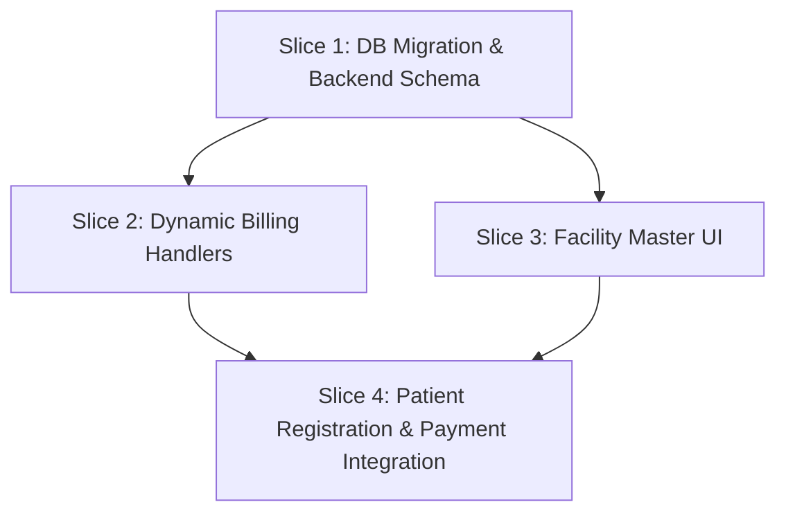

# Dynamic Department & Service Mapping — Slice Decomposition

## Slices Overview

| Slice | Title | Scope | Deliverables |
|---|---|---|---|
| **Slice 1** | DB Migration & Backend Schemas | Database FK columns, indexes, seed data backfill, Drizzle schemas & DTOs | `035_department_service_mapping.sql`, `departments.pgschema.ts`, `departments.service.ts` |
| **Slice 2** | Dynamic Billing & Event Handlers | Remove hardcoded service strings (`CONSULT-NEW`, `TRIAGE-ED`), resolve from Department entity & grace days | `handlers.ts`, `invoices.service.ts`, backend unit tests |
| **Slice 3** | Facility Master Department Config UI | Searchable dropdowns displaying `[CODE] — Name (Rate)` for consultation, triage, follow-up, and grace days | `DepartmentFormDialog.tsx`, `FacilityTree.tsx` |
| **Slice 4** | Patient Registration & Payment Flow | Dynamic fee preview on department selection & auto-populated `CollectPaymentDialog` | `PatientRegister.tsx`, `CollectPaymentDialog.tsx`, E2E tests |

---

## Dependency Graph

