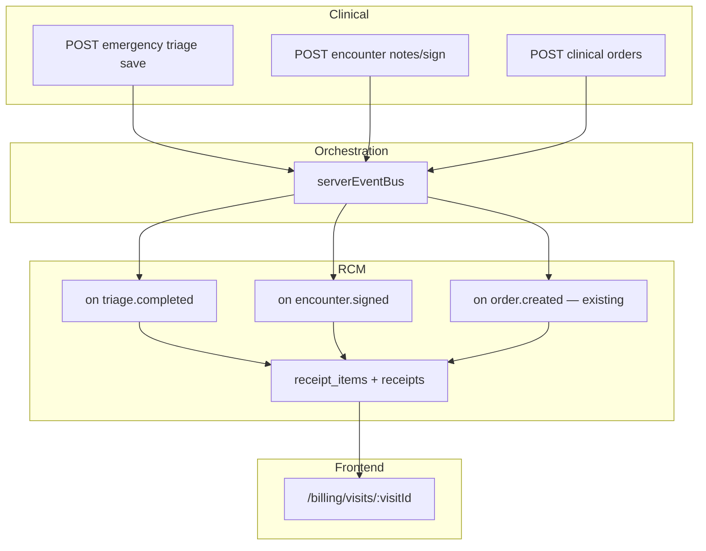

# Technical Design: Emergency billing (Option C+)

| Field | Value |
|-------|--------|
| **Project** | `his-global-south` |
| **Feature** | `emergency-billing` |
| **PRD** | [prd.md](./prd.md) |
| **Target repo** | `projects/his-global-south/` @ `develop` |
| **Status** | Draft — **Gate G2 pending** (align with [prd.md v2.0](./prd.md)) |
| **Date** | 2026-09-01 |
| **Depends on** | Emergency triage save path (`emergencyTriage.service`), RCM handlers (`rcm/shared/handlers.ts`), encounter sign |

---

## 0. Non-regression constraint

**Extend, do not replace.**

- Add `triage.completed` subscriber — do not modify `order.created` or `prescription.created`.
- Extend `encounter.signed` with an **`else if encounter_type === emergency`** branch — keep existing `if encounter_type === opd` block **byte-for-byte equivalent** in behaviour.
- Do not change `resolveConsultationFee`, Catalog Browser APIs, or receipt schema except additive `source_type` values if required.
- EB-3 slice **must** include automated test: OPD sign still produces exactly one `CONSULT-*` line; emergency sign produces `CONSULT-EMERGENCY` and does not affect OPD visits.

See [docs-update-checklist.md](./docs-update-checklist.md) for PRD updates during implement.

---

## 1. Design summary

Extend **existing OPD RCM event subscribers** — no new billing module, no UI in triage/consultation.

| Charge | Trigger | Mechanism |
|--------|---------|-----------|
| Triage fee | First triage complete | New domain event `triage.completed` → RCM handler |
| ED consult fee | Emergency encounter signed | Extend existing `encounter.signed` handler |
| ED bed fee | Triage destination on save | Same `triage.completed` handler (second line) |
| Lab / Rx | Order/Rx create | **Unchanged** |

All lines post to **visit receipt** via existing `getOrCreateReceipt()` using `visit_id` + emergency `billing_encounter_id` (same pattern as lab orders).

---

## 2. System context



---

## 3. Architecture decisions

### AD-1: Event-driven RCM (same as OPD)

**Choice:** Post-commit domain events; RCM handlers write `receipt_items`.  
**Why:** Matches lab/Rx/consult pattern; triage save must not call RCM synchronously in request path.  
**Reject:** Direct `receipts.service` call from triage service — couples clinical to RCM and risks blocking.

### AD-2: New event `triage.completed`

**Choice:** Emit after successful triage save transaction when `triage_status` becomes `complete` for the first time.  
**Payload (minimum):**

```ts
{
  encounterId: string;
  visitId: string;
  patientId: string;
  organizationId: string;
  triageDisposition: string | null;  // or unitId when dynamic disposition ships
  triagedBy: string;
}
```

**Why:** Single hook for triage fee + ED bed fee; idempotency keyed on `encounterId`.

### AD-3: Extend `encounter.signed` for emergency

**Choice:** Add parallel branch for `encounter_type = emergency`; **leave OPD branch untouched**.  
**Why:** Minimal diff; same receipt as triage lines on visit.  
**Guard:** Keep idempotency check (`source_type = encounter`, `source_id = encounterId`).  
**Regression:** OPD path must remain the first guarded branch with identical `resolveConsultationFee` call.

### AD-4: Idempotency keys

| Line type | `source_type` | `source_id` | Notes |
|-----------|---------------|-------------|--------|
| Triage fee | `emergency_triage` | `encounterId` | New source type constant |
| ED bed fee | `emergency_triage_bed` | `encounterId` | Separate from triage fee line |
| ED consult | `encounter` | `encounterId` | Existing |

Before insert, query existing line with same `(receipt_id, source_type, source_id)`.

### AD-5: ED bed code resolution (v1)

**Choice:** Map `triage_disposition` using **Emergency Triage Appendix A** codes → `BED-ED-*` (see PRD Appendix A).  
**Example:** `ITC_CRITICAL_A` → `BED-ED-CRITICAL`; `EMC` → `BED-ED-STANDARD`.  
**Unmapped:** skip bed line; triage fee still applies.

**v2:** Admin UI mapping unit UUID → bill code.

### AD-6: Non-blocking failures

**Choice:** RCM handlers try/catch; log error; never rethrow to event bus in a way that fails clinical commit (clinical already committed before emit).  
**Why:** PRD D-6.

### AD-7: IPD ward bed explicitly excluded

**Choice:** No subscriber on `ipd` bed assign or `admission.admitted`.  
**Why:** Ward receipt / M8 is separate product track.

---

## 4. Price resolution

**Reuse `resolveCatalogItemPrice()`** (`rcm/shared/resolveCatalogPrice.ts`) — same function behind today's `resolveServicePrice()` and `resolveConsultationFee()`.

```ts
// Emergency consult — mirror OPD sign handler, different code only:
const { unitPrice, description, serviceCatalogId } =
  await resolveCatalogItemPrice(orgId, 'CONSULT-EMERGENCY', 'consultation');

// Triage + bed — same helper, different codes:
await resolveCatalogItemPrice(orgId, 'TRIAGE-ED', 'consultation');
await resolveCatalogItemPrice(orgId, bedBillCode, 'general');
```

Then call existing **`addReceiptItem()`** so **adjudicateReceiptLine** runs (copay, insurance, patient-pay).

**No hardcoded amounts.** If price missing → `unitPrice: 0` + UNPRICED note (existing behaviour in handlers.ts).

**Demo seed (EB-5):** inserts org `items_master` + `item_prices` rows with sample amounts for QA hospitals only — production hospitals set their own prices in admin UI.

---

## 5. Data model changes

**v1: no new tables required.**

Optional audit extension (nice-to-have):

- `audit_events` entry when auto-line skipped (missing catalog)

Constants:

- `backend/src/modules/rcm/emergencyBilling/emergencyBilling.constants.ts` — bill codes, disposition map, `source_type` values
- Mirror frontend only if displaying labels (unlikely v1)

**Orchestration:**

- Add `TRIAGE_COMPLETED: 'triage.completed'` to event union in `orchestration.constants.ts`

---

## 6. Touch points (implementation map)

| Area | Change |
|------|--------|
| `emergencyTriage.service.ts` (or triage save handler) | After commit, `serverEventBus.emit('triage.completed', …)` **only on first complete** |
| `rcm/shared/handlers.ts` (or `rcm/emergencyBilling/handlers.ts`) | Subscribe `triage.completed`; add emergency branch on `encounter.signed` |
| `rcm/index.ts` | Register new subscriber |
| `orders.schema.ts` / receipt item validation | Allow new `source_type` values if enum constrained |
| Seed / demo | Add items_master rows + prices for pilot orgs |
| Tests | Unit: disposition map, idempotency; integration: triage save → receipt lines |

**No frontend changes required** for v1 (lines appear on existing Patient Bill page).

---

## 7. Sequence — triage save

```text
Client POST /api/clinical/emergency-triage (save)
  → clinical service: upsert triage record, update encounter triage_status=complete
  → COMMIT
  → emit triage.completed
  → RCM handler:
       getOrCreateReceipt(visitId, billingEncounterId, …)
       if no line (emergency_triage, encounterId): add TRIAGE-ED
       bedCode = map(disposition)
       if bedCode && no line (emergency_triage_bed, encounterId): add bedCode
  → SSE may invalidate billing queries (existing)
```

---

## 8. Sequence — emergency sign

```text
Client POST sign encounter
  → encounters.service emits encounter.signed
  → RCM handler:
       if encounter_type === emergency:
         getOrCreateReceipt(...)
         if no encounter source line: add CONSULT-EMERGENCY
       elif encounter_type === opd:
         existing CONSULT-{tier} logic
```

---

## 9. Slices (build order)

See [slices/README.md](./slices/README.md).

| Slice | Delivers |
|-------|----------|
| EB-1 | Event + constants + RCM handler skeleton + tests |
| EB-2 | Triage fee on `triage.completed` |
| EB-3 | Emergency consult on `encounter.signed` |
| EB-4 | ED bed fee mapping on triage |
| EB-5 | Demo catalog seed + integration smoke + docs |

---

## 10. Testing strategy

| Level | Cases |
|-------|--------|
| Unit | Disposition → bed code map; idempotency helpers |
| Service | Mock event bus; triage handler adds 0/1/2 lines |
| Integration | Emergency triage save → GET receipt items; emergency sign → consult line; OPD sign regression |
| Manual | End-to-end: register → triage → sign → `/billing/visits/:visitId` |

CI: backend `npm run build` + tests; frontend unchanged unless receipt `source_type` labels added later.

---

## 11. Risks & mitigations

| Risk | Mitigation |
|------|------------|
| Missing catalog → no lines | Seed slice; ops log; manual Add Charge |
| Duplicate lines | Strict idempotency by source_type + source_id |
| Dynamic disposition uses unit UUID | v1 map by unit code/slug; extend map when ET dynamic disposition lands |
| SATS reassessment re-fires save | Clinical BR-5 blocks re-save; reassessment API must not re-emit `triage.completed` in v1 |
| Charge Capture hides empty receipts | Triage event creates lines → receipt visible |

---

## 12. Open questions (engineering)

| ID | Question | Proposed default |
|----|----------|------------------|
| EQ-1 | Separate `billing_encounter_id` for emergency visit? | Use same as lab orders (create on first billable event if absent) |
| EQ-2 | New `source_type` enum in DB CHECK? | Add `emergency_triage`, `emergency_triage_bed` if CHECK exists; else string + validation |
| EQ-3 | Flat bed fee vs daily | v1 **flat per visit** per PRD OI-2 default |

---

## Approval

- [ ] Engineering
- [ ] Product (align with PRD G1)

**Approved by:** _______________  
**Date:** _______________

Do not implement slices until G2 approval.
