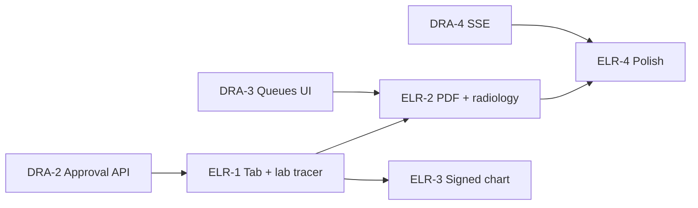

# Slices — encounter-lab-radiology-reports

| Field | Value |
|-------|--------|
| **Project** | `his-global-south` |
| **Feature** | `encounter-lab-radiology-reports` |
| **PRD** | [../prd.md](../prd.md) |
| **Technical design** | [../technical-design.md](../technical-design.md) |
| **G3 status** | **Pending** — fill Approval on each slice spec before implement |

---

## Overview

| Slice | Title | Builds on | User capability after merge |
|-------|-------|-----------|----------------------------|
| **ELR-1** | Tab shell + released lab tracer | DRA-2 fields (or seeded `released` rows) | Doctor opens Reports & Documents → views/prints one released lab result |
| **ELR-2** | PDF + radiology + sub-tabs | ELR-1, DRA-3 | Full modality split; PDF and radiology drawers; pending/not-ready states |
| **ELR-3** | Signed encounter embed | ELR-1 | Same list on `EncounterReadOnly` post-sign |
| **ELR-4** | Polish + realtime refresh | ELR-2, optional DRA-4 | Empty states, tab badge, SSE/query invalidation |

**Tracer bullet:** ELR-1 — consultation tab + one released lab line → `LabResultDrawer` + print.

---

## Dependency graph



```text
DRA-2 ──→ ELR-1 ──→ ELR-2 ──→ ELR-4
              └──→ ELR-3
DRA-3 ──→ ELR-2 (full E2E: ops → approve → doctor view)
```

**Parallelization:** ELR-3 can ship in parallel with ELR-2 after ELR-1 (shared list component). ELR-4 last.

---

## User story progress matrix

| User story | ELR-1 | ELR-2 | ELR-3 | ELR-4 |
|------------|-------|-------|-------|-------|
| US-1 Reports & Documents tab | ✓ | — | — | badge optional |
| US-2 Lab / radiology sub-sections | lab only | ✓ | ✓ | — |
| US-3 View and print released | lab typed | + PDF + rad | ✓ | — |
| US-4 Pending and not-ready states | basic | ✓ | ✓ | — |
| US-5 Critical badge | — | ✓ | ✓ | — |
| US-6 Signed encounter chart | — | — | ✓ | — |
| US-7 Full order payload | ✓ | ✓ | ✓ | — |

---

## PRD coverage check

| PRD requirement | Slice |
|-----------------|-------|
| Tab after Plan, before Care Templates | ELR-1 |
| Encounter-scoped orders only | ELR-1 |
| Released-only View/Print | ELR-1–3 (classifier) |
| Pending: Awaiting approval / Not ready | ELR-2 |
| Rejected hidden from doctor | ELR-2 |
| CRITICAL badge on line | ELR-2 |
| Bedside POC immediate view | ELR-2 (classifier `approval_exempt`) |
| Signed encounter same UX | ELR-3 |
| Consultation only — no IPD | All slices |
| No new backend routes v1 | All slices (consumer only) |

---

## Critical path

1. **DRA-2** must expose approval fields on `GET orders?encounterId=` (blocks ELR-1 in real env; dev can use grandfathered rows).
2. **ELR-1** — thinnest doctor-facing path.
3. **DRA-3** — required for full manual E2E (order → approve → view in tab).
4. **ELR-2** — completes PRD Must-Haves.
5. **ELR-3** — signed chart parity.
6. **ELR-4** — polish; optional for initial launch.

---

## Preserve existing (all slices)

- Plan tab order placement unchanged
- `listEncounterDiagnosticOrders` thin fetch for Plan tab not broken
- Lab/radiology trackers unchanged (owned by DRA feature)
- Consultation sign flow not blocked by reports tab

---

## Out of scope (all slices)

Per PRD §7:

- IPD workspace tab
- Non-clinical documents
- Order placement from reports tab
- Doctor critical acknowledgement
- New aggregator API endpoint

---

## Status tracking

Update [status.yaml](./status.yaml) when slices are approved and implemented.

## After you approve

Fill Approval on **ELR-1** after **DRA-2** is merged or test seeds exist. Run `plan-slice` before implement.
