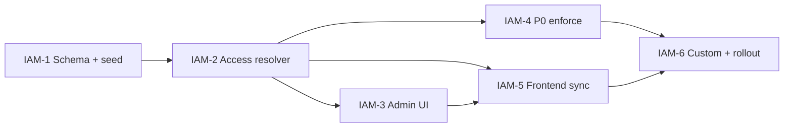

# Slices — iam-resource-groups

| Field | Value |
|-------|--------|
| **Project** | `his-global-south` |
| **Feature** | `iam-resource-groups` |
| **PRD** | [../prd.md](../prd.md) |
| **Technical design** | [../technical-design.md](../technical-design.md) |
| **G3 status** | **Pending** — fill Approval on each slice spec before implement |

---

## Overview

| Slice | Title | Builds on | User capability after merge |
|-------|-------|-----------|----------------------------|
| **IAM-1** | Schema + system groups + member tracer | — | DB has resource groups; existing users backfilled; admin can list groups and add one user to a group |
| **IAM-2** | Effective access resolver + API | IAM-1 | `/api/iam/me/access` returns merged permissions; legacy `/platform/permissions` shim; module-permissions CRUD protected |
| **IAM-3** | Resource Groups admin UI | IAM-2 | Super_admin edits group permissions/capabilities and manages members in Org Setup |
| **IAM-4** | Backend enforcement (P0 routes) | IAM-2 | Wrong group → 403 on encounters/claims/prescribe/approve paths |
| **IAM-5** | Frontend sync — API-driven nav | IAM-2, IAM-3 | Sidebar/landing from `/me/access`; `staticRoleAccess.ts` removed from runtime |
| **IAM-6** | Custom groups + route rollout | IAM-4, IAM-5 | Hospital creates custom groups; remaining routes enforce group permissions |

**Tracer bullet:** IAM-1 → IAM-2 → IAM-3 (admin adds doctor to OPD Doctor → user sees correct access in API). IAM-4 proves enforcement. IAM-5 aligns UI. IAM-6 completes coverage.

---

## Dependency graph



```text
IAM-1 → IAM-2 → IAM-3 ─┐
              ↘ IAM-4 ─┼→ IAM-6
              ↘ IAM-5 ─┘
```

**Parallelization:** IAM-4 (backend) and IAM-3 (UI) can run in parallel after IAM-2. IAM-5 needs IAM-2 minimum; IAM-3 recommended first for admin testing.

---

## User story progress matrix

| User story | IAM-1 | IAM-2 | IAM-3 | IAM-4 | IAM-5 | IAM-6 |
|------------|-------|-------|-------|-------|-------|-------|
| US-1 System groups per org | ✓ | — | — | — | — | — |
| US-2 Add/remove members | API stub | ✓ | UI | — | — | — |
| US-3 Edit group permissions | seed only | API | UI | — | — | custom |
| US-4 Effective access on login | — | ✓ | — | — | ✓ | — |
| US-5 Backend enforcement | — | protect admin API | — | ✓ | — | ✓ |
| US-6 Migrate user_roles | ✓ | verify | — | — | — | — |
| US-7 Custom groups | — | — | — | — | — | ✓ |
| US-8 Per-user override | — | — | — | — | — | out |

---

## PRD coverage check

| PRD requirement | Slice |
|-----------------|-------|
| Resource group data model | IAM-1 |
| System group seeds | IAM-1 |
| user_roles → group members migration | IAM-1 |
| Group member add/remove | IAM-1 (API), IAM-3 (UI) |
| Edit group permissions at group level | IAM-3 |
| Effective access API | IAM-2 |
| Backend route enforcement | IAM-4, IAM-6 |
| Frontend nav from API | IAM-5 |
| iam module folder structure | IAM-1 onward |
| Deprecate staticRoleAccess | IAM-5 |

---

## Critical path

1. **IAM-1** — migrations before any write paths.
2. **IAM-2** — resolver before enforcement or frontend switch.
3. **IAM-4** — security value; ship before wide frontend reliance.
4. **IAM-5** — user-visible parity with today’s nav.

---

## Preserve existing (all slices)

- Better Auth login unchanged
- `user_roles` + clinical roster / attending pickers
- platform_admin hospital management
- Demo `@flowmd.dev` accounts equivalent access post-migration
- Integration mocks: org `active: true`

---

## Out of scope (all slices)

Per PRD §7 — SSO, MFA, multi-org, patient portal auth, row-level ACLs, staff email invite.

---

## Status tracking

Update [status.yaml](./status.yaml) when slices are approved and implemented.

## After you approve

Fill Approval on **IAM-1**, then run `plan-slice` for slice-1 spec under `specs/features/his-global-south/`. Do not implement until slice spec Approval section is complete.
