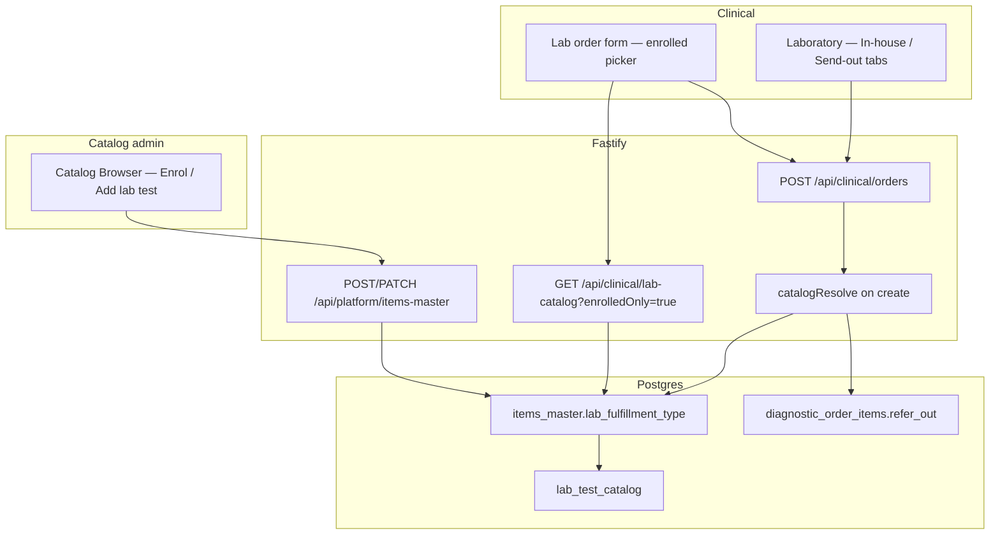

# Technical Design: Lab catalog fulfillment — in-house vs send-out enrollment

| Field | Value |
|-------|--------|
| **Project** | `his-global-south` |
| **Feature** | `lab-catalog-fulfillment` |
| **PRD** | [prd.md](./prd.md) |
| **Related** | [lab-send-out-vendors](../lab-send-out-vendors/technical-design.md) (vendor master, Laboratory tabs, barcode, PDF) |
| **Target repo** | `projects/his-global-south/` @ `develop` |
| **Status** | Draft — **Gate G2 pending** |
| **Date** | 2026-08-31 |

---

## 1. Design summary

Fix **why** a lab line is in-house vs send-out at the source: **hospital catalog enrollment**, not “missing enrollment” inference.

| Area | Today | After |
|------|-------|--------|
| Enrollment | `items_master` row = enrolled; no fulfilment intent | **`lab_fulfillment_type`** on `items_master` (`in_house` \| `send_out`) |
| Catalog overlay | Enrolled → `in_house`; not enrolled → `not_offered` → **`refer_out = true`** on order | Enrolled + type → `in_house` or `refer_out`; **not enrolled → not orderable** |
| Doctor picker | Full `lab_test_catalog` list | **Enrolled-only** list with fulfilment badge |
| Order create | `refer_out` from `facilityAvailability !== in_house` | **`refer_out` only when enrollment = `send_out`**; 422 if not enrolled |
| Lab desk | In-house / Send-out tabs (built) | Unchanged; routing driven by corrected `refer_out` |

**Implement in:** `projects/his-global-south/` (backend + frontend). No new top-level module.

---

## 2. System context



---

## 3. Architecture decisions

### AD-1 — Persist fulfilment on `items_master` (org-scoped)

**Choice:** Add nullable column `items_master.lab_fulfillment_type` (`in_house` \| `send_out`). Required (NOT NULL) when `lab_test_catalog_id IS NOT NULL`. Default **`in_house`** for lab rows.

**Why:** Fulfilment is a **hospital decision**, not a property of the global/national `lab_test_catalog` row. Same national test can be in-house at Hospital A and send-out at Hospital B.

**Not chosen:** Column on `lab_test_catalog` (would not be org-specific).

---

### AD-2 — Map to existing `FACILITY_AVAILABILITY` in catalog resolve

**Choice:** When loading enrollment overlay for a lab test:

| `lab_fulfillment_type` | `facilityAvailability` |
|------------------------|------------------------|
| `in_house` | `in_house` |
| `send_out` | `refer_out` |
| (no `items_master` row) | `not_offered` |

**Why:** Reuses `CatalogEnrollmentOverlay`, visit-plan badges, and `catalogResolve` pipeline without a parallel type system.

**Constants:** Mirror in backend `platform.constants.ts` (or `catalogs.constants.ts`) and frontend `src/clinical/constants/labFulfillment.ts` as `LAB_FULFILLMENT_TYPE` + `*_VALUES`.

---

### AD-3 — `refer_out` only when enrollment is explicitly `send_out`

**Choice:** In `catalogResolve`, for laboratory order type:

```text
referOut = base.enrollment.facilityAvailability === FACILITY_AVAILABILITY.REFER_OUT
```

**Not:** `!== IN_HOUSE` (which incorrectly treats `not_offered` as send-out).

**Wire input:** Ignore client `refer_out` on create (already enforced in `sendOut.service.ts` via `resolveReferOutForItem`).

---

### AD-4 — Enrolled-only clinical lab catalog for ordering

**Choice:** Extend `GET /api/clinical/lab-catalog` with query `enrolledOnly=true` (default **false** for backward-compatible admin/browse callers). When true:

- SQL inner-join / filter: active `items_master` for org + `lab_test_catalog_id`
- Response includes `lab_fulfillment_type`, `facilityAvailability`, `itemsMasterId`

**Why:** Single catalogue source; doctor form switches to `enrolledOnly=true`. Catalog Browser browse keeps full catalogue + enrolled flag.

---

### AD-5 — Reject unenrolled catalog lines on order create

**Choice:** During diagnostic order create, after catalog resolve, if any lab line has `facilityAvailability === not_offered` → **422** code `CATALOG_NOT_ENROLLED` with item display name.

**Also:** Require `catalogId` / resolvable lab catalog id for laboratory lines in v1 (no free-text-only lab lines).

---

### AD-6 — Send-out order guard when no lab vendors

**Choice:** If any resolved line has `referOut === true`, require at least one active lab vendor for the org (`contracted_organizations`, `org_type = laboratory`). Else **422** `NO_ACTIVE_LAB_VENDORS`.

**Why:** PRD US-A3; enrolment of send-out tests still allowed without vendors.

**UI:** Picker may show send-out rows **disabled** with tooltip when vendor count = 0 (PRD default).

---

### AD-7 — Snapshot `refer_out` on order item at create

**Choice:** Persist `diagnostic_order_items.refer_out` and `send_out_status` at insert from resolved enrollment (existing send-out create path). Admin fulfilment edits do **not** retroactively change open orders.

**Why:** PRD WF-4; matches existing item-level columns.

---

### AD-8 — Migration backfill

**Choice:** One migration:

1. Add column `lab_fulfillment_type` with CHECK ∈ `('in_house','send_out')`
2. `UPDATE items_master SET lab_fulfillment_type = 'in_house' WHERE lab_test_catalog_id IS NOT NULL AND lab_fulfillment_type IS NULL`
3. Set NOT NULL for rows where `lab_test_catalog_id IS NOT NULL` (after backfill)

**No** backfill on unenrolled catalogue rows.

---

### AD-9 — Catalog Browser UI surfaces

**Choice:**

- **EnrolSheetPanel** + **AddLabSheet**: required **Fulfilment type** control (radio/select), default In-house
- **LabTestsTab** list: badge **In-house** / **Send-out** on enrolled rows
- **Lab order form**: badge on picker rows; no vendor / send-out controls

---

### AD-10 — Laboratory desk (regression only)

**Choice:** No new desk workflows in this feature. Verify existing In-house / Send-out tabs and actions against corrected `refer_out`. Fix only if routing bugs found.

---

## 4. Data model

### Migration (single)

| Table | Column | Type | Notes |
|-------|--------|------|-------|
| `items_master` | `lab_fulfillment_type` | `text` | CHECK `in_house` \| `send_out`; NOT NULL when `lab_test_catalog_id IS NOT NULL`; default `in_house` |

**pgschema:** Update `items-master.pgschema.ts`; CHECK via `textInArrayCheck` from constants.

### Unchanged

- `lab_test_catalog` — no fulfilment column
- `diagnostic_order_items.refer_out`, `send_out_status` — set at create from resolve (send-out PRD)

---

## 5. API changes

### Platform — items master

| Method | Path | Change |
|--------|------|--------|
| POST | `/api/platform/items-master` | Body: optional `labFulfillmentType` (required when `labTestCatalogId` present); default `in_house` |
| PATCH | `/api/platform/items-master/:id` | Body: optional `labFulfillmentType` for lab rows |
| GET | `/api/platform/items-master/:id/enrol-data` | Response includes `labFulfillmentType` |

**Schemas:** Title Case AJV messages; response schemas on success + 422.

### Clinical — lab catalog (ordering)

| Method | Path | Change |
|--------|------|--------|
| GET | `/api/clinical/lab-catalog` | Query: `enrolledOnly` (boolean, default false). When true, only enrolled org lab tests; each row includes fulfilment fields |

### Clinical — orders (create)

| Method | Path | Change |
|--------|------|--------|
| POST | `/api/clinical/orders` | Stricter resolve: 422 `CATALOG_NOT_ENROLLED`, 422 `NO_ACTIVE_LAB_VENDORS`; `refer_out` from enrollment only |

**Error codes (add to clinical.constants):**

| Code | HTTP | When |
|------|------|------|
| `CATALOG_NOT_ENROLLED` | 422 | Lab line not in org `items_master` |
| `NO_ACTIVE_LAB_VENDORS` | 422 | Send-out line(s) but zero active lab vendors |
| `INVALID_LAB_FULFILLMENT_TYPE` | 422 | Bad enum on item master write |

---

## 6. Frontend changes (overview)

| Area | Change |
|------|--------|
| `src/clinical/constants/labFulfillment.ts` | `LAB_FULFILLMENT_TYPE`, labels, badges |
| Catalog Browser `EnrolSheetPanel`, `AddLabSheet` | Fulfilment control + save |
| `LabTestsTab` | Fulfilment badge column |
| `LabOrderForm` | Fetch `enrolledOnly=true`; show badges; disable send-out rows when no vendors |
| `FacilityAvailabilityBadge` / visit plan | Prefer server `facilityAvailability` from API (already partially used) |
| Consultation lab picker (if separate) | Same enrolled-only API — align in slice 3 if not slice 2 |

---

## 7. Dependency graph & build order

```text
LCF-1  Migration + item master API + Catalog Browser fulfilment UI
  └── LCF-2  Enrolled-only doctor picker + catalog resolve + order create validation
        └── LCF-3  Migration verification, vendor guard UX, consultation alignment, regression
```

**Prerequisite:** Lab send-out desk workflows (Laboratory tabs) from `lab-send-out-vendors` — already implemented locally.

---

## 8. Testing strategy

| Layer | Focus |
|-------|--------|
| Unit | `catalogResolve` referOut mapping; item master validation; order create 422 paths |
| Schema | AJV messages for new fields |
| Integration | Enrol send-out test → order → list shows `refer_out`; unenrolled catalog id → 422 |
| Frontend | Catalog enrol sheet; lab picker enrolled-only; badge display |
| Regression | In-house tab actions; send-out assign vendor flow unchanged |

**CI:** Frontend `npm run lint` + `npx tsc -b`; backend `npm run build` + tests.

---

## 9. Coding rules compliance

- Constants: `LAB_FULFILLMENT_TYPE` + `*_VALUES` backend + frontend mirror
- Unions from constants — no raw `'in_house'` comparisons in services/UI
- Fastify **response schemas** on changed routes
- Title Case AJV `errorMessage` labels
- Integration mocks: org `active: true`; list responses include `total` where paginated

---

## 10. Open questions (resolved for design)

| # | Question | Decision |
|---|----------|----------|
| 1 | Free-text lab lines without catalog? | **Blocked** in v1 |
| 2 | Send-out rows when zero vendors | **Show disabled** in picker |
| 3 | Column name | **`lab_fulfillment_type`** on `items_master` |

---

## Approval

| Role | Name | Date | Status |
|------|------|------|--------|
| Product | | 2026-08-31 | Pending |
| Engineering | | 2026-08-31 | Pending |

Reply **APPROVE DESIGN** to proceed to slice decomposition.
