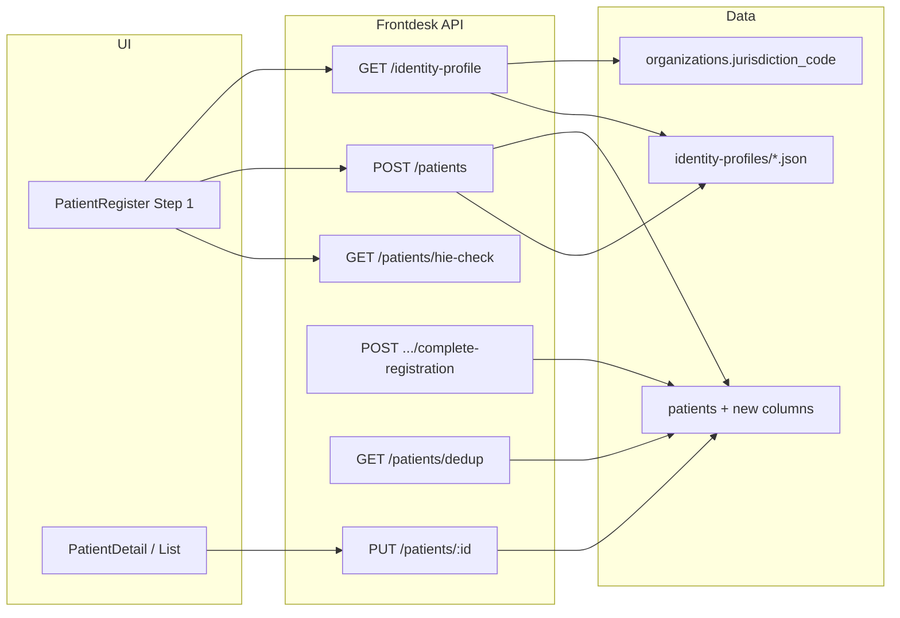

# Technical Design: Patient registration — nationality & document type

| Field | Value |
|-------|-------|
| **Project** | `his-global-south` |
| **Feature** | `patient-registration-identity-profile` |
| **PRD** | [prd.md](./prd.md) |
| **Target repo** | `projects/his-global-south/` |
| **Branch** | `feat/ipd-emergency-registration` (**mandatory** — shared with ER work; no new branch) |
| **Status** | **Approved** (G2 — 2026-08-20) |
| **Date** | 2026-08-20 |

## 1. Design summary

Add hospital-scoped, config-driven patient identity fields to full registration and completion flows:

```text
nationality            = organizations.jurisdiction_code (server-enforced, non-editable in UI)
identification_type    = profile document_types[].code
identification_number  = user-entered document number
```

Document type options come from jurisdiction JSON config. HIE Search button and `hie-check` stub remain **unchanged**.

Emergency registration (Tier A) is **unchanged** in v1.

## 2. System context



## 3. Architecture decisions

| ID | Decision | Rationale |
|----|----------|-----------|
| **AD-1** | **Nationality source** = `organizations.jurisdiction_code` for authenticated org; fallback map from `organizations.address.country` only if jurisdiction null | PRD L1; single-country hospital deploy |
| **AD-2** | **Nationality is server-enforced** — ignore client `nationality` on write; always set from org resolution | Prevents API tampering (PRD security) |
| **AD-3** | **Document types** from `backend/src/modules/frontdesk/patients/identity-profile.constants.ts` (`loadIdentityProfile`, fallback `DEFAULT_IDENTITY_PROFILE`) | PRD L3; no UI hardcoding; compile-time constants (no JSON/fs) |
| **AD-4** | **Dedicated columns** `nationality`, `identification_type`, `identification_number` on `patients` | PRD L4; query/report friendly |
| **AD-5** | **Sync `identifiers` JSONB** when `identification_type = national_id` — keep existing dedup/HIE stub paths | Backward compatibility until HIE slice |
| **AD-6** | **`GET /api/frontdesk/identity-profile`** returns locked nationality + document types for registration UI | PRD API contract |
| **AD-7** | **HIE unchanged** — no changes to `hie-check`, `getHieRegistryRecord`, or Search button wiring | PRD L5 / explicit out of scope |
| **AD-8** | **Dedup extended** — definite match on `identification_number` + org when type provided; retain JSONB national_id path | PRD open decision #3 |
| **AD-9** | **Branch** = `feat/ipd-emergency-registration` only | User mandate |
| **AD-10** | **Emergency + IPD untouched** — no changes to emergency create/completion Tier A fields beyond complete-registration identity when completing | PRD non-goals |

## 4. Data model

### 4.1 Migration `003_patient_identity_profile.sql`

```sql
ALTER TABLE public.patients
  ADD COLUMN nationality text,
  ADD COLUMN identification_type text,
  ADD COLUMN identification_number text;

CREATE INDEX idx_patients_identification
  ON public.patients (organization_id, identification_type, identification_number)
  WHERE identification_number IS NOT NULL;

COMMENT ON COLUMN public.patients.nationality IS
  'ISO 3166-1 alpha-2 nationality; set from organization jurisdiction on create/update.';
COMMENT ON COLUMN public.patients.identification_type IS
  'Document type code from jurisdiction identity profile (e.g. national_id, passport).';
COMMENT ON COLUMN public.patients.identification_number IS
  'Government-issued document number; org-scoped via patients RLS.';
```

Update `backend/src/modules/patient/pgschema/patients.pgschema.ts` with matching Drizzle columns (nullable text).

**Backward compatibility:** existing rows NULL until create/update; `identifiers` JSONB unchanged for legacy rows.

### 4.2 Write rules

| Operation | nationality | identification_type | identification_number | identifiers sync |
|-----------|-------------|---------------------|----------------------|------------------|
| Full create | org jurisdiction | required; validated against profile | required v1 | if type=`national_id`, add/update national_id entry |
| PUT update | re-force org jurisdiction if identity touched | validate if provided | validate if provided | sync on national_id |
| Complete registration | org jurisdiction | required | required v1 | sync on national_id |
| Emergency create | **no change** | not collected | not collected | unchanged |

## 5. Identity profile config

### 5.1 Files

```text
backend/src/modules/frontdesk/patients/identity-profile.constants.ts
backend/src/modules/frontdesk/patients/identity-profile.types.ts
backend/src/modules/frontdesk/patients/identity-profile.service.ts
```

### 5.2 Profile structure (TypeScript)

Per PRD — `jurisdiction_code`, `default_nationality`, `document_types[]` with `code`, `label`, `hie_identification_type` (reserved). Document type codes are defined once in `IDENTIFICATION_DOCUMENT_TYPE` within the constants file.

### 5.3 Loader

```typescript
loadIdentityProfile(jurisdictionCode: string): IdentityProfile
resolveOrgIdentityProfile(organizationId: string): Promise<ResolvedIdentityProfile>
```

`ResolvedIdentityProfile` adds:

- `nationality` — from org (AD-1)
- `nationality_label` — from static ISO→name map in backend (reuse pattern from frontend `COUNTRIES` or small `nationalityLabels.ts`)
- `nationality_editable: false`

## 6. API design

All routes use `withOrgAuth`; JSON snake_case on wire.

### 6.1 GET identity profile

```text
GET /api/frontdesk/identity-profile
```

Response:

```json
{
  "jurisdiction_code": "KE",
  "nationality": "KE",
  "nationality_label": "Kenya",
  "nationality_editable": false,
  "document_types": [
    { "code": "national_id", "label": "National ID" }
  ]
}
```

Register **before** `/api/frontdesk/patients/:id` in route table.

### 6.2 Extended create / update / complete bodies

| Field | Create | Update | Complete |
|-------|--------|--------|----------|
| `nationality` | ignored (server-set) | ignored | ignored |
| `identification_type` | required | optional | required |
| `identification_number` | required | optional | required |

Legacy `national_id` accepted on create for one release — map to `identification_type=national_id` + `identification_number` if new fields omitted (deprecation path).

### 6.3 Read projections

`GET /api/frontdesk/patients`, `GET /api/frontdesk/patients/:id` include new columns via `getTableColumns(patients)`.

### 6.4 HIE (unchanged)

```text
GET /api/frontdesk/patients/hie-check?national_id=&dob=
```

No new params. Frontend Search button continues calling `checkHieRegistry(nationalId, dob)` — may pass `identification_number` when type is national_id (same field as today’s national ID input).

## 7. Frontend design

### 7.1 Registration Step 1 (full path only)

1. On mount (full wizard): `GET /api/frontdesk/identity-profile`
2. Show **nationality** as read-only label (not combobox)
3. **Document type** select from profile
4. **Document number** text input (required)
5. Keep HIE Search on same row — still uses national ID + DOB when user clicks Search (unchanged behaviour)
6. Submit sends `identificationType`, `identificationNumber` (camelCase → snake_case via API client)

### 7.2 Patient detail / list

Display nationality label, document type label (resolve from profile or store label in response later), and document number in demographics section.

### 7.3 Complete registration

When `?id=` completion mode (ER-3): load profile + prefill identity section with locked nationality; require type + number on submit.

### 7.4 Emergency path

No changes to entry choice, emergency form, or badges.

## 8. File plan (clone)

| Area | Files |
|------|-------|
| Migration | `backend/src/db/migrations/003_patient_identity_profile.sql` |
| pgschema | `backend/src/modules/patient/pgschema/patients.pgschema.ts` |
| Config | `identity-profile.constants.ts`, `identity-profile.types.ts`, `identity-profile.service.ts` |
| API | `patients.routes.ts`, `patients.controller.ts`, `patients.schema.ts`, `patients.service.ts` |
| Dedup | `patients.service.ts` `dedupPatients` |
| Frontend service | `src/services/patients.service.ts`, `src/modules/clinical/index.ts` |
| UI | `PatientRegister.tsx`, `PatientDetail.tsx`, `PatientList.tsx` (demographics only) |
| Tests | backend unit + integration; frontend component tests |

**Forbidden:** `backend/src/modules/ipd/**`, HIE service changes, emergency Tier A form changes.

## 9. Slice build order

| Slice | Delivers | Depends on |
|-------|----------|------------|
| **PRI-1** | Migration, pgschema, service persist + read + dedup extension + identifiers sync | — |
| **PRI-2** | Profile constants, loader, `GET identity-profile`, server validation on create/update/complete | PRI-1 |
| **PRI-3** | Registration Step 1 UI (locked nationality, profile doc types) | PRI-1, PRI-2 |
| **PRI-4** | Detail/list display + complete-registration identity fields | PRI-1, PRI-2, PRI-3 |
| **PRI-5** | Tests (backend + frontend + integration regression) | PRI-1–4 |

## 10. Testing strategy

- Backend: nationality forced from org; invalid `identification_type` rejected; columns persisted; dedup on `identification_number`
- Integration: create patient returns identity fields; identity-profile returns KE types
- Frontend: nationality disabled; dropdown from API; HIE button still renders
- Regression: emergency create unchanged; hie-check stub unchanged; steps 2–3 unchanged

## 11. Rollout

1. Apply migration 003
2. Deploy backend (profile + API + write path)
3. Deploy frontend Step 1 + detail
4. Verify full registration + complete-registration in test org

## 12. Open questions (resolved for G2)

| Question | Resolution |
|----------|------------|
| Document number required? | Yes for all types v1 (PRD) |
| Foreign nationality at same hospital | Out of scope; locked to org jurisdiction |
| Legacy `national_id` body field | Accept on create; map to new columns; log deprecation |

## References

- [PRD](./prd.md)
- [Emergency registration PRD](../ipd-emergency-registration/prd.md) — emergency path unchanged
- [his-global-south patterns](../../../docs/conventions/his-global-south-patterns.md)
