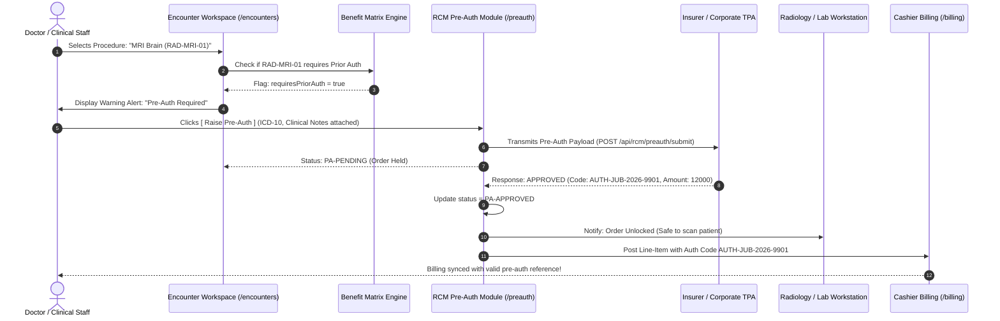

# Payer Benefit Matrix & Pre-Authorization (Pre-Auth) Guide

| Document Metadata | Details |
|---|---|
| **Feature** | Payer Benefit Matrix, Coverage Policy & Pre-Authorization Lifecycle |
| **Project** | `his-global-south` (flowMD) |
| **Target Audience** | Engineering Team, Product Managers, Hospital Administrators, Billing Staff |
| **Language** | English with Bilingual (Hinglish) Practical Annotations |
| **Status** | Active Reference Architecture |
| **Last Updated** | 2026-09-11 |

---

## 📑 Table of Contents

1. [Executive Summary & Core Concepts](#1-executive-summary--core-concepts)
2. [Tariff Matrix ($) vs Benefit Matrix (🛡️) Deep Dive](#2-tariff-matrix--vs-benefit-matrix-️-deep-dive)
3. [How to Add the Benefit Matrix After Registering a Payer](#3-how-to-add-the-benefit-matrix-after-registering-a-payer)
   - [Flow A: National Insurers (SHA, Jubilee, AAR, NHIF)](#flow-a-national-insurers-sha-jubilee-aar-nhif)
   - [Flow B: Direct Corporate Panels (Safaricom, Equity Bank, Kenya Airways)](#flow-b-direct-corporate-panels-safaricom-equity-bank-kenya-airways)
4. [Pre-Authorization (Pre-Auth) Architecture & Lifecycle](#4-pre-authorization-pre-auth-architecture--lifecycle)
   - [Why Pre-Auth is Essential in Healthcare Billing](#why-pre-auth-is-essential-in-healthcare-billing)
   - [The 5-Step End-to-End Pre-Auth Lifecycle](#the-5-step-end-to-end-pre-auth-lifecycle)
   - [Sequence Diagram: Doctor Order ➔ Pre-Auth ➔ Approval ➔ Bill Unlock](#sequence-diagram)
5. [Database Schema Design & Tables](#5-database-schema-design--tables)
   - [`plan_benefits` (Line-Item Insurance Rules)](#plan_benefits-line-item-insurance-rules)
   - [`org_payer_contracts.contract_rules` (Corporate Guardrails JSONB)](#org_payer_contractscontract_rules-corporate-guardrails-jsonb)
   - [`preauth_requests` (Authorization Tracking)](#preauth_requests-authorization-tracking)
6. [Codebase Touchpoints & Implementation Map](#6-codebase-touchpoints--implementation-map)
7. [Operational Scenarios & FAQs](#7-operational-scenarios--faqs)

---

## 1. Executive Summary & Core Concepts

In hospital administration, two questions frequently cause confusion among engineering and product teams:

1. *"Humne Payer register kar diya (e.g. Safaricom ya Jubilee), lekin uski **Benefit Matrix** kahan aur kaise configure hogi?"*
2. *"Pre-Authorization (Pre-Auth) toh insurance ka concept hota hai, yeh hamare HIS system mein doctor aur billing workflow ke sath kaise judega?"*

This document serves as the canonical reference answering both questions with UI steps, database models, and operational sequences.

---

## 2. Tariff Matrix ($) vs Benefit Matrix (🛡️) Deep Dive

Yeh do bilkul alag concepts hain:

```text
+---------------------------------------------------------------------------------------------------+
|                                      TWO PARALLEL MATRICES                                        |
+----------------------------------------------------+----------------------------------------------+
|             TARIFF MATRIX (Price List)             |         BENEFIT MATRIX (Policy Rules)        |
|             "Kitne Rupaye Ka Hai?" ($)             |     "Kya Covered Hai? Niyam Kya Hai?" (🛡️)   |
+----------------------------------------------------+----------------------------------------------+
| • Determines hospital rate / allowed price         | • Determines coverage, copay, exclusions, PA |
| • Examples:                                        | • Examples:                                  |
|   - OPD Consult = KES 1,500                        |   - Dental = 0% Covered (Excluded)           |
|   - CBC Blood Test = KES 500                       |   - Maternity = Covered up to KES 150,000    |
|   - Chest X-Ray = KES 1,200                        |   - MRI Brain = Covered BUT Pre-Auth Needed  |
|   - MRI Brain Scan = KES 10,000                    |   - General Ward = 100% Covered              |
| • Database Table: `public.item_prices`             | • Database Table: `public.plan_benefits`     |
| • Managed By: Hospital Finance / Billing Admin     | • Managed By: Insurance / Corporate HR Terms |
+----------------------------------------------------+----------------------------------------------+
```

### Direct Comparison Matrix

| Dimension | Tariff Matrix (Price List) | Benefit Matrix (Coverage Policy) |
|---|---|---|
| **Core Question** | **"Kitne Ka Hai?"** (Price / Rate) | **"Policy Mein Covered Hai Ya Nahi?"** (Rules / Limits) |
| **Who Dictates It?** | Hospital tariff negotiation / Gazette | Insurance policy underwriter / Corporate agreement |
| **Primary Tables** | `price_lists`, `item_prices` | `plan_benefits`, `org_payer_contracts.contract_rules` |
| **Downstream Impact** | Populates gross line item amount on bill | Determines patient co-pay vs insurance claim portion |
| **Pre-Auth Flag** | No relation | Sets `requires_prior_auth = true/false` |

---

## 3. How to Add the Benefit Matrix After Registering a Payer

Depending on whether the payer is a **National Insurer** or a **Direct Corporate Panel**, the Benefit Matrix is added in one of two ways:

---

### Flow A: National Insurers (SHA, Jubilee, AAR, NHIF)

National insurance companies offer structured health policies (e.g., *Jubilee Comprehensive Care*, *SHA Social Health Plan*). These policies contain hundreds of standardized clinical procedure codes with explicit coverage levels and authorization rules.

#### Step-by-Step Configuration:

1. Navigate to: **Organization ➔ `Accepted plans`** (`/accepted-plans`).
2. Locate the insurer in the active contracts table.
3. Click the **Shield Icon 🛡️ (`Benefits`)** on the contract row.
4. The system opens the **Plan Benefits Matrix Sheet**:

```text
+----------------------------------------------------------------------------------------------------+
| PLAN BENEFIT MATRIX: Jubilee Insurance - Comprehensive Platinum Plan                               |
+-------------------+----------------+---------------------------+-----------+---------+-------------+
| Service Code      | Category       | Display Name              | Covered?  | PA Req? | Co-Pay / Pay|
+-------------------+----------------+---------------------------+-----------+---------+-------------+
| CONS-GEN-001      | Consultation   | General Doctor Consult    | [x] Yes   | [ ] No  | 100% Covered|
| LAB-CBC-01        | Laboratory     | Complete Blood Count      | [x] Yes   | [ ] No  | 100% Covered|
| RAD-MRI-01        | Radiology      | MRI Brain with Contrast   | [x] Yes   | [x] YES | 10% Co-Pay  |
| SURG-CS-01        | Inpatient/OT   | Caesarean Delivery (C-Sec)| [x] Yes   | [x] YES | Covered (Cap|
| DENT-SCALE-01     | Dental         | Routine Scaling/Polishing | [ ] NO    | [ ] No  | 0% (Patient)|
+-------------------+----------------+---------------------------+-----------+---------+-------------+
| [ + Add Benefit Rule ]                                                  [ Save Benefit Matrix ]    |
+----------------------------------------------------------------------------------------------------+
```

5. **Actions you can perform here:**
   - **Toggle Coverage**: Mark non-covered services (e.g. cosmetic surgery, adult dental).
   - **Set Pre-Auth (`PA Req`)**: Flag expensive procedures (MRI, CT, Major Surgery, Chemotherapy) requiring insurer authorization before clinical execution.
   - **Set Cost-Sharing**: Define whether the patient pays a flat copay (e.g., KES 500) or coinsurance percentage (e.g., 10%).

---

### Flow B: Direct Corporate Panels (Safaricom, Equity Bank, Kenya Airways)

Direct corporate panels do not use 500-page insurance books. Their employees visit the hospital, and the company is invoiced monthly via Accounts Receivable (A/R).

Their Benefit Matrix is configured **directly inside the Payer Master onboarding form** via two distinct sections:

#### 1. The 14 Operational Checkboxes (Stored in `contract_rules` JSONB):

```text
┌────────────────────────────────────────────────────────────────────────────────────────┐
│ 🛡️ HOSPITAL OPERATIONAL & BENEFIT GUARDRAILS (Tab 3: Operational Rules)                │
├────────────────────────────────────────────────────────────────────────────────────────┤
│ [x] Admission Not Allowed        ➔ Patient cannot be admitted under this corporate      │
│ [ ] OPD Credit Not Allowed       ➔ Force cash collection for OPD visits                │
│ [x] Bed Matrix Applicable        ➔ Restricts ward type (e.g. General Ward only)        │
│ [x] Surgery Grading Required     ➔ Multi-level surgical grading approval required     │
│ [x] Express Reporting Service    ➔ Lab/Radiology express charges billable to company   │
│ [x] Preauth Mandatory            ➔ Orders above threshold require corporate LPO/guarantee│
│ [x] Exclude Surgery Components   ➔ Consumables & implants billed to patient cash      │
│ [ ] OT Advance Required          ➔ Requires upfront deposit before OT booking          │
│ [x] Doctor Visit Restriction     ➔ Limits inpatient doctor ward rounds to 1/day        │
└────────────────────────────────────────────────────────────────────────────────────────┘
```

#### 2. Agreement Quantitative Limitations:

* **Free Visits Allowed (`free_visits: 2`)**:
  - First 2 consultation visits per employee/family member are 100% free (hospital waives fee under corporate contract).
  - 3rd visit onwards is charged at standard or negotiated rates.
* **Stay Limit Days (`stay_limit_days: 14`)**:
  - Corporate covers inpatient hospitalization for up to 14 days.
  - Day 15 onwards requires corporate re-authorization or falls back to patient self-pay.

---

## 4. Pre-Authorization (Pre-Auth) Architecture & Lifecycle

### Why Pre-Auth is Essential in Healthcare Billing

Pre-Authorization is an advance agreement between the healthcare provider (hospital) and the payer (insurer/corporate sponsor) confirming that:
1. The ordered medical procedure is clinically necessary (medical necessity verification).
2. The procedure is covered under the patient's specific policy.
3. The insurer guarantees payment up to a specified pre-approved financial limit.

> [!WARNING]
> **Financial Risk Without Pre-Auth**:
> If a hospital performs a KES 45,000 MRI Brain or KES 150,000 surgery without obtaining an approved Pre-Auth code, the insurer will **summarily reject the claim during post-facto billing**. The hospital then suffers a 100% revenue write-off (bad debt).

---

### The 5-Step End-to-End Pre-Auth Lifecycle

```text
┌──────────────────────────────────────────────────────────────────────────────────────────────────┐
│                                  PRE-AUTH END-TO-END WORKFLOW                                    │
└──────────────────────────────────────────────────────────────────────────────────────────────────┘

 [ STEP 1: Doctor Orders High-Value Service in Encounter ]
 Doctor selects "MRI Brain with Contrast (RAD-MRI-01)" during consultation.
 System evaluates Benefit Matrix: `requiresPriorAuth == true`.
 Visual Alert on Doctor Screen: ⚠️ "Pre-Authorization Required by Jubilee Insurance"
                                        │
                                        ▼
 [ STEP 2: Doctor or Hospital Biller Raises Pre-Auth Request ]
 Click: [ Raise Pre-Authorization ]
 System launches PreAuthSubmitDialog (/preauth):
  • Auto-fills: Patient Name, ID, Policy Number, Insurer Code
  • Auto-fills: ICD-10 Primary Diagnosis (e.g. G44.2 Tension-type headache)
  • Auto-fills: Procedure Code & Estimated Tariff: KES 12,000
  • Doctor attaches clinical justification summary / referral letter
                                        │
                                        ▼
 [ STEP 3: Dispatch & Hold in Queue ]
 Request submitted electronically via FHIR / EDI claim bridge (or generated as PDF letter).
 Record saved in `preauth_requests` table with status: ⏳ "PA-PENDING".
 Clinical Status: Procedure held in Radiology / OT order queue with badge "Awaiting Authorization".
                                        │
                                        ▼
 [ STEP 4: Insurer / TPA Reviews & Approves ]
 Insurer adjudicator reviews clinical documentation and approves.
 System receives electronic callback (or billing officer enters authorization code manually):
  • Status updated to: ✅ "PA-APPROVED"
  • Authorization Code: `AUTH-JUB-2026-9901`
  • Approved Amount: KES 12,000
  • Validity: 30 Days
                                        │
                                        ▼
 [ STEP 5: Service Unlocks & Automatically Posts to Bill ]
 1. Order queue unlocks: Radiology technician can now execute the MRI scan.
 2. Cashier Billing Desk (/billing) automatically adds line-item:
    - Service: MRI Brain with Contrast
    - Gross: KES 12,000 | Copay (10%): KES 1,200 | Insurer Share: KES 10,800
    - Pre-Auth Reference: AUTH-JUB-2026-9901
 3. Final EDI claim (/claims) includes authorization code, guaranteeing zero claim rejection!
```

---

### Sequence Diagram



---

## 5. Database Schema Design & Tables

The benefit rules and pre-authorization workflows are backed by three foundational database structures:

### `plan_benefits` (Line-Item Insurance Rules)

Stores the fine-grained coverage policy for each service code under a given plan:

```sql
CREATE TABLE public.plan_benefits (
    id UUID PRIMARY KEY DEFAULT gen_random_uuid(),
    insurer_plan_id UUID NOT NULL REFERENCES public.insurer_plans(id) ON DELETE CASCADE,
    service_code TEXT NOT NULL,                -- e.g. 'RAD-MRI-01', 'SURG-CS-01'
    category TEXT NOT NULL,                    -- e.g. 'radiology', 'consultation', 'inpatient'
    display_name TEXT NOT NULL,                -- e.g. 'MRI Brain with Contrast'
    is_covered BOOLEAN NOT NULL DEFAULT true,  -- false = excluded service
    requires_prior_auth BOOLEAN NOT NULL DEFAULT false, -- triggers pre-auth warning
    copay_amount NUMERIC(10,2) DEFAULT 0.00,   -- flat copay (KES 500)
    coinsurance_percent NUMERIC(5,2) DEFAULT 0.00, -- percentage copay (10%)
    annual_limit_amount NUMERIC(12,2),         -- monetary ceiling
    created_at TIMESTAMPTZ NOT NULL DEFAULT now(),
    updated_at TIMESTAMPTZ NOT NULL DEFAULT now(),
    CONSTRAINT plan_benefits_plan_code_unique UNIQUE (insurer_plan_id, service_code)
);
```

### `org_payer_contracts.contract_rules` (Corporate Guardrails JSONB)

Stores the 14 operational hospital checkboxes and quantitative limits:

```json
{
  "operational_rules": {
    "admission_not_allowed": false,
    "opd_credit_not_allowed": false,
    "bed_matrix_applicable": true,
    "surgery_grading_required": true,
    "express_reporting_service": true,
    "preauth_mandatory": true,
    "exclude_surgery_components": false,
    "ot_advance_required": false,
    "doctor_visit_restriction": true,
    "multiple_doctor_visit_allowed": false,
    "admit_patient_without_advance": true,
    "release_unsettled_doctor_fees": true,
    "release_period_days": 30,
    "otp_required_at_registration": false
  },
  "limits": {
    "free_visits": 2,
    "stay_limit_days": 14,
    "annual_spend_cap": 500000.00
  },
  "accounting": {
    "sap_company_code": "90210",
    "claim_filing_code": "CI",
    "member_id_format": "^SAF-[0-9]{6}$"
  }
}
```

### `preauth_requests` (Authorization Tracking)

Tracks each authorization request from doctor initiation to insurer signoff:

```sql
CREATE TABLE public.preauth_requests (
    id UUID PRIMARY KEY DEFAULT gen_random_uuid(),
    organization_id UUID NOT NULL REFERENCES public.organizations(id),
    encounter_id UUID REFERENCES public.encounters(id),
    patient_id UUID NOT NULL REFERENCES public.patients(id),
    insurer_plan_id UUID NOT NULL REFERENCES public.insurer_plans(id),
    service_code TEXT NOT NULL,
    requested_amount NUMERIC(12,2) NOT NULL,
    approved_amount NUMERIC(12,2),
    status TEXT NOT NULL DEFAULT 'draft' 
        CHECK (status IN ('draft', 'pending', 'approved', 'rejected', 'expired')),
    preauth_code TEXT,                         -- e.g. 'AUTH-JUB-2026-9901'
    icd10_diagnosis_code TEXT NOT NULL,
    clinical_notes TEXT,
    supporting_document_urls TEXT[],
    submitted_at TIMESTAMPTZ,
    approved_at TIMESTAMPTZ,
    expires_at TIMESTAMPTZ,
    created_by UUID NOT NULL,
    created_at TIMESTAMPTZ NOT NULL DEFAULT now(),
    updated_at TIMESTAMPTZ NOT NULL DEFAULT now()
);
```

---

## 6. Codebase Touchpoints & Implementation Map

| Layer | File Path | Current Status | Responsibility |
|---|---|---|---|
| **Payer Master UI** | `src/pages/payerCatalog/AcceptedPlansPage.tsx` | ✅ Implemented | 4-tab Direct Payer Modal (Tabs: Details, Billing, Rules, Validity). |
| **Tariff Sheet UI** | `src/pages/payerCatalog/AcceptedPlansPage.tsx` (L2011) | ✅ Implemented | Service Tariffs & Rates matrix sheet with search & edit. |
| **National Gazette Sync** | `backend/src/modules/catalogs/catalogs.service.ts` | ✅ Implemented | Synchronizes government (SHA) gazetted tariffs into `items_master`. |
| **CSV Tariff Uploader** | `src/components/payerCatalog/FeeScheduleCsvUpload.tsx` | ✅ Implemented | Bulk imports custom fee schedules from CSV files. |
| **Pre-Auth Frontend** | `src/pages/preauth/PreAuthForm.tsx` & `PreAuthTracker.tsx` | ✅ Implemented | Submit pre-auth dialog and RCM tracking dashboard. |
| **Pre-Auth Backend** | `backend/src/modules/preauth/preauth.service.ts` | ✅ Implemented | Handles pre-auth state transitions (`draft` → `pending` → `approved`). |
| **Patient Registration** | `src/pages/patients/PatientRegister.tsx` | ✅ Implemented | Step 3 Cash/Credit toggle binds patient to contracted payer. |
| **Pre-Auth Billing Bridge** | `backend/src/modules/billing/billing.service.ts` | ⏳ Pending Gap | Auto-attaches `preauth_code` to invoice line item upon approval. |

---

## 7. Operational Scenarios & FAQs

### Q1: What happens if an emergency patient arrives and needs immediate surgery before Pre-Auth can be approved?
**Answer**: 
1. Emergency triage protocols override billing holds.
2. The system allows an **Emergency Override Flag** (`is_emergency = true`).
3. The surgery proceeds immediately, and an **Emergency Retrospective Pre-Auth (Post-Facto PA)** must be filed within 24 to 48 hours of admission as mandated by Kenyan health regulations.

### Q2: How does a hospital bill a patient when the corporate agreement gives "2 Free Visits"?
**Answer**:
1. When checking in the patient under Safaricom corporate credit:
2. The registration query evaluates `COUNT(encounters) WHERE patient_id = :id AND payer_id = :payer AND encounter_type = 'OPD' AND encounter_date >= agreement_start_date`.
3. If count `< 2`, the consult fee line-item is automatically marked with `rate = 0.00` and `memo = "Corporate Free Visit Allowance (1 of 2)"`.
4. On the 3rd visit, the system applies the contracted rate (e.g. KES 1,500).

### Q3: If a payer pays Cash instead of Credit, does the Benefit Matrix still apply?
**Answer**:
Yes! Even under cash/self-pay concession panels:
- Some services may be completely excluded or capped.
- For example, an NGO corporate panel may subsidize outpatient primary care (100% covered cash grant) but exclude cosmetic dermatology.

---

### Summary Checklist for Manager Demo

1. **Tariff Matrix ($)**: Shows *what the service costs* (e.g., KES 1,500 for consult, KES 12,000 for MRI).
2. **Benefit Matrix (🛡️)**: Shows *whether it's covered and what rules apply* (e.g., Covered, 10% copay, Pre-Auth required).
3. **Where to configure**:
   - For Insurance: `/accepted-plans` ➔ Shield 🛡️ (`Benefits`) sheet.
   - For Corporate: `/accepted-plans` ➔ Direct Payer modal ➔ Tab 3 (14 Checkboxes) + Agreement limits.
4. **Pre-Auth Flow**:
   - Doctor orders test ➔ Alert pops up ➔ Biller submits PA ➔ Insurer returns approval code ➔ Service unlocks & posts to bill with zero risk of claim denial.
