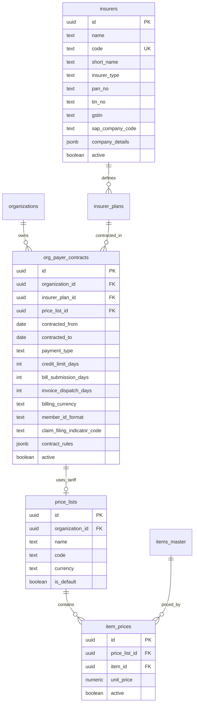
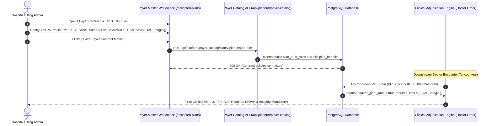
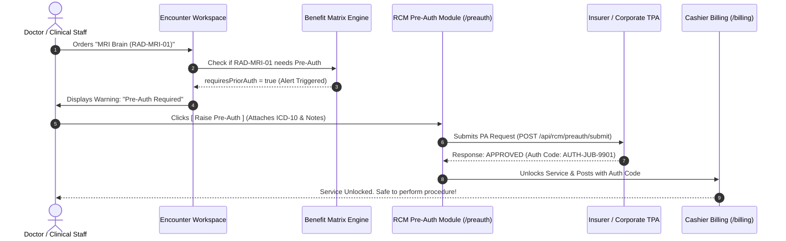

# Payer Master & Catalog: Complete LLD, Operations & Pre-Auth Architecture

| Document Metadata | Details |
|---|---|
| **Feature** | Enterprise Payer Master / Payer Catalog & Pre-Auth Architecture |
| **Project** | `his-global-south` (flowMD) |
| **Document Type** | Comprehensive Low-Level Design (LLD), Operations & Demo Handbook |
| **Target Audience** | Engineering Manager, Tech Leads, Fullstack Engineers, Product Team |
| **Status** | Complete & Production-Ready |
| **Date** | 2026-09-11 |

---

## 📑 Quick Navigation (Table of Contents)

1. [Executive Summary & Problem Statement](#1-executive-summary)
2. [Point-to-Point Comparison (Before vs After)](#2-point-to-point-comparison-before-vs-after)
3. [Payer Onboarding Workflow (Step-by-Step Practical Flow)](#3-payer-onboarding-workflow)
4. [Detailed Database Design (Schema, DDL, ERD & Constraints)](#4-detailed-database-design)
5. [🔥 Tariff Matrix ($) vs Benefit Matrix (🛡️) Deep Dive](#5-tariff-matrix--vs-benefit-matrix-️-deep-dive)
   - [5.1 Fundamental Difference & Rationale](#51-fundamental-difference--rationale)
   - [5.2 National Insurers (SHA, Jubilee) Benefit Matrix](#52-national-insurers-sha-jubilee-benefit-matrix)
   - [5.3 Direct Corporate Panels (Safaricom) Benefit Matrix](#53-direct-corporate-panels-safaricom-benefit-matrix)
   - [5.4 🔥 Unified Payer Workspace LLD: Lifting Payer Catalog's Benefits & PA Rules Engine into Payer Master](#54--unified-payer-workspace-lld-lifting-payer-catalogs-benefits--pa-rules-engine-into-payer-master)
6. [🔥 End-to-End Pre-Authorization (Pre-Auth) Workflow](#6-end-to-end-pre-authorization-pre-auth-workflow)
   - [6.1 The 5-Step Pre-Auth Lifecycle](#61-the-5-step-pre-auth-lifecycle)
   - [6.2 Sequence Diagram: Doctor Order ➔ Pre-Auth ➔ Approval ➔ Bill Unlock](#62-sequence-diagram)
7. [🔥 Pricing Scenarios: Cash vs Credit vs SHA Gazette Tariffs](#7-pricing-scenarios-cash-vs-credit-vs-sha-gazette-tariffs)
   - [7.1 Cash vs Credit Payment Types (A/R Invoicing vs Spot Cash)](#71-cash-vs-credit-payment-types)
   - [7.2 Flat Discount % vs Custom Overrides](#72-flat-discount--vs-custom-overrides)
   - [7.3 Complete 100% Unique Tariff: SHA Gazette API Sync & CSV Bulk Upload](#73-complete-100-unique-tariff-sha-gazette-api-sync--csv-bulk-upload)
8. [Current Implementation Audit & Live Demo Script](#8-current-implementation-audit--live-demo-script)
   - [8.1 What is ALREADY Implemented (85% Engine Ready)](#81-what-is-already-implemented-85-engine-ready)
   - [8.2 What is PENDING / The Gap (15% UX Polish)](#82-what-is-pending--the-gap-15-ux-polish)
   - [8.3 Step-by-Step Live Demo Script for Stakeholders](#83-step-by-step-live-demo-script-for-stakeholders)
9. [Canonical Service Codes Dictionary](#9-canonical-service-codes-dictionary)
10. [Non-Regression & Safety Checklist](#10-non-regression--safety-checklist)

---

## 1. Executive Summary

In enterprise healthcare facilities (e.g., Kenyatta National Hospital / Apeiro HIS), corporate and insurance onboarding cannot be split across 4 disjointed screens. Hospital administrators require a single-window **Payer Master** to configure demographics, billing policies, 14 hospital operational guardrails, and **inline visit tariffs (OPD, Emergency Triage, and IPD)**.

Furthermore, hospital billing must handle complex payer contracting:
1. **Tiered Pricing**: Supporting standard cash, negotiated corporate discounts, and mandatory government tariffs (e.g. SHA Gazette).
2. **Dual-Track Billing**: Splitting spot-cash collections from corporate Accounts Receivable (A/R) invoicing.
3. **Pre-Authorization (Pre-Auth)**: Locking high-value clinical services until insurer approval codes are received and attached to the claim.

---

## 2. Point-to-Point Comparison (Before vs After)

```
+---------------------------------------------------------------------------------------------------------+
|                                    BEFORE (Pehle Kaise Tha)                                             |
|                                                                                                         |
|  [Platform Catalog]              [Accepted Plans]                  [Price Lists / Catalog]              |
|   /payerCatalog                   /accepted-plans                   /priceLists                         |
|   - Platform admin only           - Pick existing plan only         - Manual item search & pricing      |
|   - Basic insurer names           - Basic discount %                - 3-4 separate screens needed       |
|   - No hospital flags             - No operational rules            - High chance of human error        |
+---------------------------------------------------------------------------------------------------------+
                                                     |
                                                     v
+---------------------------------------------------------------------------------------------------------+
|                                      AFTER (Abhi Kya Change Kiya)                                       |
|                                                                                                         |
|  [/payer-master] Enterprise 3-Column Hospital Master (Single Screen):                                   |
|   ├── Col 1: Payer Demographics + Tax IDs (PAN/TIN/GSTIN) + 14 Operational Checkboxes                   |
|   ├── Col 2: Billing/Collection Addr + Credit Limit Days + Aging + EDI Codes + Doctor Accounting       |
|   ├── Col 3: Agreement Validity + Free Visits + Stay Limit + SAP Company Code + Contact Person          |
|   └── Bottom Panel: INLINE VISIT FEES (OPD Consult, Emergency Triage, IPD Bed Tariffs)                  |
|                                                                                                         |
|  Under the Hood:                                                                                        |
|   - 1 Atomic Transaction: Insurer + Plan + Contract + Price List + 14 Visit Rates seeded atomically    |
|   - Zero Regression: Existing /payerCatalog and /accepted-plans remain 100% functional                  |
|   - Cashier & Patient Registration read the new payer immediately without code changes                 |
+---------------------------------------------------------------------------------------------------------+
```

### Feature Comparison Matrix

| # | Dimension | Pehle Kaisa Tha (Before) | Abhi Kya Change Kiya (After) |
|---|---|---|---|
| **1** | **User Interface (UI)** | Admin ko corporate company onboard karne ke liye 3 alag-alag modules mein jaana padta tha (`/payerCatalog` → `/accepted-plans` → `/priceLists`). | **Single 3-Column Enterprise Form (`/payer-master`)** banaya. Ek hi screen par Payer info, 14 Checkboxes, Financial terms, aur Visit fees set hoti hain. |
| **2** | **Visit Tariff Configuration** | Payer ke liye consultation fee ya bed charge set karne ke liye Catalog Browser mein jaake item by item manual price list banani padti thi. | **Inline Visit Fee Inputs**: Bottom panel par direct OPD (`CONSULT-NEW`), ED Triage (`TRIAGE-ED`), aur IPD Bed (`IPD-ADMISSION`, `BED-ICU`) rates enter hote hain. |
| **3** | **Hospital Operational Rules** | Bed matrix rules, surgery grading, admission blocks, OPD credit restrictions store karne ki koi jagah nahi thi. | **14 Operational Hospital Checkboxes**: Checkboxes add kiye jo clinical check-in aur billing ke time business rules enforce karte hain. |
| **4** | **Financial Aging & Credit Terms** | Credit days hardcoded ya basic the. Invoice dispatch days, bill submission turnaround, aur EDI claim indicator missing the. | Dedicated fields: `credit_limit_days`, `bill_submission_days`, `invoice_dispatch_days`, `claim_filing_indicator_code`, aur `member_id_format` (regex). |
| **5** | **Tax & Legal Demographics** | Payer ke PAN, TIN, GSTIN, SAP Company Code aur physical collection addresses properly captured nahi the. | Direct queryable columns + JSONB: `pan_no`, `tin_no`, `gstin`, `sap_company_code`, plus detailed physical/collection addresses. |
| **6** | **Database Architecture** | Dar tha ki agar alag isolated table (`payer_company_master`) banaya toh cashier aur billing queries sync se bahar ho jayengi. | **Hybrid Relational + JSONB Model**: Koi alag duplicate table nahi banaya. Core backbone (`insurers` + `org_payer_contracts`) ko expand kiya with structured JSONB (`contract_rules`, `company_details`). |
| **7** | **API Execution & Atomicity** | Multi-step REST calls hoti thi. Agar price list fail hui toh company database mein ban chuki hoti thi (orphaned/broken state). | **Atomic Transaction (`POST /direct`)**: `db.transaction(...)` ke andar Insurer + Plan + Contract + Price List + Item Prices ek sath commit hote hain. Ek bhi fail toh complete rollback. |
| **8** | **Downstream Billing Impact** | Manual tariff mapping miss hone par cashier billing cash default par fall back ho jaati thi. | **Instant Zero-Touch Resolution**: Save hote hi `org_payer_contracts.price_list_id` bind ho jata hai. Cashier aur Registration desk ko turant valid rates milte hain. |

---

## 3. Payer Onboarding Workflow

### 3.1 Screen-by-Screen UI Layout & Actions

Hospital Admin `/payer-master` par jaata hai. Saamne ye clean 3-column layout hota hai:

```text
+-----------------------------------------------------------------------------------------------------+
| [Find Payer: Search Existing...]   [ New ]   [ Save ]   [ Export to Excel ]                         |
+------------------------------------+-----------------------------------+----------------------------+
| COLUMN 1: PAYER DETAILS            | COLUMN 2: BILL DETAILS            | COLUMN 3: OTHER INFO       |
| • Payer Name: [Safaricom PLC     ] | • Billing Addr 1: [HQ Tower     ] | • Agreement From: [2026-01]|
| • Short Name: [SAFARICOM         ] | • Collection Addr: [Cashier Box ] | • Agreement To:   [2027-01]|
| • Country: [Kenya] City: [Nairobi] | • Payment Type: (•)Credit ( )Cash | • Valid For: [Corporate Yr]|
| • PIN: [00100] Phone: [+254 722..] | • Credit Limit (Days): [45      ] | • Free Visits: [2        ] |
| • PAN: [ABCDE1234F] TIN: [P051.. ] | • Bill Submission Days: [10     ] | • Stay Limit Days: [14   ] |
| • Radio: (•)Ins/Payer ( )Sponsor   | • Invoice Dispatch Days: [20    ] | • SAP Company Code: [90210]|
| • 14 Operational Flags:            | • Member ID Format: [SAF-[0-9]{6}]| • Notes: [Exec Panel 2026] |
|   [x] Admission Not Allowed        | • Claim Filing Code: [CI        ] +----------------------------+
|   [ ] OPD Credit Not Allowed       | • Doctor Accounting:              | CONTACT PERSON DETAILS:    |
|   [x] Bed Matrix Applicable        |   [x] Release Unsettled Fees      | • Name: [Sarah Kamau     ] |
|   [x] Surgery Grading Required     |   [x] Period: [30] Days           | • Desig: [Head of Health ] |
|   [x] Express Reporting Service    |   [x] OTP for Registration        | • Mobile: [+254 711 999..] |
+------------------------------------+-----------------------------------+----------------------------+
| BOTTOM PANEL: VISIT & ENCOUNTER TARIFF SETUP (Direct Rates in KES)                                  |
|  [Tab: Outpatient (OPD)]                 [Tab: Emergency Triage]          [Tab: Inpatient (IPD)]    |
|  • New Consult (CONSULT-NEW):   [1500]   • Triage Fee (TRIAGE-ED):  [500] • Admission (IPD-ADM): [3000]|
|  • Followup Consult:            [1000]   • ED Consult:             [2000] • General Ward Bed:    [2000]|
|  • Specialist Consult:          [2500]   • ED Obs Bed:             [3000] • Private Room Bed:    [5000]|
|  • Reg/File Fee (REG-OPD):       [200]   • ED Critical Bay:        [6000] • ICU Bed Daily:      [12000]|
+-----------------------------------------------------------------------------------------------------+
```

---

## 4. Detailed Database Design

### 4.1 Entity-Relationship (ER) Diagram



### 4.2 Core Tables DDL

```sql
-- 1. Insurers Master
CREATE TABLE public.insurers (
    id UUID PRIMARY KEY DEFAULT gen_random_uuid(),
    name TEXT NOT NULL,
    code TEXT NOT NULL,
    short_name TEXT,
    insurer_type TEXT NOT NULL DEFAULT 'private' 
        CHECK (insurer_type IN ('national', 'private', 'corporate', 'self_pay')),
    contact_email TEXT,
    contact_phone TEXT,
    claims_endpoint TEXT,
    pan_no TEXT,
    tin_no TEXT,
    gstin TEXT,
    sap_company_code TEXT,
    company_details JSONB NOT NULL DEFAULT '{}'::jsonb,
    active BOOLEAN NOT NULL DEFAULT true,
    created_at TIMESTAMPTZ NOT NULL DEFAULT now(),
    updated_at TIMESTAMPTZ NOT NULL DEFAULT now()
);
CREATE UNIQUE INDEX idx_insurers_code_unique ON public.insurers (code) WHERE active = true;

-- 2. Hospital Bilateral Contracts
CREATE TABLE public.org_payer_contracts (
    id UUID PRIMARY KEY DEFAULT gen_random_uuid(),
    organization_id UUID NOT NULL REFERENCES public.organizations(id) ON DELETE CASCADE,
    insurer_plan_id UUID NOT NULL REFERENCES public.insurer_plans(id) ON DELETE CASCADE,
    price_list_id UUID REFERENCES public.price_lists(id) ON DELETE SET NULL,
    payer_endpoint_id UUID REFERENCES public.payer_endpoints(id) ON DELETE SET NULL,
    network_id UUID REFERENCES public.insurer_networks(id) ON DELETE SET NULL,
    contracted_from DATE NOT NULL DEFAULT CURRENT_DATE,
    contracted_to DATE,
    discount_percent NUMERIC(5,2) NOT NULL DEFAULT 0.00,
    use_standard_cash_tariff BOOLEAN NOT NULL DEFAULT false,
    payment_type TEXT NOT NULL DEFAULT 'credit' CHECK (payment_type IN ('credit', 'cash')),
    credit_limit_days INTEGER NOT NULL DEFAULT 30,
    bill_submission_days INTEGER NOT NULL DEFAULT 7,
    invoice_dispatch_days INTEGER NOT NULL DEFAULT 14,
    billing_currency TEXT NOT NULL DEFAULT 'KES',
    member_id_format TEXT,
    claim_filing_indicator_code TEXT,
    contract_rules JSONB NOT NULL DEFAULT '{}'::jsonb,
    active BOOLEAN NOT NULL DEFAULT true,
    created_at TIMESTAMPTZ NOT NULL DEFAULT now(),
    updated_at TIMESTAMPTZ NOT NULL DEFAULT now(),
    CONSTRAINT org_payer_contracts_org_plan_unique UNIQUE (organization_id, insurer_plan_id)
);
```

---

## 5. Tariff Matrix ($) vs Benefit Matrix (🛡️) Deep Dive

### 5.1 Fundamental Difference & Rationale

| Dimension | Tariff Matrix (Price List) | Benefit Matrix (Coverage Policy) |
|---|---|---|
| **Core Question** | **"Kitne Ka Hai?" (Pricing)** | **"Policy Mein Covered Hai Ya Nahi?" (Coverage & Rules)** |
| **Examples** | `CBC Test = KES 500`<br>`Chest X-Ray = KES 1,200`<br>`C-Section = KES 30,000` | `Dental = Excluded (0% Covered)`<br>`Maternity = Covered up to KES 150,000`<br>`MRI = Covered BUT Pre-Auth Required` |
| **Who Configures?** | Hospital Finance / Billing Admin | Insurance Underwriter / Corporate HR Agreement |
| **Target Table** | `public.item_prices` & `public.price_lists` | `public.plan_benefits` & `contract_rules` |
| **Impact on Bill** | Determines line-item gross amount | Determines who pays: Patient Co-pay vs Insurance Claim |

---

### 5.2 National Insurers (SHA, Jubilee) Benefit Matrix

National insurers have complex, code-by-code benefit schedules stored in `plan_benefits`:
* In `/accepted-plans`, click **`Benefits` (Shield 🛡️ icon)** on any contract row.
* Displays 6 columns:
  1. **Service Code**: `RAD-MRI-01`
  2. **Category**: `Radiology`
  3. **Display Name**: `MRI Brain with Contrast`
  4. **Covered**: `Yes / No`
  5. **PA (Pre-Auth)**: `Required / None`
  6. **Cost Sharing**: `Co-Pay 10%` or `100% Covered`

---

### 5.3 Direct Corporate Panels (Safaricom) Benefit Matrix

Corporate panels do not use 200-page LOINC insurance books; their benefit rules are governed by:
1. **14 Operational Checkboxes**:
   * `Admission Not Allowed`: Blocks inpatient admissions.
   * `OPD Credit Not Allowed`: Forces cash collection at OPD check-in.
   * `Bed Matrix Applicable`: Enforces ward bed entitlement limits.
   * `Preauth Mandatory`: Locks high-cost orders until authorization code received.
2. **Agreement Limitations**:
   * `Free Visits Allowed`: First 2 consultation visits are 100% free; 3rd visit onwards is charged.
   * `Stay Limit Days`: Inpatient bed covered up to 14 days; subsequent days billed to patient.

---

### 5.4 🔥 Unified Payer Workspace LLD: Lifting Payer Catalog's Benefits & PA Rules Engine into Payer Master

#### 1. Architectural Motivation & Problem Statement
Currently, a deep architectural divide exists between two modules in the system:
* **Platform Payer Catalog (`/payerCatalog`)**: Contains rich, first-class authoring tools for `plan_benefits` and `plan_auth_rules` (including auto-approve dollar thresholds, turnaround hours, validity periods, and a structured required documentation checklist: clinical SOAP notes, imaging reports, lab results, referral letters). However, this is locked away on a super-admin screen.
* **Hospital Payer Master (`/accepted-plans` / `/payer-master`)**: The day-to-day hospital operations screen only provides price editing (`item_prices` via `Service Tariffs & Rates`) and a read-only benefit sheet.

**The Design Decision**: Instead of forcing hospital administrators to switch between `/payerCatalog` and `/accepted-plans` (or settling for a basic, crippled boolean toggle), we **lift and embed the full interactive Benefits & PA Rules Engine from Payer Catalog directly into the Hospital Payer Master Workspace**.

#### 2. Visual Wireframe: Unified Payer Contract Workspace
When the hospital admin clicks **`Manage Payer Policies & Tariffs`** on any contracted payer in Payer Master, a comprehensive workspace opens:

```text
┌──────────────────────────────────────────────────────────────────────────────────────────────────┐
│ UNIFIED PAYER CONTRACT WORKSPACE: Safaricom PLC (Corporate Healthcare Scheme)                    │
├──────────────────────┬──────────────────────────────┬─────────────────────────┬──────────────────┤
│ [ Tab 1: Tariffs $ ] │ [ Tab 2: Benefits Matrix 🛡️ ] │ [ Tab 3: PA Rules 📋 ]   │ [ Tab 4: Rules ] │
├──────────────────────┴──────────────────────────────┴─────────────────────────┴──────────────────┤
│                                                                                                  │
│ TAB 3: PRIOR AUTHORIZATION (PA) RULES ENGINE                                                     │
│ ──────────────────────────────────────────────────────────────────────────────────────────────── │
│ Filter by Category: [ Radiology ▼ ]   Status: [ Active ▼ ]             [ + Create New PA Profile ]│
│                                                                                                  │
│ ┌──────────────────────────────────────────────────────────────────────────────────────────────┐ │
│ │ Profile Name: High-Cost Imaging & Resuscitation                                              │ │
│ │ • Requires Prior Auth: [🔘 YES (Enforced at Clinical Order)]                                 │ │
│ │ • Auto-Approve Below:  [ KES 5,000.00 ] (Orders below this amount bypass authorization hold)  │ │
│ │ • Turnaround Target:   [ 24 ] Hours           • Validity Window: [ 30 ] Days                  │ │
│ │ • Required Documentation Checklist (Enforced during PA Submission):                          │ │
│ │   [x] Clinical Notes / SOAP                 [x] Diagnostic Imaging Report                    │ │
│ │   [x] Laboratory Blood Panel                [ ] Prior Attending Referral Letter              │ │
│ │   [x] Primary ICD-10 Diagnostic Code        [ ] National ID / Corporate Identity Card        │ │
│ │                                                                                              │ │
│ │ Linked Procedures / Services:                                                                │ │
│ │ [ RAD-MRI-01: MRI Brain ]  [ RAD-CT-02: CT Abdomen ]  [ SURG-CS-01: Caesarean Section ]      │ │
│ └──────────────────────────────────────────────────────────────────────────────────────────────┘ │
│                                                                                                  │
│ [ Cancel Changes ]                                                 [ Save Payer Contract Matrix ]│
└──────────────────────────────────────────────────────────────────────────────────────────────────┘
```

#### 3. Component Reuse & Architecture Map

| Capability | Source Component (`src/pages/payerCatalog/PayerCatalogPage.tsx`) | Target Payer Master Integration (`AcceptedPlansPage.tsx` / `PayerMasterPage.tsx`) |
|---|---|---|
| **Benefit Row Authoring** | `BenefitListRow` & `BenefitFormPanel` (L1382-1402) | Embedded under **Tab 2 (Benefits Matrix)** for the contract's linked plan. |
| **PA Profile Management** | `renderAuthTabContent` & `renderAuthEditForm` (L1720-1850) | Embedded under **Tab 3 (PA Rules Engine)** for the contract's linked plan. |
| **Document Checklist** | `PA_DOCUMENTATION_OPTIONS` (L234-243) | Reused directly to enforce document validation in clinical order alerts. |
| **Auto-Approve Threshold** | `plan_auth_rules.auto_approve_below` | Evaluated during clinical order creation in `adjudication.ts` (L1116-1136). |

#### 4. Execution Sequence: Single-Window Payer Authoring



---

## 6. End-to-End Pre-Authorization (Pre-Auth) Workflow

### 6.1 The 5-Step Pre-Auth Lifecycle

```
[ Step 1: Doctor Orders Service ]
Doctor selects MRI Brain or C-Section in consultation workspace (/encounters).
System checks Payer Benefit Rule ➔ `requiresPriorAuth = true`.
Screen displays warning: ⚠️ "Pre-Authorization Required by Jubilee Insurance"
                 │
                 ▼
[ Step 2: Biller / Doctor Raises Pre-Auth ]
Click: [ Raise Pre-Authorization ]
System opens PreAuthSubmitDialog (/preauth):
Auto-populates: Patient ID, Policy Number, ICD-10 Diagnosis, Estimated Amount (KES 12,000).
Doctor attaches clinical summary.
                 │
                 ▼
[ Step 3: Submission to Insurer ]
Request dispatched via FHIR / EDI API (or generated as PA letter).
Status in /preauth tracker: ⏳ "PA-PENDING"
Order is held in clinical queue with status "Awaiting Authorization".
                 │
                 ▼
[ Step 4: Insurer Approves ]
Insurer sends Approval Code: `AUTH-JUB-2026-9901` with Approved Amount.
Status in tracker: ✅ "PA-APPROVED"
                 │
                 ▼
[ Step 5: Service Unlocks & Added to Bill ]
1. Order automatically unlocked for execution (Lab / Radiology can perform test).
2. Line-item posted to Cashier Receipt (/billing) with Pre-Auth Code attached.
3. Final claim includes `AUTH-JUB-2026-9901`, guaranteeing zero claim rejection!
```

---

### 6.2 Sequence Diagram



---

## 7. Pricing Scenarios: Cash vs Credit vs SHA Gazette Tariffs

### 7.1 Cash vs Credit Payment Types

| Attribute | `Payment Type: Cash` | `Payment Type: Credit` |
|---|---|---|
| **Patient Out-of-Pocket** | 100% on the spot (Cash, Card, M-Pesa) | 0% (Only co-pay if mandated) |
| **Where Bill Goes** | **`/billing` (Cashier Desk)** | **`/claims` (RCM Accounts Receivable)** |
| **Settlement Time** | Instant (Receipt generated) | 30 to 45 Days (Company bank transfer) |
| **Use Case** | Walk-in patients, Concession panels | Safaricom, Jubilee, Corporate Panels |

---

### 7.2 Flat Discount % vs Custom Overrides

* **Scenario A (Flat Discount %)**: Payer negotiates a flat 10% discount on all hospital services.
  * Formula: `Final Rate = Hospital Standard Cash Rate * (1 - 0.10)`.
  * Zero manual data entry needed for 500+ items.
* **Scenario B (Custom Overrides)**: Payer accepts standard rates EXCEPT for high-volume tests:
  * Hospital opens **`Service Tariffs & Rates ($)`** sheet on `/accepted-plans`.
  * Searches for `MRI Brain`, changes contract rate from `KES 10,000` to `KES 8,000`, and hits **Save**.
  * Billing engine prioritizes custom override first, falling back to standard rate for unedited items.

---

### 7.3 Complete 100% Unique Tariff: SHA Gazette API Sync & CSV Bulk Upload

When a payer (like Kenya's Social Health Authority - SHA) has 1,000 unique government-mandated rates:
1. **Automated National Sync**:
   * Navigate to `Catalog Browser` ➔ Click **`[ Sync National Catalogue ]`**.
   * Calls `syncNationalCatalogue()` API to pull official gazette tariffs directly into `items_master` and `item_prices`.
2. **Fee Schedule CSV Upload**:
   * Use `FeeScheduleCsvUpload.tsx` to upload `SHA_Gazette_Tariff.csv`.
   * Maps `service_code, allowed_amount, currency` directly to the SHA Price List in one atomic database insert.

---

## 8. Current Implementation Audit & Live Demo Script

### 8.1 What is ALREADY Implemented (85% Engine Ready)

1. ✅ **Direct Payer Onboarding Form**: `AcceptedPlansPage.tsx` (Line 859-1450) with 4 tabs and full validation.
2. ✅ **14 Hospital Operational Flags**: Bed matrix, Surgery grading, Admission blocked, OPD credit blocked, OT advance.
3. ✅ **National Catalog Sync (SHA Gazette)**: `catalogs.service.ts` (`syncNationalCatalogue`).
4. ✅ **Fee Schedule CSV Bulk Upload**: `FeeScheduleCsvUpload.tsx` (434 lines of code).
5. ✅ **Service Tariffs & Rates Matrix Sheet**: `AcceptedPlansPage.tsx` (Line 2011-2320) with search and cell-level editing.
6. ✅ **Pre-Auth Tracker & Submission**: `/preauth` (`PreAuthForm.tsx`, `PreAuthTracker.tsx`, `preauth.service.ts`).
7. ✅ **Patient Registration Billing Split**: `PatientRegister.tsx` (Cash vs Credit mode toggle with insurer binding).

---

### 8.2 What is PENDING / The Gap (15% UX Polish)

1. ⏳ **Standalone 3-Column Screen (`/payer-master`)**: Lift form out of modal dialog into a dedicated page.
2. ⏳ **Top Bar "Find Payer" Combobox**: Rapid search and auto-population of existing payers.
3. ⏳ **Inline Visit Fee Inputs**: Direct input fields for OPD (`CONSULT-NEW`), ED Triage (`TRIAGE-ED`), and IPD Bed charges on the payer form.
4. ⏳ **Dedicated Sidebar Link**: Direct link for `Payer Master` under `Organization` in `AppSidebar.tsx`.
5. ⏳ **Export to Excel (`.xlsx`)**: 1-Click download of registered payers and operational rules.

---

### 8.3 Step-by-Step Live Demo Script for Stakeholders

Run this exact sequence during your manager demo:

1. **Step 1 (Corporate Onboarding)**:
   * Go to **Organization ➔ `Accepted plans`** (`/accepted-plans`).
   * Click **`[ Direct Payer / Panel ]`** (Building icon).
   * Show Tab 1 (Company Details, Tax IDs), Tab 2 (Credit Days, Member ID Regex), Tab 3 (**14 Hospital Checkboxes**), Tab 4 (Agreement Dates).
2. **Step 2 (Tariff Matrix Sheet)**:
   * Close modal. On any contract row, click **`Rates / Tariffs` ($ icon)**.
   * Show searchable matrix of hospital services with editable contract rates.
3. **Step 3 (Hospital Services & National Sync)**:
   * Go to **Organization ➔ `Catalog Browser`** (`/catalogBrowser`).
   * Show Services, Lab, Radiology tabs. Show **`[ Sync National Catalogue ]`** button for SHA gazette rates.
4. **Step 4 (Patient Check-in with Credit)**:
   * Go to **Registration ➔ `Patient Register`** (`/patients/register`).
   * Step 3: Toggle from Cash to **Credit**. Show the contracted Payer dropdown and Policy ID validation.
5. **Step 5 (Pre-Auth & Claims)**:
   * Show **RCM ➔ `Pre-Auth`** (`/preauth`) for approval tracking and **`Claims`** (`/claims`) for EDI invoicing.

---

## 9. Canonical Service Codes Dictionary

| Department | Service Code | Item Description | Clinical Trigger |
|---|---|---|---|
| **OPD** | `CONSULT-NEW` | Outpatient New Consultation Fee | General doctor consultation sign |
| **OPD** | `CONSULT-FOLLOWUP` | Outpatient Return / Follow-up Fee | Follow-up visit within clinic window |
| **OPD** | `CONSULT-SPECIALIST` | Specialist Doctor Consultation | Specialist consultation sign |
| **OPD** | `REG-OPD` | OPD Registration / File Fee | Reception check-in desk |
| **Emergency** | `TRIAGE-ED` | Emergency Triage Assessment Fee | On `triage.completed` event |
| **Emergency** | `CONSULT-EMERGENCY` | Emergency Doctor Consultation Fee | On emergency encounter sign |
| **Emergency** | `BED-ED-OBS` | ED Observation Bed Hourly/Daily | Triage destination = Observation Bay |
| **Emergency** | `BED-ED-CRITICAL` | ED Resuscitation Bay Charge | Triage category = Red / Critical Care |
| **Emergency** | `BED-ED-STANDARD` | ED Standard Bay Charge | Triage category = Yellow / General Bay |
| **IPD** | `IPD-ADMISSION` | Inpatient Admission / File Case Fee | Ward bed assignment / admission |
| **IPD** | `BED-GENERAL-WARD` | General Ward Bed Daily Charge | Midnight bed census calculation |
| **IPD** | `BED-PRIVATE` | Private Room Daily Charge | Midnight census for private room beds |
| **IPD** | `BED-ICU` | Intensive Care Unit Bed Daily Charge | Midnight census for ICU / HDU beds |
| **IPD** | `IPD-DOCTOR-VISIT` | Inpatient Routine Ward Round Fee | Daily doctor round sign |

---

## 10. Non-Regression & Safety Checklist

| Component | Regression Risk | Mitigation & Architecture Guarantee |
|---|---|---|
| **`/payerCatalog`** | Zero | Platform canonical catalog remains untouched for global super-admins. |
| **`/accepted-plans`** | Zero | Bilateral contract acceptance continues operating; contracts are 100% interoperable. |
| **Cashier Billing** | Zero | Resolves prices via `org_payer_contracts.price_list_id`. Existing queries work out-of-the-box. |
| **Patient Registration** | Zero | Reads active payers via `listOrgPayerContracts()`. Direct corporate panels appear automatically. |
| **Multi-Tenancy** | Zero | Sessions derive `organizationId` server-side. Postgres RLS prevents cross-hospital data leakage. |
