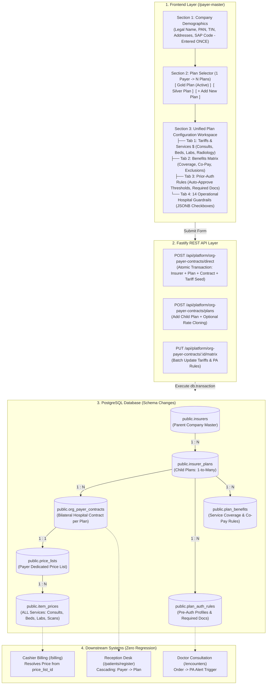
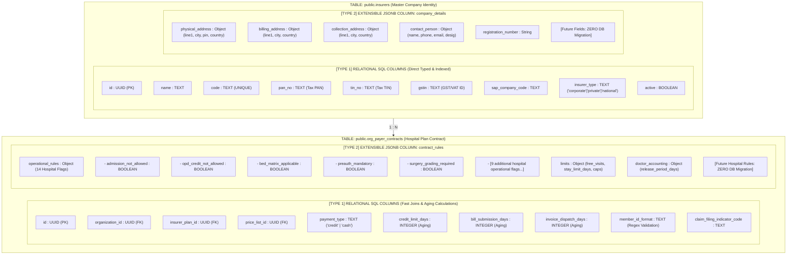
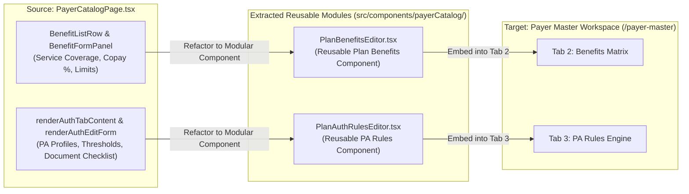

# Low-Level Design (LLD): Enterprise Payer Master & Multi-Plan Architecture

| Specification Metadata | Details |
|---|---|
| **Document Title** | Enterprise Payer Master, Multi-Plan Relational Hierarchy & Unified Tariffs LLD |
| **System** | `his-global-south` (flowMD Hospital Information System) |
| **Document Status** | Final Engineering Specification (Gate G2 Deliverable) |
| **Language** | 100% Technical English |
| **Format** | Point-to-Point, Technical, Single Master Architecture Diagram |

---

## Table of Contents

1. [Executive Summary & Problem Statement](#1-executive-summary)
2. [Point-to-Point Architectural Comparison (Before vs After)](#2-point-to-point-architectural-comparison)
3. [Unified Architecture & Data Flow (Single Master Diagram)](#3-unified-architecture--data-flow)
4. [Database Changes for Payer Addition (Exact Schema & DDL)](#4-database-changes-for-payer-addition)
5. [Exact JSONB Structures & Validations](#5-exact-jsonb-structures--validations)
   - [5.1 `insurers.company_details` JSONB](#51-insurerscompany_details-jsonb)
   - [5.2 `org_payer_contracts.contract_rules` JSONB (14 Checkboxes + Limits)](#52-org_payer_contractscontract_rules-jsonb)
   - [5.3 `plan_auth_rules` Document Checklist & Thresholds](#53-plan_auth_rules-document-checklist--thresholds)
6. [Single-Window Master-Detail UI Specification](#6-single-window-master-detail-ui-specification)
7. [Payer Catalog Component Reuse in Payer Master: The "Why" and "How"](#7-payer-catalog-component-reuse-in-payer-master-the-why-and-how)
   - [7.1 The "Why" (Architectural Justification & Rationale)](#71-the-why-architectural-justification--rationale)
   - [7.2 The "How" (Implementation & Integration Strategy)](#72-the-how-implementation--integration-strategy)
8. [REST API Execution Contracts & Payload Shapes](#8-rest-api-execution-contracts)
9. [Multi-Tenancy, Safety & Non-Regression Guarantees](#9-multi-tenancy-safety--non-regression-guarantees)

---

## 1. Executive Summary

Enterprise healthcare providers require a unified **Payer Master** to configure corporate sponsors, bilateral insurance plans, operational hospital rules, and service tariffs. 

The previous architecture suffered from three core limitations:
1. **Module Fragmentation**: Hospital administrators had to navigate across 3 disconnected screens (`/payerCatalog`, `/accepted-plans`, `/priceLists`) to onboard a single payer.
2. **Flat Coupling**: A payer company could only be bound to a single plan in the onboarding flow; adding a secondary tier (e.g., Gold vs Silver) forced duplicate creation of the parent company.
3. **Siloed Pre-Authorization Engine**: Rich prior-authorization rules existed exclusively within the platform super-admin catalog (`/payerCatalog`), locking hospital administrators out of tailoring service authorization rules.

This LLD formalizes the **Master-Detail Enterprise Payer Architecture**, introducing unified multi-plan management, in-place tariff matrix editing, structured JSONB hospital operational rules, and embedded prior-authorization governance.

---

## 2. Point-to-Point Architectural Comparison

| Dimension | Legacy Architecture (Before) | Target Enterprise Architecture (After) |
|---|---|---|
| **Onboarding UX** | Admin navigated across 3 separate modules (`/payerCatalog` -> `/accepted-plans` -> `/priceLists`). | **Single-Window Workspace (`/payer-master`)**: Demographics, plans, tariffs, and prior-authorization policies managed in one screen. |
| **Multi-Plan Support** | Flat 1:1 coupling. Secondary plans required duplicate creation of the parent payer company. | **Hierarchical Master-Detail (1:N)**: Company legal info entered once; multiple plans (`[Gold]`, `[Silver]`) managed via child cards/tabs. |
| **Tariff Configuration** | Split between an abstract price list page (`/priceLists`) and hardcoded visit inputs. | **Unified Tariffs & Services ($)**: All hospital rates—including OPD Consults, Emergency Triage, Bed charges, Labs, and Surgeries—live in ONE unified matrix. |
| **Rate Inheritance** | Every service price had to be re-entered manually from scratch for every plan. | **1-Click Plan Rate Cloning**: New plans under a payer can clone baseline prices from an existing plan (`copyRatesFromPlanId`). |
| **Prior-Authorization** | Configured only on platform super-admin page (`/payerCatalog`). Read-only in hospital views. | **Embedded PA Rules Engine**: Auto-approval dollar thresholds, validity days, and required document checklists (`SOAP`, `Imaging`, `Labs`) managed in-place. |
| **Hospital Policies** | No database storage for bed entitlements, admission blocks, or surgery grading. | **14 Operational Checkboxes**: Persisted as structured JSONB in `org_payer_contracts.contract_rules`. |
| **Patient Registration** | Single flat payer selection with no structured plan tiering. | **Cascading Hierarchy**: Step 1: Select Payer (`Britam`) -> Step 2: Select Plan (`Britam Gold` vs `Britam Silver`). |
| **Billing Integrity** | Manual price list binding created risk of unlinked fallback to standard cash rates. | **Zero-Touch Binding**: `org_payer_contracts.price_list_id` resolves prices natively; zero changes required to cashier queries. |

---

## 3. Unified Architecture & Data Flow



---

## 4. Database Changes for Payer Addition

### 4.0 Database Evolution: Previous Schema vs New Hybrid Architecture

> [!NOTE]
> **Clarification: What Does 'Hybrid Schema' Mean? (No Single Field is Called 'Hybrid')**
> In PostgreSQL, there is **no data type called 'hybrid'**.
> An architecture is termed a **Hybrid Schema** because each table contains **two distinct types of columns**:
> 1. **Type 1: Fixed Relational SQL Columns** (`pan_no`, `tin_no`, `payment_type`, `credit_limit_days`) -> Standard SQL types (`TEXT`, `INTEGER`, `BOOLEAN`) used for foreign keys, B-tree indexes, and fast mathematical SQL queries (`WHERE CURRENT_DATE - bill_date > credit_limit_days`).
> 2. **Type 2: Extensible JSONB Document Columns** (`company_details`, `contract_rules`) -> PostgreSQL `JSONB` containers holding nested JSON structures (addresses, contact person, 14 hospital operational flags, custom limits).
>
> **Why this Hybrid design?** Pure relational would require running a risky `ALTER TABLE` SQL migration every time a hospital requests a new operational rule or custom tax field. Pure NoSQL (MongoDB) would destroy SQL join speed and financial aging calculations. The **Hybrid model delivers both: sub-millisecond SQL indexing + zero-downtime extensibility**.

#### Visual Architecture Diagram (Relational SQL Columns vs Extensible JSONB)



#### Exact Field Classification Matrix (Why Each Field is Relational vs JSONB)

| Table | Column Name | Column Type | Model Category | Contained Properties / Purpose | Why This Specific Storage Model Was Chosen? |
|---|---|---|---|---|---|
| `insurers` | `pan_no`, `tin_no`, `gstin` | `TEXT` | **Relational SQL** | Direct single values | **Fast Querying & Uniqueness**: Needs B-tree indexing and strict validation across facilities. |
| `insurers` | `sap_company_code` | `TEXT` | **Relational SQL** | Direct single value | **ERP Integration**: Queried directly by automated SAP financial sync scripts. |
| `insurers` | `company_details` | **`JSONB`** | **Extensible JSONB** | `physical_address`, `billing_address`, `collection_address`, `contact_person` | **Document Nesting**: Stores multi-address structures and contact persons without creating 3 redundant normalized address tables. |
| `org_payer_contracts` | `payment_type` ('credit'\|'cash') | `TEXT` | **Relational SQL** | Direct enum string | **Core Financial Filter**: Checked on every single patient check-in and billing query (`WHERE payment_type = 'credit'`). |
| `org_payer_contracts` | `credit_limit_days`, `bill_submission_days` | `INTEGER` | **Relational SQL** | Numerical integer days | **SQL Arithmetic**: Used in aging ledger queries (`WHERE CURRENT_DATE - bill_date > credit_limit_days`). |
| `org_payer_contracts` | `member_id_format` | `TEXT` | **Relational SQL** | Regex pattern string | **Input Sanitization**: Client and server validate member ID regex on check-in. |
| `org_payer_contracts` | `contract_rules` | **`JSONB`** | **Extensible JSONB** | 14 hospital operational flags + limits + doctor accounting | **Zero-Migration Future Proofing**: Holds all 14 hospital operational flags, free visits, and stay limits. If a hospital introduces rule #15 or #16 tomorrow, it is added directly into JSONB with **ZERO schema migration and ZERO downtime**! |

---

### 4.1 Parent Insurer Master (`public.insurers`)
* **What is added/modified**: Direct legal/tax columns added to store enterprise registration data once per payer, plus structured `company_details` JSONB for multi-address management.
* **DDL Specification**:
  ```sql
  CREATE TABLE public.insurers (
      id UUID PRIMARY KEY DEFAULT gen_random_uuid(),
      name TEXT NOT NULL,
      code TEXT NOT NULL UNIQUE,
      short_name TEXT,
      insurer_type TEXT NOT NULL DEFAULT 'corporate' 
          CHECK (insurer_type IN ('national', 'private', 'corporate', 'self_pay')),
      contact_email TEXT,
      contact_phone TEXT,
      claims_endpoint TEXT,
      -- Enterprise Tax & Legal Demographics (ADDED):
      pan_no TEXT,
      tin_no TEXT,
      gstin TEXT,
      sap_company_code TEXT,
      company_details JSONB NOT NULL DEFAULT '{}'::jsonb,
      active BOOLEAN NOT NULL DEFAULT true,
      created_at TIMESTAMPTZ NOT NULL DEFAULT now(),
      updated_at TIMESTAMPTZ NOT NULL DEFAULT now()
  );

  CREATE UNIQUE INDEX idx_insurers_code_unique ON public.insurers(code) WHERE active = true;
  ```

---

### 4.2 Insurer Plans Master (`public.insurer_plans`)
* **What is added/modified**: Encapsulates distinct insurance or corporate products (e.g. Gold, Silver) under a parent insurer.
* **DDL Specification**:
  ```sql
  CREATE TABLE public.insurer_plans (
      id UUID PRIMARY KEY DEFAULT gen_random_uuid(),
      insurer_id UUID NOT NULL REFERENCES public.insurers(id) ON DELETE CASCADE,
      name TEXT NOT NULL,           -- e.g. 'Britam Gold Plan', 'Safaricom Executive Tier'
      code TEXT NOT NULL,           -- e.g. 'BRIT-GOLD', 'SAF-EXEC'
      plan_type TEXT NOT NULL DEFAULT 'comprehensive'
          CHECK (plan_type IN ('comprehensive', 'outpatient_only', 'inpatient_only', 'corporate', 'supplemental')),
      waiting_period_days INTEGER NOT NULL DEFAULT 0,
      active BOOLEAN NOT NULL DEFAULT true,
      created_at TIMESTAMPTZ NOT NULL DEFAULT now(),
      updated_at TIMESTAMPTZ NOT NULL DEFAULT now(),
      CONSTRAINT insurer_plans_insurer_code_unique UNIQUE (insurer_id, code)
  );

  CREATE INDEX idx_insurer_plans_insurer ON public.insurer_plans(insurer_id);
  ```

---

### 4.3 Hospital Bilateral Contracts (`public.org_payer_contracts`)
* **What is added/modified**: Stores credit aging, financial policies, and the 14 operational hospital checkboxes in `contract_rules` JSONB.
* **Key Constraint**: Binds `organization_id` to `insurer_plan_id` (enabling 1 Payer to have multiple distinct contracts with different tariffs).
* **DDL Specification**:
  ```sql
  CREATE TABLE public.org_payer_contracts (
      id UUID PRIMARY KEY DEFAULT gen_random_uuid(),
      organization_id UUID NOT NULL REFERENCES public.organizations(id) ON DELETE CASCADE,
      insurer_plan_id UUID NOT NULL REFERENCES public.insurer_plans(id) ON DELETE CASCADE,
      price_list_id UUID REFERENCES public.price_lists(id) ON DELETE SET NULL,
      payment_type TEXT NOT NULL DEFAULT 'credit' CHECK (payment_type IN ('credit', 'cash')),
      credit_limit_days INTEGER NOT NULL DEFAULT 30,
      bill_submission_days INTEGER NOT NULL DEFAULT 7,
      invoice_dispatch_days INTEGER NOT NULL DEFAULT 14,
      billing_currency TEXT NOT NULL DEFAULT 'KES',
      member_id_format TEXT,                    -- Regex format for patient policy number
      claim_filing_indicator_code TEXT,         -- EDI claim filing code
      contract_rules JSONB NOT NULL DEFAULT '{}'::jsonb, -- 14 Hospital Checkboxes + Limits
      contracted_from DATE NOT NULL DEFAULT CURRENT_DATE,
      contracted_to DATE,
      discount_percent NUMERIC(5,2) NOT NULL DEFAULT 0.00,
      use_standard_cash_tariff BOOLEAN NOT NULL DEFAULT false,
      active BOOLEAN NOT NULL DEFAULT true,
      created_at TIMESTAMPTZ NOT NULL DEFAULT now(),
      updated_at TIMESTAMPTZ NOT NULL DEFAULT now(),
      -- CRITICAL ENFORCEMENT: Hospital binds to PLAN, enabling 1 Payer -> N Contracts:
      CONSTRAINT org_payer_contracts_org_plan_unique UNIQUE (organization_id, insurer_plan_id)
  );

  CREATE INDEX idx_org_payer_contracts_lookup ON public.org_payer_contracts(organization_id, insurer_plan_id) WHERE active = true;
  ```

---

### 4.4 Prior-Authorization Policy Engine (`public.plan_auth_rules`)
* **What is added/modified**: Stores service authorization thresholds and clinical document checklists.
* **DDL Specification**:
  ```sql
  CREATE TABLE public.plan_auth_rules (
      id UUID PRIMARY KEY DEFAULT gen_random_uuid(),
      plan_id UUID NOT NULL REFERENCES public.insurer_plans(id) ON DELETE CASCADE,
      rule_name TEXT NOT NULL,                   -- e.g. 'High-Cost Imaging PA Profile'
      requires_prior_auth BOOLEAN NOT NULL DEFAULT true,
      auto_approve_below NUMERIC(12,2),          -- e.g. KES 5000 (amounts below bypass PA hold)
      validity_days INTEGER DEFAULT 30,          -- Validity period of issued authorization
      review_turnaround_hours INTEGER DEFAULT 24,
      required_documentation TEXT[] DEFAULT ARRAY[]::TEXT[], -- ['clinical_notes', 'imaging_report', 'lab_results']
      active BOOLEAN NOT NULL DEFAULT true,
      created_at TIMESTAMPTZ NOT NULL DEFAULT now(),
      updated_at TIMESTAMPTZ NOT NULL DEFAULT now()
  );

  CREATE INDEX idx_plan_auth_rules_plan ON public.plan_auth_rules(plan_id) WHERE active = true;
  ```

---

## 5. Exact JSONB Structures & Validations

### 5.1 `insurers.company_details` (JSONB)
Persists parent company multi-address data, corporate registration, and designated billing contact:

```json
{
  "physical_address": {
    "line1": "HQ Tower, 4th Floor",
    "line2": "Waiyaki Way",
    "city": "Nairobi",
    "state": "Nairobi County",
    "postal_code": "00100",
    "country": "Kenya"
  },
  "billing_address": {
    "line1": "Finance & Accounts Payable, Box 40112",
    "city": "Nairobi",
    "country": "Kenya"
  },
  "collection_address": {
    "line1": "Cashier Collection Box",
    "city": "Nairobi",
    "country": "Kenya"
  },
  "contact_person": {
    "name": "Jane Kamau",
    "designation": "Head of Corporate Health",
    "email": "jkamau@britam.com",
    "phone": "+254711999888"
  },
  "registration_number": "CPR/2012/88211",
  "corporate_group": "Financial Services"
}
```

---

### 5.2 `org_payer_contracts.contract_rules` (JSONB)
Encapsulates all **14 Hospital Operational Flags**, quantitative caps (free visits, stay limits), and doctor accounting rules:

```json
{
  "operational_rules": {
    "admission_not_allowed": false,
    "opd_credit_not_allowed": false,
    "bed_matrix_applicable": true,
    "surgery_grading_required": true,
    "express_reporting_service": true,
    "preauth_mandatory": true,
    "exclude_surgery_components": false,
    "ot_advance_required": false,
    "doctor_visit_restriction": true,
    "multiple_doctor_visit_allowed": false,
    "admit_patient_without_advance": true,
    "release_unsettled_doctor_fees": true,
    "release_period_days": 30,
    "otp_required_at_registration": false
  },
  "limits": {
    "free_visits": 2,
    "stay_limit_days": 14,
    "annual_spend_cap": 500000.00
  },
  "accounting": {
    "sap_company_code": "90210",
    "claim_filing_code": "CI",
    "member_id_format": "^BRIT-[0-9]{6}$"
  }
}
```

#### The 14 Operational Checkboxes Specification:
1. `admission_not_allowed`: Inpatient admission blocked at reception if true.
2. `opd_credit_not_allowed`: OPD checkout forces cash settlement even under credit contracts.
3. `bed_matrix_applicable`: Restricts admission to authorized ward types (e.g. General Ward only).
4. `surgery_grading_required`: Requires multi-level surgical grading sign-off before OT posting.
5. `express_reporting_service`: Express lab/radiology surcharge allowed to be billed to payer.
6. `preauth_mandatory`: Orders above threshold require authorization code before clinical execution.
7. `exclude_surgery_components`: Surgical consumables and implants billed to patient cash.
8. `ot_advance_required`: Requires deposit before surgical theater scheduling.
9. `doctor_visit_restriction`: Limits billable routine doctor ward rounds to 1 per day.
10. `multiple_doctor_visit_allowed`: Allows multiple specialist consultation billings on same date.
11. `admit_patient_without_advance`: Allows emergency IPD bed allocation with zero deposit.
12. `release_unsettled_doctor_fees`: Releases clinical fees to visiting doctors before payer settles claim.
13. `release_period_days`: Window (in days) after which doctor fees are released.
14. `otp_required_at_registration`: Sends SMS OTP to patient mobile at check-in to verify identity.

---

### 5.3 `plan_auth_rules` Document Checklist & Thresholds
Enforces clinical documentation requirements during order evaluation:

```json
{
  "rule_name": "High-Cost Imaging & Resuscitation",
  "requires_prior_auth": true,
  "auto_approve_below": 5000.00,
  "validity_days": 30,
  "review_turnaround_hours": 24,
  "required_documentation": [
    "clinical_notes",
    "imaging_report",
    "lab_results"
  ]
}
```

* **Permitted Document Tokens**: `clinical_notes`, `imaging_report`, `lab_results`, `referral_letter`, `treatment_plan`, `prior_auth_form`, `member_id`, `national_id`.

---

## 6. Single-Window Master-Detail UI Specification

All rates—including OPD Consults, Emergency Triage, and Beds—are unified into **Section 3: Tab 1 (Tariffs & Services $)**:

```text
+---------------------------------------------------------------------------------------------------------+
| [ Top Bar: Find Payer: Search Existing Payer... ]     [ + New Payer ]     [ Export to Excel (.xlsx) ]   |
+---------------------------------------------------------------------------------------------------------+
| SECTION 1: PAYER COMPANY DEMOGRAPHICS (Configured ONCE per Payer)                                       |
| • Payer Name: [Britam Insurance PLC    ]   • Short Name: [BRITAM        ]   • Type: (•)Corp ( )Ins      |
| • PAN / Tax ID: [ABCDE1234F]  • TIN: [P051234567X]  • SAP Code: [90210]  • Currency: [KES]              |
| • Physical Address: [HQ Tower, Nairobi ]   • Contact Person: [Jane Kamau - Head of Health]              |
+---------------------------------------------------------------------------------------------------------+
| SECTION 2: PLANS & SCHEMES UNDER THIS PAYER (1 Payer -> Multiple Plans Hierarchy)                        |
| Active Plan Selection:                                                                                  |
| ┌───────────────────────────────┐ ┌───────────────────────────────┐ ┌─────────────────────────────────┐ |
| │ [Active] Britam Gold Plan (Active)  │ │ [Plan] Britam Silver Plan         │ │ [ + Add New Plan to Payer ]  │ |
| │ Tariff: Gold Price List (9k)  │ │ Tariff: Silver Price List     │ └─────────────────────────────────┘ |
| │ PA: High-Cost Orders Only     │ │ PA: Mandatory for All Orders  │                                     |
| └───────────────────────────────┘ └───────────────────────────────┘                                     |
+---------------------------------------------------------------------------------------------------------+
| SECTION 3: PLAN CONFIGURATION WORKSPACE (For Selected Plan: "Britam Gold Plan")                         |
| ┌──────────────────────┬──────────────────────────────┬─────────────────────────┬─────────────────────┐ |
| │ [ Tab 1: Tariffs $ ] │ [ Tab 2: Benefits Matrix  ] │ [ Tab 3: PA Rules ]   │ [ Tab 4: 14 Rules ] │ |
| └──────────────────────┴──────────────────────────────┴─────────────────────────┴─────────────────────┘ |
|                                                                                                         |
| Filter by Category: [Core Visit & Bed Charges] [Consultations] [Radiology] [Laboratory] [Surgeries]   |
|                                                                                                         |
| Service Code    │ Description                  │ Standard Cash │ Contract Rate (KES) │ PA Required?    |
| ────────────────┼──────────────────────────────┼───────────────┼─────────────────────┼──────────────── |
| CONSULT-NEW     │ Outpatient New Consult Fee   │ KES 1,500     │ [ 1,200           ] │ [[Plan] OFF        ] |
| TRIAGE-ED       │ Emergency Triage Fee         │ KES 500       │ [ 500             ] │ [[Plan] OFF        ] |
| BED-GEN-WARD    │ General Ward Bed Daily       │ KES 2,000     │ [ 1,800           ] │ [[Plan] OFF        ] |
| BED-ICU         │ Intensive Care Unit Daily    │ KES 12,000    │ [ 10,000          ] │ [[X] YES (ON)   ] |
| RAD-MRI-01      │ MRI Brain with Contrast      │ KES 10,000    │ [ 9,000           ] │ [[X] YES (ON)   ] |
|                                                                                                         |
| [ Clone / Copy Rates from Another Plan ]                              [ Save Payer & Plan Matrix ]   |
+---------------------------------------------------------------------------------------------------------+
```

---

## 7. Payer Catalog Component Reuse in Payer Master: The "Why" and "How"

### 7.1 The "Why" (Architectural Justification & Rationale)

1. **Zero Code Duplication (Strict DRY Compliance)**:
   * `PayerCatalogPage.tsx` already contains ~1,200 lines of fully tested, production-grade React components for managing service benefits (`BenefitListRow`, `BenefitFormPanel`), cost-sharing co-pays, annual spending limits, and prior-authorization policies (`PlanAuthRule`, auto-approval thresholds, validity days, and document checklists).
   * Rebuilding these forms inside Payer Master would duplicate state management, CSS styling, and validation rules, generating technical debt and divergent bug fixes.
2. **Unified Single-Window Hospital Administration**:
   * Eliminates the artificial barrier where hospital billing administrators had to access the platform super-admin page (`/payerCatalog`) just to configure prior-authorization or benefit rules for their contracted plans.
3. **Zero-Touch Downstream Engine Compatibility**:
   * The downstream clinical adjudication engine (`adjudication.ts`, L1080-1139) already evaluates `plan_benefits` and `plan_auth_rules`.
   * Reusing the exact same data contracts means doctor consultation alerts (`VisitPlanSectionsFull.tsx`) and RCM pre-auth tracking (`/preauth`) work immediately with zero backend refactoring.

---

### 7.2 The "How" (Implementation & Integration Strategy)



#### Step-by-Step Integration Protocol:
1. **Module Extraction**:
   - Refactor `BenefitListRow` and `BenefitFormPanel` from `PayerCatalogPage.tsx` into `src/components/payerCatalog/PlanBenefitsEditor.tsx`.
   - Refactor `renderAuthTabContent` and `renderAuthEditForm` into `src/components/payerCatalog/PlanAuthRulesEditor.tsx`.
2. **Workspace Embedding**:
   - In `PayerMasterPage.tsx`, bind the components directly into Section 3:
     - **Tab 2 (Benefits Matrix )**: Passes `planId={activePlan.id}` into `<PlanBenefitsEditor />`.
     - **Tab 3 (PA Rules Engine )**: Passes `planId={activePlan.id}` into `<PlanAuthRulesEditor />`.
3. **Reactive Query Invalidation**:
   - When the hospital admin switches active plans from `[Britam Gold]` to `[Britam Silver]`, React Query invalidates and refetches `['plan-benefits', activePlan.id]` and `['plan-auth-rules', activePlan.id]`, seamlessly updating the UI in place.
4. **Direct API Mutation**:
   - Updates continue writing directly to the battle-tested endpoints:
     - `PUT /api/platform/payer-catalog/plans/:planId/benefits`
     - `PUT /api/platform/payer-catalog/plans/:planId/auth-rules`
   - Guarantees zero schema divergence between the platform catalog and hospital operations.

---

## 8. REST API Execution Contracts

### 8.1 Onboard Payer with Initial Plan & Tariffs (`POST /api/platform/org-payer-contracts/direct`)
Executes an atomic multi-table transaction creating the insurer, plan, contract, price list, and tariffs:

```typescript
// POST /api/platform/org-payer-contracts/direct
// Request Payload:
{
  "insurerName": "Britam Insurance PLC",
  "shortName": "BRITAM",
  "panNo": "ABCDE1234F",
  "tinNo": "P051234567X",
  "sapCompanyCode": "90210",
  "companyDetails": {
    "physical_address": { "line1": "HQ Tower", "city": "Nairobi", "country": "Kenya" },
    "contact_person": { "name": "Jane Kamau", "phone": "+254711999888" }
  },
  "planName": "Britam Gold Plan",
  "planCode": "BRIT-GOLD",
  "paymentType": "credit",
  "creditLimitDays": 45,
  "operationalRules": {
    "preauth_mandatory": true,
    "bed_matrix_applicable": true
  },
  "initialTariffs": [
    { "serviceCode": "CONSULT-NEW", "unitPrice": 1200 },
    { "serviceCode": "TRIAGE-ED", "unitPrice": 500 },
    { "serviceCode": "BED-GEN-WARD", "unitPrice": 1800 },
    { "serviceCode": "RAD-MRI-01", "unitPrice": 9000, "requiresPriorAuth": true }
  ]
}
```

* **Backend Transaction Implementation (`payerCatalog.service.ts`)**:
  ```typescript
  return await db.transaction(async (tx) => {
    // 1. Upsert Parent Insurer
    const [ins] = await tx.insert(insurers).values({ ... }).onConflictDoUpdate({ ... }).returning();
    // 2. Upsert Child Plan
    const [plan] = await tx.insert(insurer_plans).values({ insurer_id: ins.id, ... }).returning();
    // 3. Provision Dedicated Price List
    const [pl] = await tx.insert(price_lists).values({ name: `${ins.name} - ${plan.name} Tariff`, ... }).returning();
    // 4. Create Bilateral Hospital Contract
    const [contract] = await tx.insert(org_payer_contracts).values({ insurer_plan_id: plan.id, price_list_id: pl.id, ... }).returning();
    // 5. Seed Tariffs directly into item_prices
    await seedItemPrices(tx, pl.id, initialTariffs);
    return { contract, insurerId: ins.id, planId: plan.id };
  });
  ```

---

### 8.2 Add Child Plan with Rate Cloning (`POST /api/platform/org-payer-contracts/plans`)
```typescript
// POST /api/platform/org-payer-contracts/plans
// Request Payload:
{
  "insurerId": "c4d129a0-1234-4b56-7890-abcdef123456",
  "planName": "Britam Silver Plan",
  "planCode": "BRIT-SILVER",
  "copyRatesFromPlanId": "e5f238b1-5678-4c90-1234-fedcba654321", // Gold Plan ID to copy baseline
  "creditLimitDays": 30,
  "operationalRules": {
    "preauth_mandatory": true,
    "admission_not_allowed": false
  }
}
```

* **Rate Cloning Query**:
  ```sql
  INSERT INTO public.item_prices (organization_id, price_list_id, item_id, care_setting, unit_price, active)
  SELECT :orgId, :newSilverPriceListId, ip.item_id, ip.care_setting, ip.unit_price, true
  FROM public.item_prices ip
  WHERE ip.price_list_id = :goldPriceListId AND ip.active = true;
  ```

---

## 9. Multi-Tenancy, Safety & Non-Regression Guarantees

1. **Zero Billing Regressions**: Cashier billing queries resolve prices exclusively via `org_payer_contracts.price_list_id`. Existing queries require zero modification.
2. **Strict Multi-Tenancy Isolation**: All contracts and price lists are partitioned by `organization_id`. PostgreSQL Row Level Security (RLS) ensures Facility A cannot view or mutate Facility B's tariffs or plans.
3. **Atomic Rollback Guarantee**: Multi-table onboarding operations execute inside `db.transaction`. If any step fails, the entire transaction rolls back cleanly.
4. **Idempotent Mutation**: Re-saving an existing payer or plan performs an upsert (`ON CONFLICT DO UPDATE`), preventing duplicate entries.
