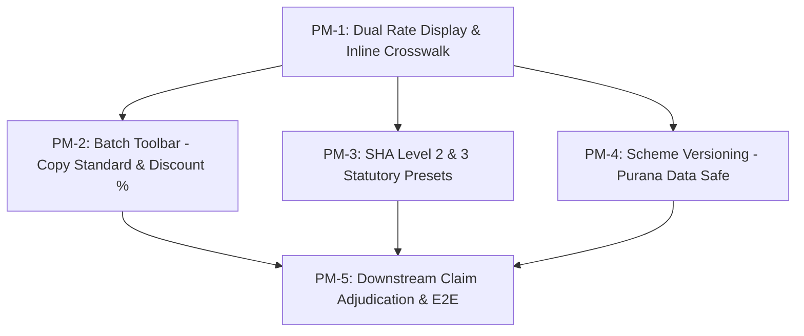

# Slices — payer-tariffs-mapping-versioning

| Field | Value |
|-------|--------|
| **Project** | `his-global-south` |
| **Feature** | `payer-master` / `accepted-plans` (Tariffs, Crosswalk & Versioning) |
| **PRD** | [../prd.md](../prd.md) |
| **Plan** | [../plan.md](../plan.md) |
| **Technical design** | [../technical-design.md](../technical-design.md) |
| **Status** | **Awaiting Human Approval** |

---

## Overview

| Slice | Title | Description & User Capability |
|---|---|---|
| **PM-1** | **Tracer Bullet: Dual Rate Display & Inline Payer Code Crosswalk** | Table displays `Hospital Current Rate (KES)` alongside editable `Payer Claim Code [ ✍️ ]` and `Contracted Rate [ ✍️ ]`. Persists both rates and statutory claim codes. |
| **PM-2** | **Batch Toolbar: 1-Click Copy Standard Rates & Global Discount %** | Top toolbar batch actions: 1-click copy standard hospital cash rates across all services, and apply overall negotiated discount % (e.g. 10% off current rates). |
| **PM-3** | **Kenya Statutory Presets: SHA Level 2 & Level 3 Tariff Matrix** | 1-click buttons to load official 19.03.2026 Kenya gazette tariffs and codes for Level 2 (Dispensary) and Level 3 (Health Centre & Maternity). |
| **PM-4** | **Mechanism B: Scheme Versioning (Purana Data 100% Safe)** | Create new version of a payer scheme with atomic cloning of rates & mappings; freezes old version to protect past patient bills and claims. |
| **PM-5** | **Downstream RCM Claim Generation & E2E Crosswalk** | Automatic emission of mapped `payerClaimCode` on insurance claim line items during clinical and cashier checkout. |

---

## Dependency Graph

---

## Traceability to Requirements

| Requirement | Addressed By |
|---|---|
| Hospital Current Rate Display (bold baseline) | **PM-1** |
| Editable Payer Claim Code `[ ✍️ ]` on every row | **PM-1** |
| Zero schema migrations (`item_prices` + `plan_benefits`) | **PM-1**, **PM-4** |
| 1-Click Copy Standard Hospital Rates | **PM-2** |
| Overall Global Discount % Applier (batch calculation) | **PM-2** |
| Kenya SHA Level 2 & Level 3 Pre-fills (Gazette 19.03.2026) | **PM-3** |
| Scheme Versioning (Mechanism B - Old schemes freeze read-only) | **PM-4** |
| Future / Any Payer Ready (No hardcoded vendor locks) | **PM-1**, **PM-2**, **PM-4** |
| Downstream RCM Claim generation with mapped code | **PM-5** |
