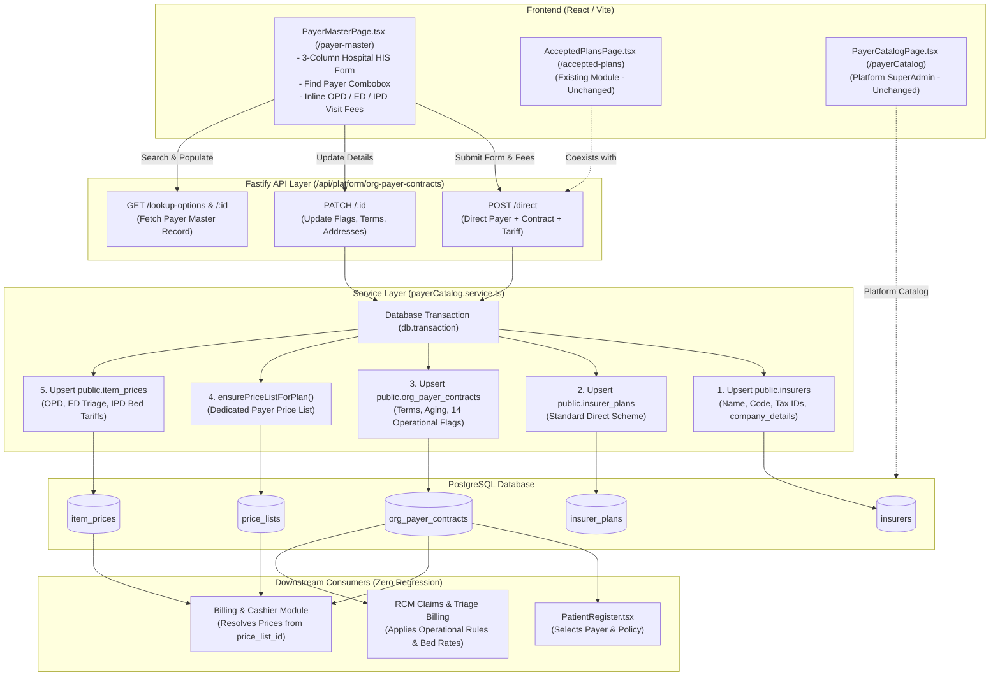
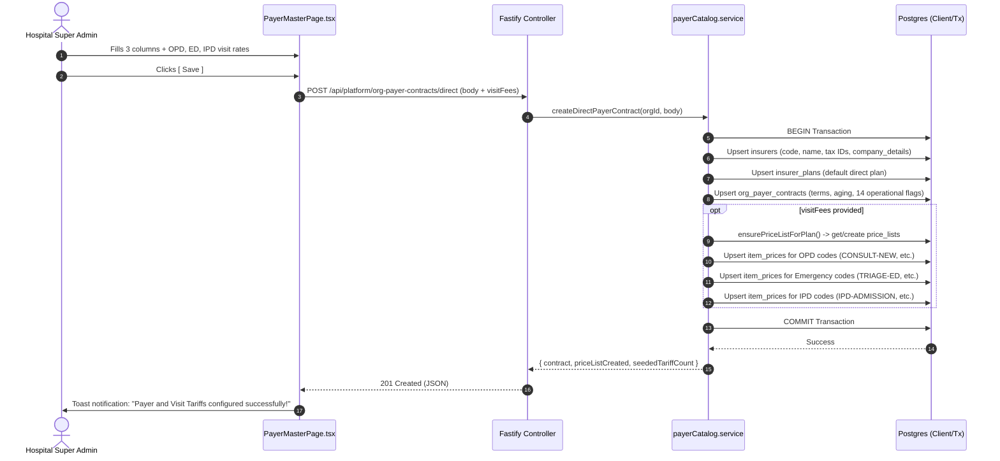

# Technical Design: Enterprise Payer Master & Catalog Architecture

| Field | Value |
|---|---|
| **Project** | `his-global-south` |
| **Feature** | `payer-master` (Enterprise Payer Catalog & Direct Corporate Registration) |
| **PRD** | [prd.md](./prd.md) · [plan.md](./plan.md) · [ticket.md](./ticket.md) |
| **Target repo** | `projects/his-global-south/` |
| **Status** | **Awaiting Manager / Tech Lead Review & Gate Approval** |
| **Date** | 2026-09-11 |
| **Depends on** | `modules/payerCatalog`, `modules/platform/pgschema`, `modules/rcm`, `price_lists`, `item_prices` |

---

## 0. Non-Regression Constraints & System Boundaries

1. **Strict Additive Coexistence**:
   - The platform canonical catalog (`/payerCatalog`, `insurers`, `insurer_plans`) and hospital contracts module (`/accepted-plans`, `org_payer_contracts`) must remain **100% operational** without breaking changes or regressions.
   - Existing Cashier Billing (`src/pages/patientBill/`), Patient Registration (`src/pages/patients/PatientRegister.tsx`), and FHIR Eligibility checks (`src/pages/Eligibility.tsx`) must continue resolving contracts via `org_payer_contracts` and price lists without modification.
2. **Unified Data Backbone (No Sync Silos)**:
   - We do not create an isolated, disconnected table that duplicates insurer data. Any enterprise company or direct payer registered through the Payer Master form **immediately registers as a first-class insurer and org payer contract** with linked tariff price lists.
3. **Atomic Fee Provisioning**:
   - Saving a payer master configuration with visit fees (OPD, Emergency Triage, IPD) must run inside a single database transaction. If price list creation or tariff insertion fails, the entire transaction rolls back.

---

## 1. Design Summary & Architecture Matrix

| Layer | Responsibility | Mechanism / Implementation |
|---|---|---|
| **Frontend UI** | 3-Column Enterprise Form + Visit Fee Config | `src/pages/payerCatalog/PayerMasterPage.tsx` (accessible via `/payer-master` and quick-link in `/accepted-plans`). |
| **API Endpoints** | REST API for Direct Payer Onboarding & Catalog Management | Fastify routes: `POST /api/platform/org-payer-contracts/direct`, `PATCH /api/platform/org-payer-contracts/:id`, `GET /api/platform/org-payer-contracts/:id/details`, `POST /api/platform/org-payer-contracts/:id/seed-visit-fees`. |
| **Core Service** | Transactional Upsert, Plan Binding, Tariff Seeding | `payerCatalog.service.ts` (`createDirectPayerContract`, `seedContractVisitFees`, `getOrgPayerContractDetails`). |
| **Database Model** | Hybrid Relational + Structured JSONB Schema | Direct columns on `insurers` & `org_payer_contracts` for queryable fields (PAN, TIN, GSTIN, payment_type, credit_limit_days) + JSONB structures (`company_details`, `contract_rules`) for the 14 operational flags, doctor accounting, and contract metadata. |
| **Pricing Engine** | Automatic Tariff & Price List Seeding | Automatically creates/links a `price_lists` record (`<Payer>-Direct-Tariff`) and inserts/upserts `item_prices` for standard visit codes (`CONSULT-NEW`, `TRIAGE-ED`, `IPD-ADMISSION`, etc.). |

---

## 2. System Context & Data Flow



---

## 3. Architecture Decisions (ADs)

### AD-1: Hybrid Relational + Structured JSONB Schema (vs New Silo Table)
- **Context**: The enterprise registration form has over 40 attributes (demographics, 14 operational hospital checkboxes, doctor accounting flags, EDI claim indicators, tax IDs).
- **Choice**: Store high-frequency query/join attributes as direct typed columns in `insurers` and `org_payer_contracts`, and group the dense operational configurations into typed JSONB columns (`insurers.company_details` and `org_payer_contracts.contract_rules`).
- **Why**:
  1. **Zero-regression**: All existing queries across registration, billing, and cashiering already query `org_payer_contracts`. If we created a disconnected `payer_company_master` table, existing billing queries wouldn't know about it without massive refactoring.
  2. **Zero schema bloat**: Avoids 30+ column migrations for niche hospital HIS flags while preserving full TypeScript schema validation and Drizzle type-safety.
  3. **High read/write performance**: The JSONB document is read in a single query with the contract row.
- **Rejected**: Creating a standalone `payer_company_master` table with 50 columns. This causes duplicate data sync issues with `insurers` and breaks compatibility with the existing billing engine.

### AD-2: Atomic All-in-One Transaction for Payer, Contract, and Visit Tariffs
- **Context**: Enterprise hospital administrators want to onboard a corporate company and immediately specify their Outpatient, Emergency, and Inpatient visit fees in one screen.
- **Choice**: When `POST /api/platform/org-payer-contracts/direct` is submitted with visit fees, execute the entire flow in an atomic `db.transaction(...)`. The service:
  1. Upserts `insurers` (deriving code if not provided).
  2. Upserts `insurer_plans` (creates a default direct plan).
  3. Resolves or generates the custom `price_lists` record (`ensurePriceListForPlan`).
  4. Upserts `org_payer_contracts` with contract rules and aging days.
  5. Inserts/updates `item_prices` for the provided fee codes (`CONSULT-NEW`, `TRIAGE-ED`, `BED-ED-OBS`, `IPD-ADMISSION`, etc.).
- **Why**: Eliminates partial state. If a fee insertion fails (e.g. invalid item code or currency mismatch), the insurer and contract are rolled back cleanly.
- **Rejected**: Multi-step wizard requiring the user to create the company on screen 1, navigate to price lists on screen 2, and link them on screen 3.

### AD-3: Strict Multi-Tenant Isolation
- **Context**: In a multi-tenant hospital deployment, hospital organizations must never see or overwrite each other's custom contracts or tariff rates.
- **Choice**: 
  - `insurers` records for private/national payers remain platform-readable, but corporate direct payers carry the org's context.
  - `org_payer_contracts` is strictly scoped by `organization_id = req.auth.organizationId` (enforced via Fastify `withOrgAndRoles` prehandler and Postgres RLS).
  - All write mutations (`POST /direct`, `PATCH /:id`) derive `organization_id` strictly from the authenticated session, never accepting client overrides.

### AD-4: Direct Tariff Key Mapping (OPD, Emergency, IPD)
- **Context**: Visit fee inputs on the UI need to map reliably to standard items in `items_master`.
- **Choice**: Standardize on system canonical item codes:
  - **OPD**: `CONSULT-NEW`, `CONSULT-FOLLOWUP`, `CONSULT-SPECIALIST`, `REG-OPD`.
  - **Emergency**: `TRIAGE-ED`, `CONSULT-EMERGENCY`, `BED-ED-OBS`, `BED-ED-CRITICAL`, `BED-ED-STANDARD`.
  - **IPD**: `IPD-ADMISSION`, `BED-GENERAL-WARD`, `BED-PRIVATE`, `BED-ICU`, `IPD-DOCTOR-VISIT`.
  If an item code is not present in `items_master`, the service auto-provisions the system item entry under the relevant service category before setting the tariff.

---

## 4. Data Model & Schema Details

### 4.1 Schema Overview

```
public.insurers (Platform & Direct Payers)
├── id: uuid (PK)
├── name: text NOT NULL
├── code: text NOT NULL (UNIQUE where active = true)
├── short_name: text
├── insurer_type: text ('national' | 'private' | 'corporate' | 'self_pay')
├── contact_email: text
├── contact_phone: text
├── pan_no: text (Indexed)
├── tin_no: text (Indexed)
├── gstin: text
├── sap_company_code: text
├── company_details: jsonb NOT NULL DEFAULT '{}'
│   ├── address1, address2, city, state, country, pin_code, phone, fax, email
│   ├── auto_email_reminder_days: number
│   ├── company_type, company_sub_type
│   └── contact_person: { name, designation, mobile_no, email, exclusion_type }
└── active: boolean NOT NULL DEFAULT true

public.org_payer_contracts (Hospital Org Bilateral Contract)
├── id: uuid (PK)
├── organization_id: uuid NOT NULL (FK -> organizations.id)
├── insurer_plan_id: uuid NOT NULL (FK -> insurer_plans.id)
├── price_list_id: uuid (FK -> price_lists.id)
├── contracted_from: date NOT NULL DEFAULT CURRENT_DATE
├── contracted_to: date
├── discount_percent: numeric(5,2) NOT NULL DEFAULT 0.00
├── use_standard_cash_tariff: boolean NOT NULL DEFAULT false
├── payment_type: text NOT NULL DEFAULT 'credit' ('credit' | 'cash')
├── credit_limit_days: integer NOT NULL DEFAULT 30
├── bill_submission_days: integer NOT NULL DEFAULT 7
├── invoice_dispatch_days: integer NOT NULL DEFAULT 14
├── billing_currency: text NOT NULL DEFAULT 'KES'
├── member_id_format: text (Regex pattern, e.g. 'SAF-[0-9]{6}')
├── claim_filing_indicator_code: text
├── contract_rules: jsonb NOT NULL DEFAULT '{}'
│   ├── operational_flags:
│   │   ├── express_reporting_service: boolean
│   │   ├── admission_not_allowed: boolean
│   │   ├── is_ews: boolean
│   │   ├── opd_not_allowed: boolean
│   │   ├── discount_not_show_on_op_bill: boolean
│   │   ├── surgery_grading: boolean
│   │   ├── ot_advance_mandatory: boolean
│   │   ├── panel_company: boolean
│   │   ├── is_general_ward: boolean
│   │   ├── opd_credit_not_allowed: boolean
│   │   ├── is_bed_matrix_applicable: boolean
│   │   ├── credit_limit_restriction: boolean
│   │   ├── exclude_surgery_components: boolean
│   │   └── medical_gas_applicable_for_first_surgery: boolean
│   ├── doctor_accounting:
│   │   ├── release_unsettled_fee: boolean
│   │   ├── release_unsettled_period_days: number
│   │   ├── is_allow_pharmacy_disc: boolean
│   │   └── otp_for_registration: boolean
│   ├── addresses:
│   │   ├── billing_address1, billing_address2
│   │   ├── collection_address1, collection_address2
│   │   ├── submission_address, dispatch_address
│   │   └── requested_by
│   └── agreement_meta:
│       ├── agreement_no: text
│       ├── remarks: text
│       ├── agreement_detail: text
│       ├── valid_for: text
│       ├── no_of_free_visits: number
│       ├── stay_limit_days: number
│       ├── tag_nomenclature: text
│       ├── report_tagging: text
│       ├── company_notes: text
│       └── revenue_expected: text
└── active: boolean NOT NULL DEFAULT true
```

---

## 5. API Contracts & Endpoint Specifications

### 5.1 Direct Payer Creation & Tariff Seeding
- **Route**: `POST /api/platform/org-payer-contracts/direct`
- **Auth**: Authenticated session with `super_admin` or `billing_admin` role.
- **Request Body**:
```json
{
  "insurerName": "Safaricom PLC",
  "shortName": "SAFARICOM",
  "payerType": "corporate",
  "planName": "Executive Direct Panel",
  "panNo": "ABCDE1234F",
  "tinNo": "P051234567Z",
  "gstin": "27ABCDE1234F1Z5",
  "sapCompanyCode": "SAP-90210",
  "companyDetails": {
    "address1": "HQ Westlands Road",
    "address2": "Tower 2, Floor 8",
    "city": "Nairobi",
    "state": "Nairobi County",
    "country": "Kenya",
    "pin_code": "00100",
    "phone": "+254 722 000000",
    "email": "panel@safaricom.co.ke",
    "auto_email_reminder_days": 15,
    "contact_person": {
      "name": "Sarah Kamau",
      "designation": "Head of Benefits",
      "mobile_no": "+254 711 999888",
      "email": "skamau@safaricom.co.ke",
      "exclusion_type": "None"
    }
  },
  "paymentType": "credit",
  "creditLimitDays": 45,
  "billSubmissionDays": 10,
  "invoiceDispatchDays": 20,
  "billingCurrency": "KES",
  "memberIdFormat": "SAF-[0-9]{6}",
  "claimFilingIndicatorCode": "CI",
  "contractRules": {
    "operational_flags": {
      "admission_not_allowed": false,
      "opd_not_allowed": false,
      "opd_credit_not_allowed": false,
      "is_bed_matrix_applicable": true,
      "credit_limit_restriction": true,
      "surgery_grading": true,
      "ot_advance_mandatory": false,
      "is_general_ward": false,
      "express_reporting_service": true,
      "discount_not_show_on_op_bill": false,
      "exclude_surgery_components": false,
      "medical_gas_applicable_for_first_surgery": true
    },
    "doctor_accounting": {
      "release_unsettled_fee": true,
      "release_unsettled_period": "30",
      "is_allow_pharmacy_disc": false,
      "otp_for_registration": true
    },
    "agreement_meta": {
      "agreement_no": "SAF-AGR-2026",
      "remarks": "Signed corporate panel agreement",
      "no_of_free_visits": 2,
      "stay_limit_days": 14,
      "revenue_expected": "10000000"
    }
  },
  "useStandardCashTariff": false,
  "discountPercent": 0.00,
  "visitFees": {
    "opd": {
      "consultNew": 1500,
      "consultFollowup": 1000,
      "consultSpecialist": 2500,
      "regOpd": 200
    },
    "emergency": {
      "triageEd": 500,
      "consultEmergency": 2000,
      "bedEdObs": 3000,
      "bedEdCritical": 6000,
      "bedEdStandard": 2500
    },
    "ipd": {
      "ipdAdmission": 3000,
      "bedGeneralWard": 2000,
      "bedPrivate": 5000,
      "bedIcu": 12000,
      "ipdDoctorVisit": 1500
    }
  }
}
```
- **Response** (`201 Created`):
```json
{
  "contract": {
    "id": "44444444-4444-4444-4444-444444444444",
    "organization_id": "11111111-1111-1111-1111-111111111111",
    "insurer_plan_id": "66666666-6666-6666-6666-666666666666",
    "price_list_id": "88888888-8888-8888-8888-888888888888",
    "payment_type": "credit",
    "credit_limit_days": 45,
    "billing_currency": "KES",
    "active": true
  },
  "priceListCreated": true,
  "seededTariffCount": 14
}
```

### 5.2 Contract Details & Master Query
- **Route**: `GET /api/platform/org-payer-contracts/:id`
- **Auth**: Authenticated member of organization.
- **Returns**: Full contract object joined with `insurers` (name, short name, tax IDs, company_details) and `price_lists` item count.

### 5.3 Contract Update / Patch
- **Route**: `PATCH /api/platform/org-payer-contracts/:id`
- **Auth**: `super_admin` or `billing_admin`.
- **Payload**: Partial update for operational flags, aging turnaround, contact person, or status.

---

## 6. Transaction & Execution Sequence



---

## 7. Frontend UI & State Architecture

### 7.1 Component Layout (`src/pages/payerCatalog/PayerMasterPage.tsx`)

```
+---------------------------------------------------------------------------------------+
|  Top Action Bar: [Find Payer Combobox (Search...)]   [ New ]   [ Save ]   [ Export ]  |
+---------------------------------------------------------------------------------------+
| Column 1: Payer Details      | Column 2: Bill Details       | Column 3: Other Info    |
| - Name & Short Name          | - Billing & Collection Addr  | - Agreement Validity    |
| - Physical Address           | - Claim Filing Code          | - Free Visits & Stays   |
| - Phone, Email, Fax, PIN     | - Credit Limit (Days)        | - PAN / TIN No          |
| - Radio: Sponsor/Payer/None  | - Member ID Format (Regex)   | - SAP Company Code      |
| - 14 Operational Checkboxes: | - Aging Turnaround Days      | - Revenue Expected      |
|   * Admission Not Allowed    | - Doctor Accounting:         | - Company Notes         |
|   * OPD Credit Not Allowed   |   * Release Unsettled Fee    +-------------------------+
|   * Surgery Grading          |   * Release Period (Days)    | Contact Person Section: |
|   * Bed Matrix Applicable    |   * Allow Pharmacy Disc      | - Name & Designation    |
|   * Express Reporting, etc.  |   * OTP for Registration     | - Mobile & Exclusion    |
+-------------------------------------------------------------+-------------------------+
| Bottom Panel: Visit & Encounter Fees Configuration (OPD, Emergency Triage, IPD)       |
| - Tab 1: OPD Fees (Consult New, Followup, Specialist, Reg)                            |
| - Tab 2: Emergency Triage (Triage Fee, Consult Emergency, ED Obs Bed, ED ICU Bay)     |
| - Tab 3: IPD Tariffs (Admission Fee, General Ward Daily, Private Room, ICU Daily)     |
+---------------------------------------------------------------------------------------+
| Set Pricing Triggers: Standard Pricing | Markup | Service Limits | Custom Pricing ... |
+---------------------------------------------------------------------------------------+
```

### 7.2 Form State Management
- All form inputs use a typed state model (`PayerMasterFormState`).
- The "Find Payer" combobox listens to `/api/platform/org-payer-contracts` and immediately hydrates all 3 columns upon selection.
- Clicking `[ New ]` resets the form to pristine defaults.
- Real-time client validation checks:
  - Required fields: `insurerName`, `billingCurrency`, `paymentType`.
  - Regex validation for `memberIdFormat`.
  - Non-negative constraints on credit limit days and visit rates.

### 7.3 Unified Payer Workspace: Lifting Payer Catalog's Benefits & PA Rules Engine into Payer Master

#### Architectural Decision (AD-4):
* **Context**: Currently, rich Benefit and Prior-Authorization rule authoring (`plan_benefits`, `plan_auth_rules`, `required_documentation`, `auto_approve_below`, `validity_days`) lives exclusively inside the platform catalog (`/payerCatalog`). In hospital day-to-day operations (`/accepted-plans` / `/payer-master`), benefits are read-only, and the tariff drawer only edits prices (`item_prices`).
* **Decision**: We lift and embed the full interactive **Benefits Matrix** (`BenefitListRow`, `BenefitFormPanel`) and **PA Rules Engine** (`PlanAuthRule`, auto-approve thresholds, required document checklist) from `PayerCatalogPage.tsx` directly into the Hospital Payer Workspace.
* **Resulting Unified Workspace Structure**:
  1. **Tab 1: Tariff Matrix ($)**: Unit prices, hospital cash vs custom contract prices, flat discounts.
  2. **Tab 2: Benefits Matrix (🛡️)**: Covered services, co-pays, coinsurance %, monetary ceiling limits, exclusions.
  3. **Tab 3: PA Rules Engine (📋)**: Prior-auth profiles, auto-approve below limits, required documentation checklist (`clinical_notes`, `imaging_report`, `lab_results`, `referral_letter`), turnaround hours, validity days.
  4. **Tab 4: Hospital Operational Guardrails**: 14 hospital checkboxes (`preauth_mandatory`, `admission_not_allowed`, `bed_matrix_applicable`, etc.) and agreement limits (`free_visits`, `stay_limit_days`).
* **Downstream Integration**:
  - Reuses existing `adjudication.ts` (L1080-1139) without modifications. When a doctor orders an item in `/encounters`, the engine evaluates `plan_auth_rules.requires_prior_auth` and triggers the live clinical alert.


---

## 8. Rollout, Testing & Verification Plan

### 8.1 Automated Backend Integration Tests
- Verify direct contract creation with all 14 operational flags, tax IDs, and JSONB structures.
- Verify atomic rollback if tariff insertion fails.
- Verify idempotency: re-saving the same payer updates the existing insurer, contract, and prices rather than creating duplicates.
- Verify multi-tenant isolation: Org A cannot read or mutate Org B's payer contracts.

### 8.2 Frontend Tests
- Verify `PayerMasterPage` renders with all 3 columns and fee inputs.
- Verify selecting a payer from the combobox correctly populates all form fields.
- Verify clicking `[ New ]` clears all inputs.

### 8.3 Manual Verification Steps
1. Navigate to `/payer-master`.
2. Enter corporate payer: "Kenyatta Commercial Bank (KCB)", Credit Limit: 30 days, Currency: KES.
3. Check flags: `Bed Matrix Applicable`, `Express Reporting Service`, `Surgery Grading`.
4. Enter visit tariffs:
   - OPD Consult: 2000 KES
   - Emergency Triage: 800 KES
   - IPD General Ward Bed: 3500 KES
5. Click `[ Save ]`.
6. Go to `/accepted-plans` and confirm KCB appears as an active accepted contract.
7. Go to `PatientRegister.tsx`, switch to Credit billing, and verify KCB is selectable with the configured credit policy.

---

## 9. Gate Approval Checklist

- [ ] Technical design reviewed by Engineering Manager / Tech Lead
- [ ] Non-regression constraint confirmed (zero disruption to existing billing/cashier flows)
- [ ] Schema approach approved (Hybrid relational + JSONB vs new table)
- [ ] Atomicity and fee seeding pattern approved
- [ ] Gate G2 approved for implementation slicing
