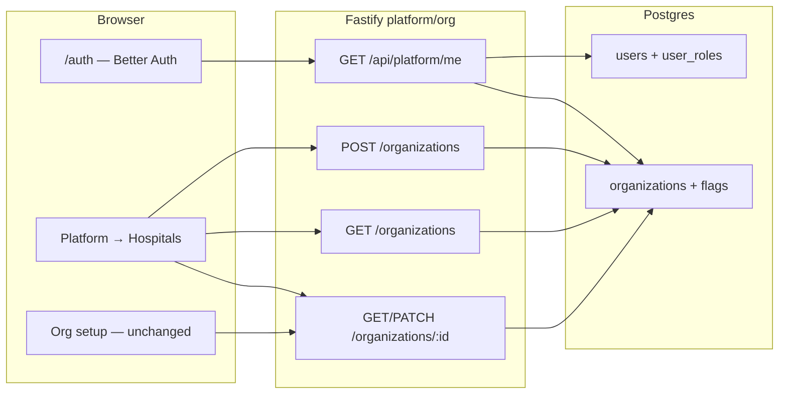

# Technical Design: Platform Admin — onboard & manage hospitals

| Field | Value |
|-------|--------|
| **Project** | `his-global-south` |
| **Feature** | `platform-admin-hospitals` |
| **PRD** | [prd.md](./prd.md) |
| **Target repo** | `projects/his-global-south/` @ `develop` (implement on a new branch — not IPD admissions) |
| **Status** | Full plan written — **Gates G1–G3 pending checkboxes** |
| **Date** | 2026-08-23 |

---

## 1. Design summary

Add a **cross-tenant hospital onboarding** capability for flowMD operators without changing hospital `super_admin`.

Today:

- Hospitals are `organizations` rows created by seed/SQL.
- `GET/PATCH /api/platform/organizations/:id` is **own-org only**; PATCH also requires `super_admin`.
- There is no list-all or create-hospital API.
- `app_role` has no `platform_admin`. `assertSuperAdmin()` is the hospital-admin gate. SQL `is_platform_admin()` (if present) remains an alias of `super_admin` for **payer RLS** — this design does **not** change that function.

This feature:

1. Adds role `platform_admin` (seed-only account `platform@flowmd.ai`).
2. Adds `organizations.opd_enabled` / `ipd_enabled`.
3. Adds create + list-all hospital APIs gated by the new role.
4. Lets platform admin GET/PATCH **any** org (same writable fields as Org setup + flags).
5. Exposes flags on `GET /api/platform/me`.
6. Adds **Platform → Hospitals** UI for that role only.

Same Better Auth login. No second app. No email invite (later suggestion).

Architecture [his-global-south.md §7](../../../docs/architecture/his-global-south.md) already names the flag columns. **Sidebar hide / IPD API 403 when `ipd_enabled=false` is not this design** — PRD defers gating. This design only persists flags and returns them on `/me`.

---

## 2. System context



---

## 3. Architecture decisions

### AD-1 — New `app_role` value; do not reuse `super_admin`

**Choice:** Add `platform_admin` to Postgres `app_role` and Drizzle `app_role` enum.

**Why:** PRD lock — hospital `super_admin` stays one-org (users, org profile, payer catalog). Cross-tenant onboard is a different persona.

**Not chosen:** Repurposing `super_admin` or renaming `is_platform_admin()` to mean the new role. That would change payer RLS and existing admin screens.

---

### AD-2 — App-layer `assertPlatformAdmin()`, leave SQL `is_platform_admin()` alone

**Choice:** New Fastify/service check: caller has `user_roles.role = platform_admin`. Existing `assertSuperAdmin()` and payer gates stay as they are.

**Why:** PRD out-of-scope: “any change to `is_platform_admin()` / `super_admin` payer gates.”

**Implement note:** Confirm whether the API DB role is subject to RLS. Authorization for hospital CRUD is **service-layer**. Do not broaden payer policies. If the pool user is RLS-enforced on `organizations`, add a **narrow** extra SELECT/INSERT/UPDATE policy for `platform_admin` on that table only — verify during implement, do not assume.

---

### AD-3 — Extend platform **org** feature; no new backend module

**Choice:** Hospital create/list/edit live in `backend/src/modules/platform/org/` (same plugin). New constants on `platform.constants.ts` (`ROLE.PLATFORM_ADMIN`). Invite / personnel role pickers **must not** include `platform_admin`.

**Why:** Organizations already own the table and Org setup PATCH. A second “tenants” module would duplicate the field contract.

---

### AD-4 — Cross-tenant only on the new/extended hospital routes

**Choice:**

| Caller | GET `:id` / PATCH `:id` | POST create / GET list |
|--------|-------------------------|------------------------|
| `platform_admin` | Any org id | Allowed |
| Hospital `super_admin` | Own org only (today’s `requestedId !== orgId` → 403; PATCH still `assertSuperAdmin`) | 403 |
| Everyone else | Unchanged | 403 |

Platform admin profile still belongs to the demo org (FK only). Hospital APIs **ignore that org** for list/create/edit.

---

### AD-5 — Additive org flags; backfill existing tenants

**Choice:** `opd_enabled boolean NOT NULL DEFAULT true`, `ipd_enabled boolean NOT NULL DEFAULT false`. CHECK: at least one true. Existing rows get those defaults. Optional seed: demo Flow Health `ipd_enabled = true` for IPD testing.

**Why:** Zero new tables. Matches architecture §7 defaults. Existing OPD hospitals keep current behaviour until a later gating slice.

---

### AD-6 — Seed-only platform operator

**Choice:** `create-admin.ts` / demo seed creates `platform@flowmd.ai` + `user_roles.platform_admin`. Document SQL runbook. No API to grant the role. Self sign-up never assigns it.

**Why:** PRD — hospital staff cannot elevate themselves.

---

### AD-7 — Frontend: portable `src/platform/` hospitals surface

**Choice:** New UI under `src/platform/` (paths in `src/platform/constants/`, pages for list/create/edit), barrel re-export if needed. Sidebar item **Platform → Hospitals** only when session roles include `platform_admin`. Hide hospital admin modules for a user who has **only** that role.

**Why:** Matches the IPD portable-module pattern. Does not rewrite Org setup.

**Not chosen:** Putting this inside `/org-setup` (wrong persona).

---

### AD-8 — `/me` carries flags; no nav/API gating in this design

**Choice:** `GET /api/platform/me` includes `opd_enabled`, `ipd_enabled` from the user’s organization.

**Why:** PRD US-6. Sidebar/IPD 403 gating is a later slice (architecture §7).

---

## 4. Data model / migration overview

**No new tables.**

1. `ALTER TYPE app_role ADD VALUE 'platform_admin'` (and mirror in `backend/src/db/schema/enums.ts`).
2. `organizations`:
   - `opd_enabled boolean NOT NULL DEFAULT true`
   - `ipd_enabled boolean NOT NULL DEFAULT false`
   - CHECK `(opd_enabled OR ipd_enabled)`
3. Backfill is the column defaults.
4. Seed: user + profile (demo org FK) + `user_roles (platform_admin)`.
5. pgschema mirror for the two columns + CHECK from constants (`sql.raw` / `textInArrayCheck` pattern is N/A for booleans; CHECK is boolean OR).

Writable create/PATCH body = every writable `organizations` column today + the two flags. Server-owned: `id`, `created_at`, `updated_at`. `name` required. `npi` unique if set. `billing_mode` ∈ `dpc | fee_for_service | hybrid`.

---

## 5. Endpoints

Auth: Better Auth session + org context (existing `withOrgAuth`), **plus** platform-admin assert on create/list and on cross-tenant get/patch.

| Method | Path | Auth | Purpose |
|--------|------|------|---------|
| POST | `/api/platform/organizations` | `platform_admin` | Create hospital |
| GET | `/api/platform/organizations` | `platform_admin` | List all (name, npi, active, billing_mode, currency, jurisdiction_code, flags, created_at) |
| GET | `/api/platform/organizations/:id` | `platform_admin` → any id; else own org only | Read one |
| PATCH | `/api/platform/organizations/:id` | `platform_admin` → any id + flags; `super_admin` → own org, existing rules (flags optional later or ignored for hospital admin in v1 — **hospital PATCH does not need to edit flags**) | Update |
| GET | `/api/platform/me` | Authenticated | Existing profile + `opd_enabled`, `ipd_enabled` |

**POST body (snake_case wire):** see PRD field contract. Validate with Fastify schema from `platform.constants` / org constants (`BILLING_MODE_VALUES`, currencies, time formats). UUIDs on `:id`.

**Errors:** 400/422 both flags false or empty name; 403 non–platform-admin on create/list; 409 duplicate NPI; 404 unknown id.

Hospital `super_admin` PATCH of flags: **out of this persona**. If the existing PATCH body later includes flag keys, ignore them unless caller is `platform_admin` (prevents hospital admin turning off IPD).

---

## 6. Frontend (system level)

| Surface | Behaviour |
|---------|-----------|
| `/auth` | Unchanged — `platform@flowmd.ai` |
| Sidebar | “Hospitals” if `platform_admin` |
| `/platform/hospitals` | List |
| `/platform/hospitals/new` | Create form (Org-setup fields + OPD/IPD checkboxes) |
| `/platform/hospitals/:id` | Edit |

Reuse Org setup field layout/components where practical. camelCase in TS; client converts snake_case.

---

## 7. Auth, errors, compliance

- Session cookie (ADR 0008). No new auth plugin.
- PHI: hospital list is org metadata (name, NPI, flags) — still org-admin-sensitive; restrict to `platform_admin`.
- Audit: optional later; not required for G2.
- HIPAA: no extra PHI columns.

---

## 8. Testing

- Unit: `assertPlatformAdmin` vs `assertSuperAdmin`; flag CHECK; schema enums from constants.
- Integration: `platform_admin` POST/GET list 201/200; `super_admin` (`admin@flowmd.ai`) POST/list **403**; own-org PATCH still works; `/me` contains flags.
- UI smoke: login as platform admin → Hospitals list → create → appears.

---

## 9. Dependency graph / build order

```text
1. Migration: enum + org columns + CHECK
2. Constants + pgschema mirror
3. Seed platform@flowmd.ai
4. Service: create, list, get/patch branch, /me flags
5. Fastify schemas + routes
6. Frontend hospitals + sidebar
7. Runbook doc
8. Tests
```

**Slices (full plan):** [slices/README.md](./slices/README.md)

| Slice | Spec | Tracer |
|-------|------|--------|
| PAH-1 | [pah-1-create-list](../../../specs/features/his-global-south/platform-admin-hospitals-pah-1-create-list.md) | Migration + seed + POST/GET collection + list/create UI |
| PAH-2 | [pah-2-edit-me](../../../specs/features/his-global-south/platform-admin-hospitals-pah-2-edit-me.md) | Cross-tenant GET/PATCH + edit UI + `/me` flags |
| PAH-3 | [pah-3-hardening](../../../specs/features/his-global-south/platform-admin-hospitals-pah-3-hardening.md) | Role exclusion + 403 tests + runbook |

---

## 10. Out of scope (do not design further)

- Email invite / first hospital admin password
- Changing `is_platform_admin()` SQL
- Payer catalog, Personnel, clinical
- Sidebar or IPD API gating by flags
- Auto-create hospital `super_admin` on create

---

## 11. Open questions

| # | Question | Recommendation |
|---|----------|----------------|
| 1 | Does the API DB user hit `organizations` RLS? | Verify in implement; auth stays in service either way |
| 2 | Demo Flow Health `ipd_enabled=true`? | Yes for local IPD work |
| 3 | Formal G1 checkboxes on PRD | Treat this TD as the plan to approve; tick G1+G2 together if product agrees |

---

## Approval (Gate G2)

- [ ] Product: role split and Hospitals-only UI accepted
- [ ] Tech: AD-1 … AD-8 accepted (especially AD-2 — do not retarget `is_platform_admin()`)
- [ ] Scope: no flag-based nav/API gating in v1

**Approved by:** ___  
**Date:** YYYY-MM-DD

**Agent rule:** Do not implement until G2 and the PAH-1 Approval block are filled.

Decompose + plan-slice already written (2026-08-23) at [slices/README.md](./slices/README.md). After you tick G2 and PAH-1, say: `implement PAH-1`.
