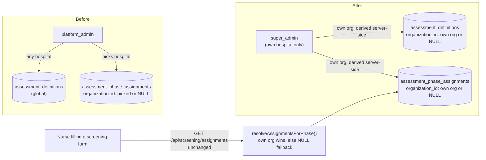

# Technical Design: Screening administration — Platform Admin → Hospital Super Admin

| Field | Value |
|-------|--------|
| **Project** | `his-global-south` |
| **Feature** | `screening-hospital-admin` |
| **PRD** | [prd.md](./prd.md) — **Gate G1 approved** 2026-09-02 |
| **Target repo** | `projects/his-global-south/` @ `develop` |
| **Status** | **Implemented** (2026-09-02) — backend + frontend done, validated against local Docker stack |
| **Date** | 2026-09-02 |
| **Depends on** | None |

---

## 0. Non-regression constraint

**This is an actor swap, not a rebuild.** Everything about how the feature works stays identical — same two actions (author a question set, assign it to a phase), same tables, same patient-facing resolution logic. The only things that change:

1. Who is allowed to call the management endpoints (`super_admin` instead of `platform_admin`)
2. Where the write is scoped (always the caller's own hospital — the hospital picker goes away because it's no longer needed)
3. One new nullable column so a hospital's own question sets don't collide with another hospital's

Do not touch `resolveAssignmentsForPhase` (the patient-facing read path) — it is out of scope and must keep behaving exactly as it does today.

---

## 1. Design summary

| Layer | Change |
|-------|--------|
| Auth | `screeningAdminAuth.service.ts` — drop the `platform_admin` branch, keep only `super_admin` |
| `definitions.service.ts` | Swap `assertPlatformAdmin` → the actor resolver; scope reads/writes to caller's org |
| `assignments.service.ts` | Same swap; drop `organization_id` from the create request body (server derives it) |
| Schema | Add nullable `organization_id` to `assessment_definitions` (mirrors the column `assessment_phase_assignments` already has) |
| Frontend | Move the admin pages out of `src/platform/`, into the hospital-admin part of the app; drop the hospital-picker dropdown; move the sidebar entry |

No new tables. No new event types. No orchestration/event-bus involvement — this module doesn't use one.

---

## 2. System context



---

## 3. Architecture decisions

### AD-1: Reuse the actor-resolver pattern, drop the platform branch

**Choice:** `screeningAdminAuth.service.ts` already exists (unused on this branch) with a `{scope:'platform'} | {scope:'hospital', organizationId}` union. Simplify it to a single shape: `resolveScreeningAdmin(userId, organizationId): Promise<{organizationId: string} | null>`, backed by `assertSuperAdmin`.
**Why:** Finishes work already scaffolded; smaller diff than writing new auth from scratch.
**Reject:** Keep the union and just stop calling the `platform` branch — leaves dead code and a confusing type that implies platform_admin might come back. Delete it cleanly instead.

### AD-2: `organization_id` always server-derived, never client input

**Choice:** Every write handler sets `organization_id: req.auth.organizationId` (already available from `withOrgAuth`). The request body for `createAssignment` drops the `organization_id` field entirely. If a client sends one anyway, ignore it (do not merge it into the insert).
**Why:** Only source of truth for "which hospital" once every caller belongs to exactly one hospital. Accepting a client value would let a hospital admin target another hospital's data.

### AD-3: `organization_id` on `assessment_definitions`, nullable, FK → `organizations`

**Choice:** Add the column, index it, extend the unique constraint from `(code, version)` to `(organization_id, code, version)`. No backfill — existing rows land on `organization_id = NULL` automatically and keep serving as the fallback default set (unchanged behavior for hospitals that haven't created their own).
**Why:** Same pattern `assessment_phase_assignments` already uses; zero-downtime, no data migration script needed.

### AD-4: Ownership check on every mutation

**Choice:** PATCH/PUT/DELETE on a definition or assignment first loads the row and checks `row.organization_id === caller.organizationId`. Mismatch (including `NULL`) → 403.
**Why:** Without this, a hospital could still guess another hospital's row id and mutate it even though they can no longer *see* it through the list endpoint.

### AD-5: Frontend relocation follows existing precedent, not a new pattern

**Choice:** Move `src/platform/pages/screening/*` → `src/pages/screening/` and register routes directly in `appRoutes.tsx`, wrapped in `<RequireRole role={SUPER_ADMIN}>` — identical to how `PayerCatalogPage` is already done. Not the nested `/platform/*` router.
**Why:** Matches `Personnel`/`ClinicalStaff`/`PayerCatalog` — all existing `super_admin`-only screens use this shape already. No new frontend pattern introduced.

---

## 4. Data model change

```sql
-- assessment_definitions
ALTER TABLE assessment_definitions
  ADD COLUMN organization_id uuid REFERENCES organizations(id) ON DELETE CASCADE;

CREATE INDEX idx_assessment_definitions_org ON assessment_definitions (organization_id);

ALTER TABLE assessment_definitions
  DROP CONSTRAINT assessment_definitions_code_version_key,
  ADD CONSTRAINT assessment_definitions_org_code_version_key UNIQUE (organization_id, code, version);

COMMENT ON COLUMN assessment_definitions.organization_id IS
  'Owning hospital. NULL = platform-seeded shared default (fallback content, no longer editable via any admin UI after screening-hospital-admin). '
  'Non-null = authored by that hospital''s super_admin via /screening.';
```

(Exact migration file number confirmed at implement time — pgschema edited first, `npm run db:generate` reviewed, then committed as `NNN_screening_definitions_organization_id.sql` per `backend-architecture.mdc`.)

`assessment_phase_assignments`: **no schema change** — only the service-layer write path changes (§3 AD-2).

---

## 5. Touch points (implementation map)

| File | Change |
|------|--------|
| `backend/src/modules/screening/pgschema/assessment-definitions.pgschema.ts` | Add `organization_id`, index, updated unique constraint |
| `backend/src/db/migrations/NNN_....sql` | Generated migration + `COMMENT ON` |
| `backend/src/modules/screening/screeningAdminAuth.service.ts` | Simplify to hospital-only actor resolver |
| `backend/src/modules/screening/definitions/definitions.service.ts` | Actor swap; org-scope list/create/patch/edit; ownership check on mutation |
| `backend/src/modules/screening/assignments/assignments.service.ts` | Actor swap; drop `organization_id` from create body; org-scope everywhere; ownership check |
| `backend/src/modules/screening/screening.types.ts` | Drop `organization_id` from `CreateAssignmentBody`; add `organization_id`/ownership flag to response row types |
| `backend/src/modules/screening/definitions/definitions.routes.ts` / `.schema.ts` | Update stale "platform_admin-only" comment; extend response schemas for new fields |
| `backend/src/modules/screening/assignments/assignments.routes.ts` / `.schema.ts` | Same |
| `src/platform/pages/screening/*` → `src/pages/screening/*` | Move (index, new, edit, QuestionBuilder) |
| `src/platform/hooks/useScreeningAdmin.ts`, `src/platform/api/screening.service.ts` | Move next to relocated pages |
| `src/routes/appRoutes.tsx` | Add `/screening`, `/screening/new`, `/screening/:id/edit` routes wrapped in `RequireRole`; add legacy redirect from `/platform/screening*` |
| `src/routes/platformRoutes.tsx` | Remove `screening/*` sub-route + import |
| `src/components/layout/AppSidebar.tsx` | Remove `Screening` from `requiresPlatformAdmin` block; add it to the `requiresSuperAdmin` block (next to Clinical Staff / Personnel / Payer catalog) |
| `src/platform/constants/index.ts` | Move/rename `PLATFORM_SCREENING_PATH` constants out of the `platform` constants file to wherever the relocated page's own constants live |

---

## 6. Sequence — create a hospital's own question set

```text
Hospital super_admin → POST /api/screening/definitions { code, title, questions }
  → withOrgAuth: req.auth.organizationId resolved from session
  → resolveScreeningAdmin(userId, organizationId): assertSuperAdmin → { organizationId }
  → check (code, organization_id) not already taken
  → INSERT with organization_id = caller's org
  → 201
```

## 7. Sequence — assign it to a phase

```text
Hospital super_admin → POST /api/screening/phase-assignments { definition_id, phase, required, sort_order }
  (no organization_id in body)
  → resolveScreeningAdmin(...) → { organizationId }
  → definition_id must belong to caller's org OR be organization_id IS NULL (platform default)
  → INSERT with organization_id = caller's org
  → 201
```

## 8. Sequence — patient-facing read (unchanged)

```text
GET /api/screening/assignments?phase=triage
  → resolveAssignmentsForPhase(callerOrg, phase)
  → org rows if any, else NULL-org rows
  → unchanged by this feature
```

---

## 9. Testing strategy

| Level | Cases |
|-------|--------|
| Unit | `resolveScreeningAdmin` returns null for non-super_admin; returns org for super_admin |
| Service | `createDefinition`/`createAssignment` always write caller's org regardless of any client-sent value; mutation ownership check rejects mismatched org |
| Integration | Hospital A cannot list/read/edit/delete Hospital B's definitions or assignments (extend existing `assignments.service.test.ts`, `definitions.service.test.ts`); `platform_admin` gets 403 on every screening admin route; pre-existing rows still resolve as `NULL`-org fallback with no backfill |
| Regression | `resolveAssignmentsForPhase` / patient-facing screening form unaffected — existing tests must stay green unmodified |
| Manual | Log in as hospital A super_admin: create + assign a question set, confirm it appears in hospital A's triage form and not hospital B's; confirm `platform_admin` no longer sees Screening in the sidebar and `/platform/screening` no longer resolves |

CI: `npm run lint && npx tsc -b` (frontend) + `npm run build` + tests (`backend/`).

---

## 10. Risks & mitigations

| Risk | Mitigation |
|------|------------|
| A caller still sends `organization_id` in the assignment body out of habit (old frontend code, API consumers) | Server ignores it — always derives from `req.auth.organizationId`; add an explicit test asserting a spoofed value in the body has no effect |
| Some other code path reads `assessment_definitions` directly and doesn't expect a new column | Grep all call sites before the migration lands (nullable column is additive/safe either way, but confirm nothing does `select *` into a strict type) |
| `emergency-triage` ET-4 (still hub-gated, separate feature) reads screening assignments | Its read path is `resolveAssignmentsForPhase`, untouched here — confirm with a quick check of ET-4-related code before merge, no code change expected |

---

## 11. Open questions (engineering)

| ID | Question | Proposed default |
|----|----------|------------------|
| EQ-1 | Reject vs. silently ignore a client-supplied `organization_id` in the assignment body | Reject with 400 — explicit is safer than silent |
| EQ-2 | Final frontend folder: `src/pages/screening/` vs `src/modules/screening/` | `src/pages/screening/`, matching `Personnel`/`PayerCatalog` precedent (small admin screen, not a full module) |
| EQ-3 | `/platform/screening*` — redirect or 404 | Redirect to `/screening` |

---

## Approval

- [x] Engineering
- [x] Product (align with PRD G1)

**Approved by:** Rahul Ranjan
**Date:** 2026-09-02

**Gate G2: APPROVED.** Treated as a single slice (no separate slice doc — matches hub precedent for changes this small). Proceeding directly to implementation.
